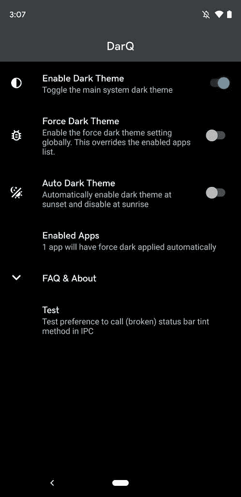

# DarQ 在没有 root 的情况下，在 Android 10 上启用每个应用的强制黑暗模式

> 原文：<https://www.xda-developers.com/darq-per-app-forced-dark-mode-android-10-without-root/>

Android 10 带来了一些有用的功能，这使得它比 Android 9 更受欢迎。Android 9 不确定的双按钮导航系统[让位于完全手势导航](https://www.xda-developers.com/google-gesture-navigation-android-10/)，后者运行得更好。在[谷歌意识到高级有机发光二极管显示器上的黑暗主题的好处](https://www.xda-developers.com/google-wants-developers-to-add-dark-themes-to-save-battery-life/)之后，Android 10 还为[带来了支持它的应用程序上的全系统黑暗模式](https://www.xda-developers.com/google-releases-stable-android-10-for-pixel-smartphones/)。谷歌在 Android 上的第一方应用很快被更新为[添加黑暗主题](https://www.xda-developers.com/google-gmail-dark-mode-android/)。全系统黑暗模式功能是用户多年来一直要求的，他们终于在 Android 10 中得偿所愿。然而，仍有改进的余地。虽然谷歌增加了一个开发者选项，强制所有应用程序打开黑暗模式(即使那些没有专门更新该功能的应用程序)，但现有的 Android 没有办法在每个应用程序的基础上启用强制黑暗模式。不出所料，XDA 社区前来救援。XDA 公认的开发者 Quinny899 于 6 月发布了 DarQ 应用，允许用户启用每个应用的强制黑暗模式。

 <picture></picture> 

DarQ settings

DarQ 的唯一限制是它需要 root 用户，因为它发送一个 shell 命令，需要提升特权来启用强制黑暗模式选项。这意味着非 out 用户不再参与行动。甚至自定义用户界面也没有解决这个问题的方法。OPPO 的 [ColorOS 7](https://www.xda-developers.com/oppo-coloros-7-review/) 在显示设置中添加了一个强制的全系统黑暗模式切换(将其从开发者选项中取出)，但同样，它不能在每个应用程序的基础上进行切换。不过，我们总是可以相信社区会提出创新的解决方案。在 1.2 版本中，DarQ 现在已经更新为在没有 root 的 Android 10 上支持每个应用程序的黑暗模式。它通过使用 ADB 脚本来实现这一点，该脚本必须单独下载。该应用程序现在需要用户授予它 ADB shell 级别的权限，以便它可以运行强制黑暗模式选项的相同命令，而不需要 root。

DarQ 还使用了一个辅助服务，这样它就可以检测用户选择的应用程序何时在前台，以启用强制黑暗模式，然后在这些应用程序不在前台时禁用黑暗模式。

在 1.2 版本中，该应用程序现在支持一加的 OxygenOS。此次更新还在应用列表中增加了搜索框。

完整的更改日志记录如下:

### DarQ v1.2 变更日志

v1.2

- DarQ 现在没有 root 也能工作！使用来自 XDA 线程或 GitHub 库的 ADB 脚本来运行所需的后台服务，以使用 DarQ，而无需启动您的设备。

-固定根检测

-增加了 OxygenOS 支持

-在应用列表中添加了搜索框

-在应用列表中添加了系统应用过滤器(默认隐藏)

在每个应用程序的基础上切换强制黑暗模式意味着用户可以在 Twitter 等应用程序中启用黑暗模式，同时选择在脸书和 Instagram 上禁用它。DarQ 还可以在夜间自动开启黑暗模式。它支持用户灵活性，这很好。我们能期待像这样的选项在下一个 Android 版本中作为开发者选项提供吗？我们必须等到下个月才能知道答案。

* * *

**[从 XDA 实验室下载 DarQ](https://labs.xda-developers.com/store/app/com.kieronquinn.app.darq)**| | |**[XDA 论坛线程获取 DarQ](https://forum.xda-developers.com/android/apps-games/app-darq-app-selectable-force-dark-t3944356)******