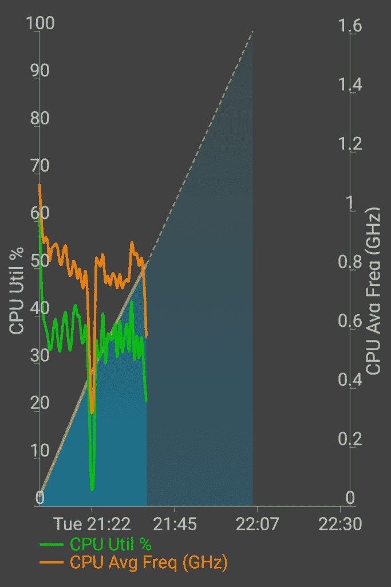
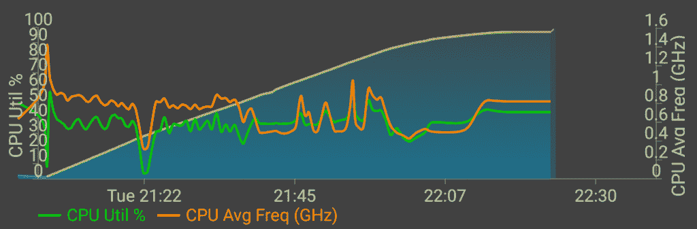
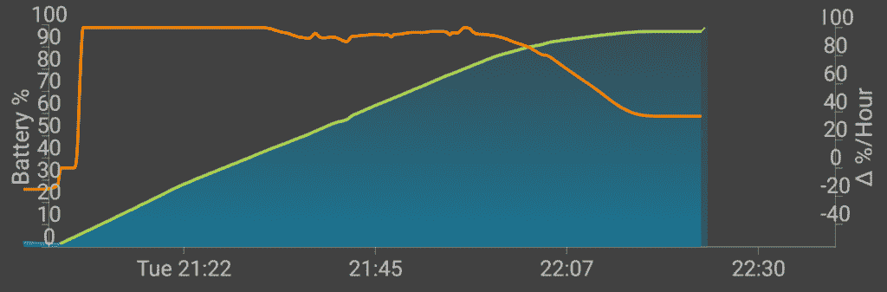
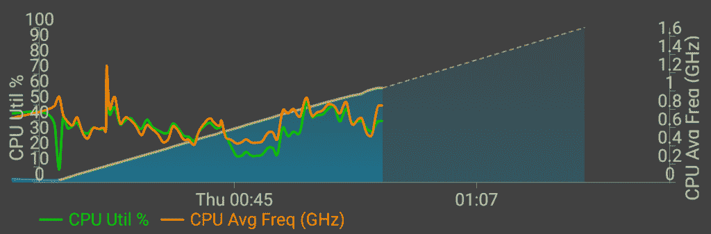
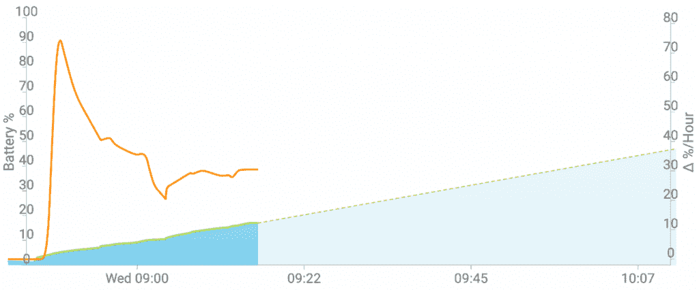

# Dash 充电速度分析:即使大量使用也能快速充电

> 原文：<https://www.xda-developers.com/dash-charge-speed-analysis-even-with-heavy-usage-your-phone-will-charge-rapidly-and-stay-cool/>

更快的充电速度已经成为原始设备制造商幸灾乐祸的一个常见规格，推动他们自己的标准和实施，以立即给你充电。如今，当一部手机充电速度不快时，它就会突出来，让人头疼。

与我们在 2015 年的其他设备中看到的快速充电 2.0 相比， [OnePlus 2](http://forum.xda-developers.com/oneplus-2) 就是这样一种情况，其[的充电时间慢得惊人](http://www.xda-developers.com/oneplus-2-xda-review/#Battery%20Life)(相对而言)。最令人沮丧的是，OnePlus 2 拥有实现更快充电标准所必需的芯片组，但出于这样或那样的原因，OnePlus 2 的所有者只剩下一个漂亮但无用的 USB Type C 端口，可以说是弊大于利。

然后是寻求纠正这一不幸的 OnePlus 3 ,再次带来了 USB Type C 端口——现在这是一个常见的地方——但采用了不同的技术，即 Oppo 的 VOOC 快速充电的修改版本。周二，[我们精确地解释了这是如何工作的](http://www.xda-developers.com/oneplus-3-dash-charging-explained-coming-to-your-custom-rom-sometime-after-july/)，也解释了为什么你(幸运地)可能会在 7 月后的某个时候在定制的 rom 中看到它。在这篇文章中，我们将省去技术细节，来谈谈我们认为在博客世界中没有得到充分解决的一些事情:*实际的用户体验*，以及为什么 Dash Charging 如此有用。你可能在它的官方演示和早期评论中听到过一些东西，但很少有人触及它最重要的功能:**无限制的充电速度**。

 我们进行了一些基准测试和真实使用测试，并辅以一些工具来标准化和图形化收费率。我们发现的结果非常令人印象深刻，特别是在用一台 [Nexus 6P](http://forum.xda-developers.com/nexus-6p) 做参考进行测试时。虽然许多人只是吹捧 Dash 充电能够在 30 分钟内达到 63%以上的电池电量(我们证实了这一点)，但其他两个独特的功能最终是这种充电标准优于大多数竞争对手的地方。首先，热量集中在充电器上，而不是手机本身。当然，如果你打算在充电时使用手机，这主要是一个问题——否则，唯一的好处是硬件寿命。当你*决定使用你的设备，或者甚至让它运行后台任务或服务时，Dash 充电真正有用的方面就开始了，比如 hotspotting，所有这些都是影响其他设备充电的使用场景。在开始之前，必须注意充电器本身确实会变得相当热:我们发现充电器本身在充电时可以达到 48°C | 118.4°F 以上。小心点！*

 然而，我们最喜欢的功能是无论手机使用情况如何，都可以全速或接近全速充电。事实上，在生活中的某个时刻，你可能会发现自己在出发或回家之前需要或想要使用手机，却发现手机电量不足，需要紧急充电。其他手机通常会在使用手机时限制充电速率，但 Dash Charging 可以以大致相同的速率给你充电，不考虑你在使用手机时用完的电池。我们进行了各种测试来衡量 Dash 充电在多大程度上实现了这一讨论中的功能，结果非常令人满意。首先，我们想测试如何在充电时使用手机，在 30 分钟内达到一加宣传的数字 *63%。在左侧，你会发现该设备在 30 分钟内以最大亮度从 **1%升至约 51%,同时在包括谷歌 Play 商店、GMail、Chrome 和 Hangouts(使用 DiscoMark)在内的应用程序中重复循环，每个应用程序都冷启动。光是这一点就很有意思了，但是快充也让它走到了最后。***

在下面的示例中，您可以看到与上面的示例相同的示例，但是持续了 30 分钟。此外，在那之后，我们继续使用该设备进行 YouTube 和 Hangouts 消息的组合(或者更确切地说，测试 liveblogging ),直到手机充满电。这项测试的最后时间(当手机达到 100%时)正好是 **1 小时 20 分钟**，唯一令人讨厌的是最后几个百分点花了更长的时间，如下图所示。

如您所见，在 30 分钟之后，CPU 在整个实时任务中保持相当活跃。下面你也可以看到变化率，很明显，手机一旦超过 80%就开始降低充电速度，正如几乎所有其他手机所预期的那样。

虽然这已经很好地展示了 Dash 充电的能力，但我们还进行了两次测试，一次更重，一次更轻。重度的那次，我们在最大亮度下玩了**沥青 8****20 分钟，把电池从 14%带到 51%** (37%的变化)。在轻量级测试中，我们在最低亮度下随意地**浏览网页** **30 分钟，将电池从 1%带到 60%** 。这非常接近一加宣传的空闲充电率，但请记住，这是低强度和最低亮度，正如上面的变化率图所示，充电在接近该点之前开始放缓。

根据这些样本，我们估计，当电池电量大约在 8%到 50%之间时，充电速度最快，80%是充电速度开始显著下降的点。我们还在 Nexus 6P 上运行了最大亮度的应用循环测试，结果非常可怜(1%到 17%)。同样值得注意的是，Nexus 6P 达到了 37°C | 98.6°F，高于它在连续 10 次 GeekBench 基准测试后累积的温度[。](http://www.xda-developers.com/oneplus-3-performance-throttling-and-thermals-analysis-redeeming-the-oneplus-2/)

* * *

我希望这说明了为什么 Dash 充电是不同的和有用的。我个人很欣赏在使用手机的同时能够以接近全速的速度为设备充电，因为我在移动中工作，在工作和大学期间都使用手机，在通勤或在校园内走动时，手机通常是我的个人热点。这是一种解放的感觉，不是每个人都会以同样的程度融入到他们的用例中，但是我相信每个人都会欣赏它。话虽如此，这并不一定会超过 Dash 充电标准对每个人的影响:如果你打算为你的 OnePlus 3 快速充电，你需要在你的充电器中使用专有技术——这意味着你会被一加(或许还有 Oppo)的充电器*和*电缆所困扰(由于某种原因，它非常粗)。

同时有这么多充电标准令人沮丧，我们正在从 microUSB 过渡到 USB Type C，但至少我们可以看到它们以自己的*特殊雪花*方式变得更加有用。在这方面，Dash 充电是苦乐参半的:受限于 OEM 的充电器会抵消你过去对快速充电电池组或充电配件的投资(我有很多)。同时，对于那些需要快速充电或不间断充电的人来说，Dash Charging 是最方便的充电技术之一。权衡利弊取决于你，但是我们希望你从这篇文章中得出一个更清晰的观点来实现这个决定。

**我们仍在为我们的全面审查而努力，我们将把我们在 RAM 、[性能](http://www.xda-developers.com/oneplus-3-performance-throttling-and-thermals-analysis-redeeming-the-oneplus-2/)、[充电](http://www.xda-developers.com/oneplus-3-dash-charging-explained-coming-to-your-custom-rom-sometime-after-july/)、[即将修复](http://www.xda-developers.com/oneplus-3-reviewer-ota-brings-srgb-mode-and-ram-adjustments/)等方面的[发现纳入其中！请继续关注 XDA 更深入的报道！](http://www.xda-developers.com/how-to-fix-the-oneplus-3s-memory-management-almost-double-the-apps-in-memory/)**

[**查看 XDA 的 OnePlus 3 论坛！**](http://forum.xda-developers.com/oneplus-3)