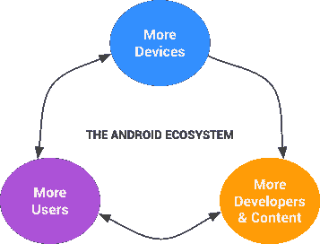

# 亲爱的 Google Play 审核团队，请不要作恶

> 原文：<https://www.xda-developers.com/dear-google-play-review-team-please-be-more-transparent/>

你是一名开发人员，你全身心地投入到应用程序中，因为你热爱编码，你想向世界展示你的劳动成果。你决定支付 25 美元注册一个 Google Play 开发者账户，并夜以继日地工作以实现这个头衔。

你终于有了一个可以发布的可接受的版本，所以你编译了 APK 并上传到 Google 的服务器上。最后，你决定点击发布，你的应用就上线了。慢慢地，随着社交媒体网站上的用户和 Android 博客开始注意到你的工作，这款应用掀起了波澜。你欣喜若狂！人们喜欢你的作品！尽管偶尔会有无用的、不值得的一星评价([每个人都有一星](https://www.youtube.com/watch?v=FYZfNZbn0SU))但你对公众对你作品的反应还是满意的。然而，有一天，你醒来时发现了一封来自 Google Play 审核团队的电子邮件:

*“发生了什么事？* *为什么我的应用被移除了？”*你当然会回信询问你的应用为什么被移除。但你再次得到一个模糊的答案，同时想知道为什么你的应用程序被下架，而你能够指出几十个，如果不是几百个，也不符合 Google Play 内容政策中这一模糊条款的应用程序。

* * *

**谷歌玩应用打地鼠**

[相当多的开发者](https://www.reddit.com/r/androiddev/search?q=removed%2Bgoogle&sort=new&restrict_sr=on&t=all)有过相当[令人沮丧的经历](https://medium.com/@joshliptzin/this-is-how-google-kills-your-app-c1abad30eb25#.b23wb4871)处理他们的应用程序被从 Play Store 下架，特别是在过去的一周 [Android 社区的许多人对谷歌移除流行的开源 4chan 浏览器](https://www.reddit.com/r/Android/comments/42qozx/clover_another_4chan_browser_removed_by_google/) [Clover](https://floens.github.io/Clover/) 感到愤怒。1 月 17 日，该应用被谷歌 Play 商店暂停，原因是“违反了内容政策中有关色情内容的规定”现在，4chan 上确实有相当多的暗示性材料(而且有些*确实是*暗示性材料),这些材料在过去曾让[其他 4chan 应用](https://partyvan4chan.wordpress.com/2014/04/15/party-van-has-been-suspended-from-google-play/?utm_source=feedburner&utm_medium=feed&utm_campaign=Feed%3A+PartyVan4chanApp+%28Party+Van+4chan+App%29)陷入麻烦。

然而，有一段时间，4chan 应用程序似乎可以通过删除所有不安全工作图片栏的默认链接来遵守谷歌关于色情内容的内容政策规定。相反，这些应用程序的开发者允许你通过手动输入董事会的名称来浏览成人内容。自 2014 年秋季首次淘汰 4chan 应用以来，一年半已经过去了，现在谷歌似乎正在对某些未能满足其内容政策的应用进行打地鼠。

什么变了？[据提起上诉的开发商](https://github.com/Floens/Clover/issues/149#issuecomment-174992326)称:

> 请参见 [#124](https://github.com/Floens/Clover/issues/124) 中的请求和 [`22ace00`](https://github.com/Floens/Clover/commit/22ace00b2166ef41587522bba7f8a3dec9d83e22) 中的添加，我添加了两个新的默认板，并对它们进行了洗牌，这样/g/就不会总是在顶部。Clover 需要硬编码一些板，因为否则当 Clover 等待 api 响应时，板列表是空的。这只有在你第一次启动 Clover 的时候才会实现。因此，在那次更新之后，它没有总是按照以下顺序排列:/g/、/v/、/a/、/co/、/int/，而是随机排列了这 7 个字母的顺序:/g/、/v/、/a/、/co/、/int/、/sp/、/tv/。
> 
> Clover 会在启动时自动加载电路板列表中的第一块电路板。而不是一直呈现/g/首先它呈现了这些中的一个/g/，/v/，/a/，/co/，/int/，/sp/，/tv/(因为现在被洗牌了)。现在我没有太多的考虑，但是/a/不是最 sfw 的板，即使它是蓝色的板。因此，有 1/7 的/a/ winding 变化位于电路板列表的顶部，并自动加载。这就是乐趣开始的时候。在上传了一个新的测试版本后，这可能就是 Clover 被暂停的原因。他们拒绝了我的上诉，理由如下:“你的应用程序描绘了具有性暗示姿势的动漫人物图像，这被认为是露骨的性内容。”所以/a/确实是罪魁祸首。

所以基本上，他是无意中把他的用户链接到了一个展示成人内容的版块(尽管版块本身*并不致力于此类内容*)。正如你们中的许多人可能已经听说的，4chan 论坛是不可预测的，那里的社区几乎张贴了他们想讨论的任何内容，其中包括不安全的工作内容。谷歌的立场有一定的道理——然而，直到开发者上诉后**,我们才发现为什么它首先被撤下！尽管如此，这并不是什么大不了的事情，尽管不必为你的作品为什么会被删除而震惊得挠头也不错！大多数开发者会接受反馈，重新上传符合内容政策的应用版本，正如 Clover 的开发者所做的那样:**

> 三叶草现在有更多的默认安全板，不再自动添加任何板。/a/和其他一些板现在被标记为 nsfw 板，所以你甚至看不到它的下拉列表。
> 
> 现在你可以说，每一个浏览器或 reddit 应用程序也应该被禁止进入 Play Store，因为你可以用它们浏览 nsfw 的材料。但问题是 Clover 并没有搜索 nsfw 的资料。如果你让用户搜索 nsfw 材料，如果他们知道 url/board code/subreddit 名称，这是没问题的，但是不要在没有任何动作的情况下呈现它。
> 
> 甚至 Google Play 也建议只上传一个带有另一个包名的新版本，这就是我要做的。很遗憾，我不能将 26 万当前用户更新到新版本，但我希望新包名的消息会传开。当我上传后，我会再给你一个更新。

然而，噩梦并没有就此结束，因为在开发者将一个看似兼容的 Clover 版本重新上传到谷歌 Play 商店的几天后，它又被移除了。然而，这一次，谷歌删除了该应用程序，因为他们*“已经确定【他的】应用程序或应用程序列表将用户链接到一个含有色情或性内容的网站。”*这位开发人员对这种推理感到非常不安，这是可以理解的，他已经开始将他的应用程序专门发布到由 [F-Droid](https://f-droid.org/repository/browse/?fdid=org.floens.chan) 托管的主要开源存储库中。所以至少这结束了一个人与另一个人的斗争。

* * *

**因为言外之意**

我希望当你读到谷歌关于移除三叶草的最终决定时，你仔细考虑了一下，因为我确实这么做了。基于 4chan 仅仅在网站的某个地方有色情材料*的事实而删除 Clover 是非常令人担忧的。Reddit 应用会有什么变化？默认情况下，NSFW 的内容在大多数 Reddit 应用程序上是被限制的，*但是在网站上偶然发现成人内容肯定不难*。Twitter、Tumblr、Imgur 和许多其他网站也是如此。这些网站中的每一个都有，或者[即将发布](https://www.reddit.com/r/Android/comments/3wexo9/sign_up_for_the_reddit_for_android_mobile_beta/)，针对“含有色情或性内容的网站”的官方申请*

许多开发者甚至不知道为什么他们的应用会被关闭

他们也会被谷歌裁掉吗？谷歌是不是有选择地瞄准 4chan 应用，而忽略了大玩家的应用？目前，至少还有其他 4chan 应用程序尚未被送到谷歌古拉格，但我们最近看到[谷歌毫无顾忌地删除违反其内容政策的应用程序，无论该公司规模有多大。](http://thenextweb.com/apps/2016/02/03/google-suddenly-removes-samsung-supported-ad-blocking-app-from-play-store/)

无论你有多强大，如果谷歌认为你的应用违反了他们的内容政策，他们可以随时删除你的应用——这有利于公平，但标准首先是有缺陷的。

> “欢迎来到 Play Store 的开发者生活。关于他们对应用程序和政策的处理有不少争议，但没有足够的媒体关注来让公众关心。”- Reddit 用户 [twigboy](https://www.reddit.com/r/Android/comments/440epz/google_suddenly_removes_samsungsupported_ad/czmmlg3?context=2) 回应谷歌撤回三星赞助的 Adblock Fast 应用

让我们先弄清楚这里的一些事情。是的，谷歌是一家私人企业，他们可以出于任何理由从自己的平台上删除内容。*是的*，谷歌 Play 商店有数不清的应用要分类，所以他们这里的客户支持有点枯燥也就不足为奇了。然而，这些理由都不能成为谷歌对开发者支持不力的借口。移动应用开发者已经在过度饱和的应用市场中遭受损失。为什么谷歌要进一步对一些开发者设置障碍，威胁他们的应用程序随时可能被删除？

他们已经要求开发者在他们的应用上设置内容分级，这还不够吗？虽然我肯定谷歌一直在努力微调他们用来自动抓取违反政策的应用程序的算法(...毕竟这是谷歌)，对于开发者来说仍然是不公平的，因为许多人依赖他们的应用程序作为主要收入来源，不得不处理自动删除和上诉过程。自从 Play Store 变得如此之大，谷歌就忽略了对其开发者的关心，而开发者对平台的成功至关重要。

* * *

**不要作恶**

我们知道你已经从你的[“不作恶”](https://en.wikipedia.org/wiki/Don%27t_be_evil)座右铭谷歌中走出来，但是也许你可以改变[“做正确的事？”](http://blogs.wsj.com/digits/2015/10/02/as-google-becomes-alphabet-dont-be-evil-vanishes/)公平地说，谷歌并不是每次删除都是含糊不清的，有些错误是被逆转的。大多数应用程序删除可能是合法的删除，但我们只看到和听到了很多出错的应用程序。甚至其中一些投诉是没有法律依据的，因为开发商可能会声称不公平的拆迁，并在决定显然是正确的时候遗漏了关于上诉的关键信息。然而，如果所有这些抱怨至少有一个共同点的话，那就是他们中的许多人都不知道为什么他们的应用程序会被关闭。与其仅仅引用应用程序被认为违反内容政策的部分，让开发人员自己去弄清楚为什么他们的应用程序被删除，为什么不直接告诉他们呢？你至少可以避免在[的某些](https://www.reddit.com/r/Android/comments/42qozx/clover_another_4chan_browser_removed_by_google/)部分[的](https://www.reddit.com/r/Android/comments/43b3i0/clover_the_4chan_browser_that_was_removed_from/)[部分](https://www.reddit.com/r/Android/comments/43slge/clover_seems_to_be_taken_off_the_play_store_again/)的部分[的](https://www.reddit.com/r/Android/comments/43tf60/clover_suspended_again_simply_because_it_links_to/)部分激起的争议，尽管你肯定[不可能赢得全部。](http://www.xda-developers.com/witch-hunts-and-wizardry/)

Android 生态系统的繁荣依赖于用户、设备制造商和开发者之间的健康平衡。这是谷歌推出的兼容性项目背后的核心理念。当开发人员大声疾呼要求更好的客户支持时，谁在听呢？处理开发者请求的一致性、透明性和快捷性是我们都将受益的东西，因为更多的开发者将会放心地把他们的时间投入到谷歌平台的开发中，而不用担心 banhammer。也许这不是谷歌要解决的首要问题，但我们当然希望随着更多的注意力被吸引到这个问题上，开发者的声音会被听到。