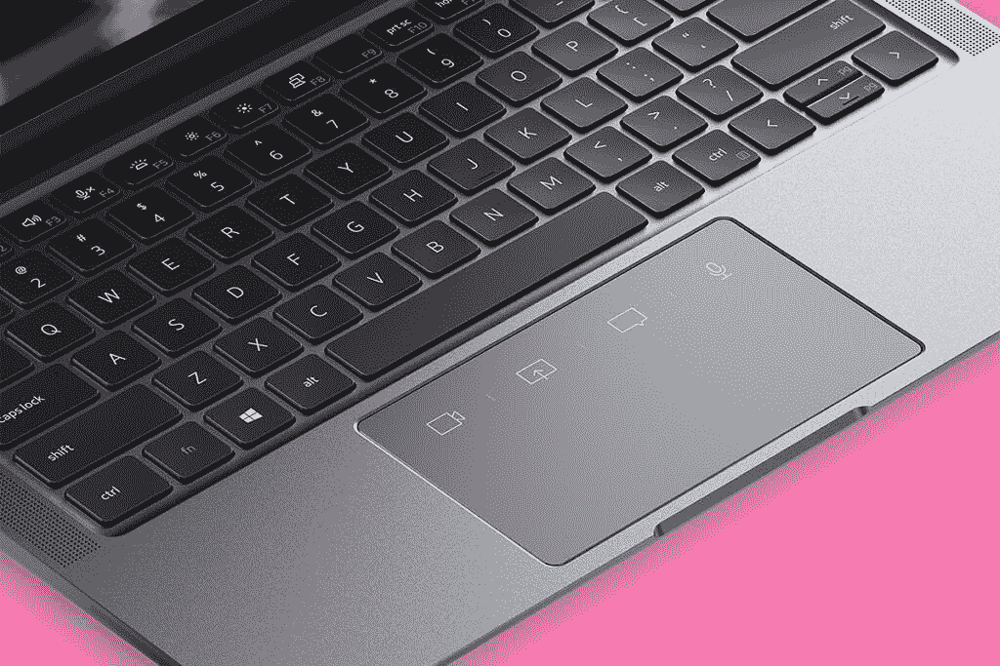
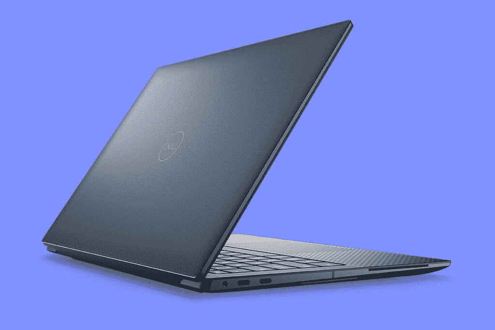
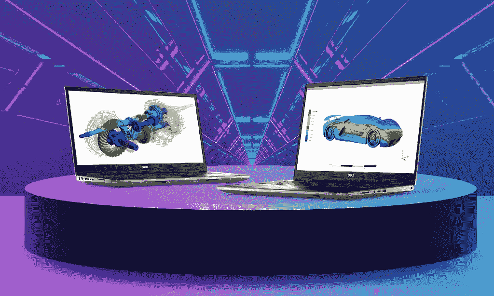

# 戴尔推出新款 13 英寸商用笔记本电脑 Latitude 9330

> 原文：<https://www.xda-developers.com/dell-13-inch-business-laptop-the-latitude-9330/>

今天，戴尔宣布推出全新的 Latitude 9330 商用变形机，以及几款新的 Precision 工作站，包括 5470 周年纪念版、7670 和 7770。

当然，抢尽风头的是 Latitude 9330，这是该系列中的第一款 13 英寸笔记本电脑。以前，相对较新的 Latitude 9000 系列包括 14 英寸和 15 英寸版本，但现在，它将改为 13 英寸和 14 英寸。

## Dell Latitude 9330

Latitude 9330 旨在将戴尔可以放入 13 英寸旗舰笔记本电脑的所有东西都打包在一起。它拥有第 12 代(U 系列)处理器，QHD+ 16:10 显示屏，4G LTE 和 5G 选项，重量为 2.8 磅。厚度仅为 8.3 毫米，是有史以来最薄的 Dell Latitude 笔记本电脑。

 <picture></picture> 

Dell Latitude 9330

它还拥有世界上第一个协作触摸板。正如您从上图中看到的，它包括 Zoom meeting 的快速访问按钮，您可以使用这些按钮来打开和关闭视频、静音或取消静音、共享屏幕或聊天。触摸板本身仍然是机械的，而不是像戴尔 XPS 13 Plus 那样的触觉触摸板。

它配备了上个月发布的新的戴尔优化器功能，例如当有人从你的肩膀上看时，可以自动模糊你的屏幕。当然，它还具有您熟悉的戴尔优化器功能，例如快速登录，当您坐在电脑前时，它会唤醒电脑，然后使用红外摄像头让您登录。

Dell Latitude 9330 将于 6 月在全球上市，价格将在接近该日期时宣布。

## Dell Precision 5470 25th 周年纪念版、7670 和 7770

 <picture></picture> 

Dell Precision 5470 Anniversary Edition

今年是戴尔 Precision 工作站问世 25 周年，因此推出了 Precision 5470 25th 周年纪念版。它有一种新的钴色，这是它与 Precision 5470 的区别，在美国限量供应。定价尚未公布。

 <picture></picture> 

Dell Precision 7670 and 7770

最后，我们推出了 Precision 7670 和 7770。与 Latitude 系列不同，Latitude 系列使用 9000 作为其高级系列(这是几年前才添加的)，高级 Latitude 机器打着 7000 的旗号。由于这些都是 16 和 17 英寸的机器，他们带来了权力。

它们配备了英特尔的第 12 代处理器，功率提高到了 55W，考虑到这些类型的机器通常使用 45W 处理器，这是令人印象深刻的。对于显卡，您将能够获得高达 NVIDIA RTX A5500 显卡和高达 128GB DDR5 内存。值得注意的是，DDR5 更经得起未来的考验，因为由于零件成本的原因，许多机器仍在装运 DDR4。

它们还配备了相对较新的 Dell Optimizer for Precision。它有新的报告和分析功能，旨在提高你在这样的机器上使用的应用类型的性能。

与今天发布的所有产品一样，Precision 7670 和 7770 还没有定价。他们即将抵达 Q2。