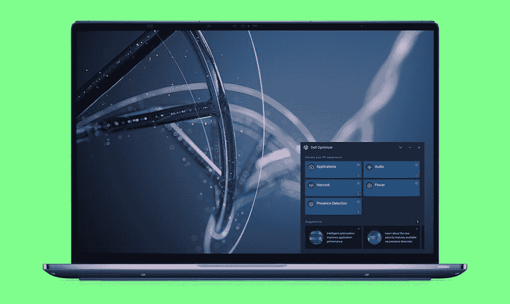
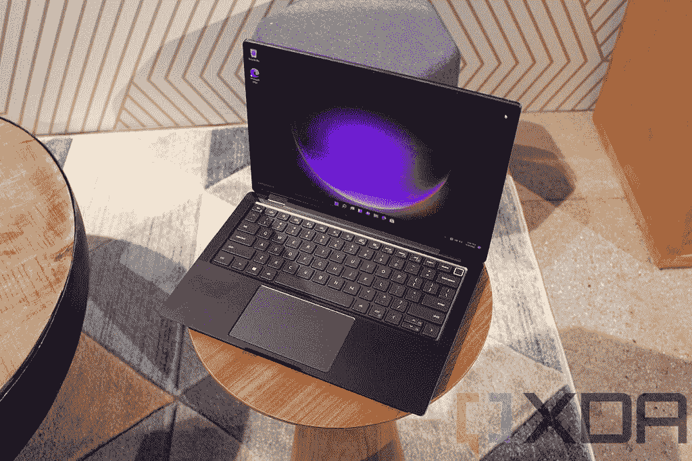
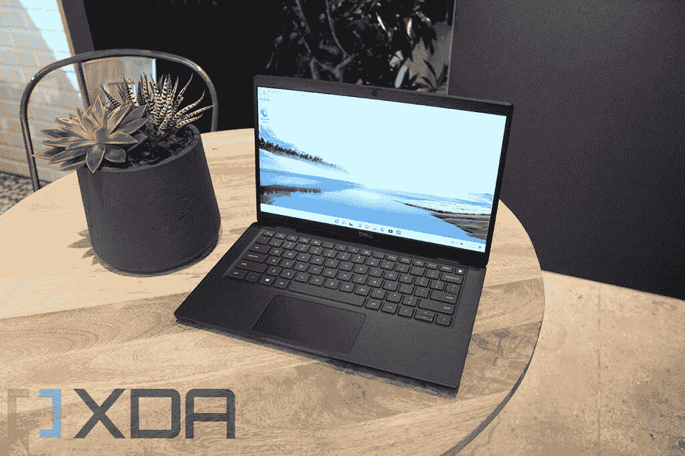
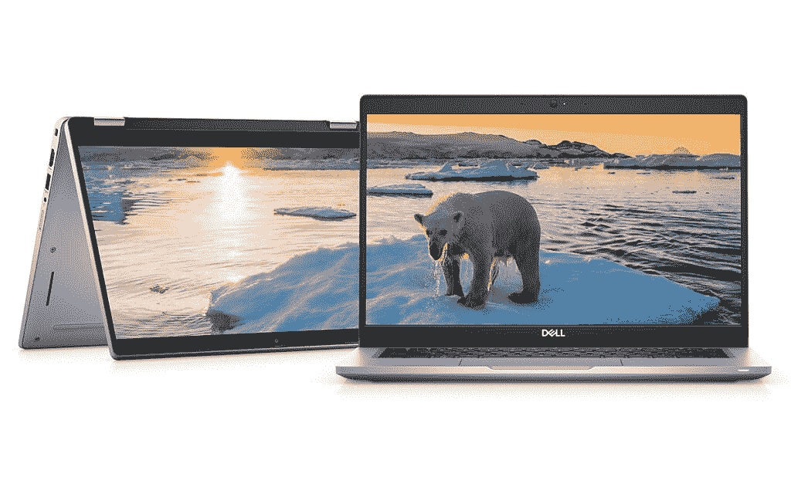

# 如果有人越过你的肩膀看，戴尔的新 Latitude 电脑会模糊屏幕

> 原文：<https://www.xda-developers.com/dell-latitude-2022-launch/>

今天，戴尔宣布推出其整个产品组合的新款 Latitude 笔记本电脑，包括 3000、5000、7000 和 9000 系列。Latitude 7330 有一个新的超轻版本，重量不到一公斤，旗舰产品 Latitude 9430 有一个新的设计，等等。当然，还有新的戴尔优化器功能。

“混合工作不再是一种事后想法或特权，而是一种标准，”戴尔技术公司客户端产品事业部总裁 Ed Ward 说道。“当员工在不同地点之间移动以完成工作时，创造高效的体验是首要任务。我们最新的商业产品组合继续将协作、智能和安全放在首位，增加投资以满足当今和未来人们的各种需求。”

## 戴尔优化器即将推出新功能

戴尔优化器是一个应用程序，包含一套用于 Latitude 产品的人工智能功能，尽管它也适用于 Precision 工作站。这是戴尔[商用电脑](https://www.xda-developers.com/best-business-laptops/)在竞争中脱颖而出的关键。您会发现 ExpressSign-in 是一项重要功能。它使用传感器来检测你何时在它面前，唤醒它，然后红外摄像头通过面部识别让你登录，让你醒来并登录到你的电脑，而无需触摸它。这只是其中一个功能，还有很多新功能。

 <picture></picture> 

Dell Optimizer

首先，戴尔优化器 3.0 将具有智能隐私功能。例如，如果它检测到有人越过你的肩膀看，它会模糊屏幕。用户也可以被提醒有人试图查看你的工作。

还包括更好的噪声消除。现在，噪音消除不仅适用于您的麦克风，也适用于传入的噪音。这样，当和你说话的人为狗叫声道歉时，你可以说你根本没听见。

最后，还有连接功能。它可以让您将有线和无线网络结合起来，而且非常智能。戴尔承诺将延迟降低 30%。

最酷的是，许多这些功能也将搭载到现有设备上。唯一不会的是那些需要新硬件的。这个想法是为了表明，如果您购买了 Latitude，它确实会随着时间的推移而增加功能。

## 新的 Dell Latitude 硬件

### Dell Latitude 9430

Dell Latitude 9430 有翻盖式和 2 合 1 两种配置，是该系列的旗舰产品。这款 14 英寸笔记本电脑旨在与惠普 EliteBook 1000 系列和联想 ThinkPad X1 系列竞争。虽然上一代产品中有一些 FHD 网络摄像头，但它现在是标准配置，16:10 显示屏也是标准配置，提供 FHD+和 QHD+选项。

 <picture></picture> 

Dell Latitude 9430

它配备了英特尔新的第 12 代 U 系列处理器，并且有一种新的金属石墨配色。与它以前的拉丝铝表面相比，它的外观很好。同样，它提供 5G 连接，这是最初的 Dell Latitude 9000 笔记本电脑的关键价值指标之一，并且电池续航时间长。

戴尔 Latitude 9430 将于 4 月上市，起价 2245 美元。

### 戴尔 Latitude 7000 系列，包括新的 Latitude 7330 超轻系列

Dell Latitude 7330 的碳纤维表面已经非常轻了，但现在又有了一款重量不到一千克的超轻机型。事实上，它的重量仅为 2.13 磅，是最小、最轻的 13.3 英寸 16:9 高级商用笔记本电脑。它也没有在端口上妥协，包装了两个 Thunderbolt 4 端口，一个 USB 3.2 Gen 1 Type-A 端口，HDMI 2.0，一个耳机插孔等等。除了减轻重量的镁合金材料之外，它几乎就是 Latitude 7330。

 <picture></picture> 

Dell Latitude 7330 Ultralight

整个系列仍采用 16:9 显示屏，在 Latitude 7330 系列中，您将获得英特尔 Alder Lake U15 处理器。Latitude 7430 和 7530 分别为 14 英寸和 15 英寸，将有一个 P 系列处理器选项，通过 28W TDP 提供更大的功率。自然，更强大的芯片需要更多的机箱空间。如果戴尔试图将它放在 13 英寸的型号中，它将不得不缩小电池。

另一个你在 13.3 英寸的 Latitude 7330 中找不到的东西是 5G。与往常一样，所有 Latitude 7000 笔记本电脑都提供 4G LTE，但您只会在 Latitude 7430 中找到 5G。

Dell Latitude 7330 Ultralight 将于 4 月上市，起价 1899 美元。Latitude 7330、7430 和 7530 也将于 4 月上市，起价分别为 1，562 美元、1，419 美元和 1，442 美元。

### 戴尔 Latitude 5000 系列

戴尔的 Latitude 5000 笔记本电脑种类繁多，比较主流。Latitude 5330、5430 和 5530 在 15 英寸型号中采用 U15 处理器和 P 系列芯片，更注重工作效率，但还有更强大的 Latitude 5431 和 5531，它们分别采用 P 系列处理器和 45W H 系列处理器。它们也都提供 4G LTE。

 <picture></picture> 

Dell Latitude 5330

该公司还吹嘘说，新的 Latitude 5000 个人电脑是迄今为止最可持续的笔记本电脑。事实上，他们建立在其概念 Luna 的努力，这是在消费电子展上宣布的。

“戴尔的宗旨是创造推动人类进步的技术。有机会为我们的后代把事情变得更好，这让我们深受鼓舞。这一点在我们设计和包装产品的新方式中显而易见，有助于减少环境影响、废物和排放，”戴尔技术公司客户端产品事业部高级副总裁 Rahul Tikoo 说道。“随着我们循环领导地位的建立，我们将更进一步——不断检查、重新检查和重新考虑产品生命周期的每一步，以便在未来提供更加可持续的产品。”

戴尔承诺笔记本电脑盖子由 71%的可回收和可再生材料组成，如造纸行业的树木生物塑料、回收碳纤维和消费后回收塑料。该基地使用 20%的回收碳纤维，脚是由蓖麻油。在风扇外壳中，您会发现 28%的海洋塑料。正如你所希望的，包装是由 100%回收或可再生材料制成的。

Dell Latitude 5330、5430 和 5530 将于 4 月上市，起价分别为 1562 美元、1419 美元和 1442 美元。Latitude 5431 和 5531 也将于 4 月上市，但该公司没有确认定价。