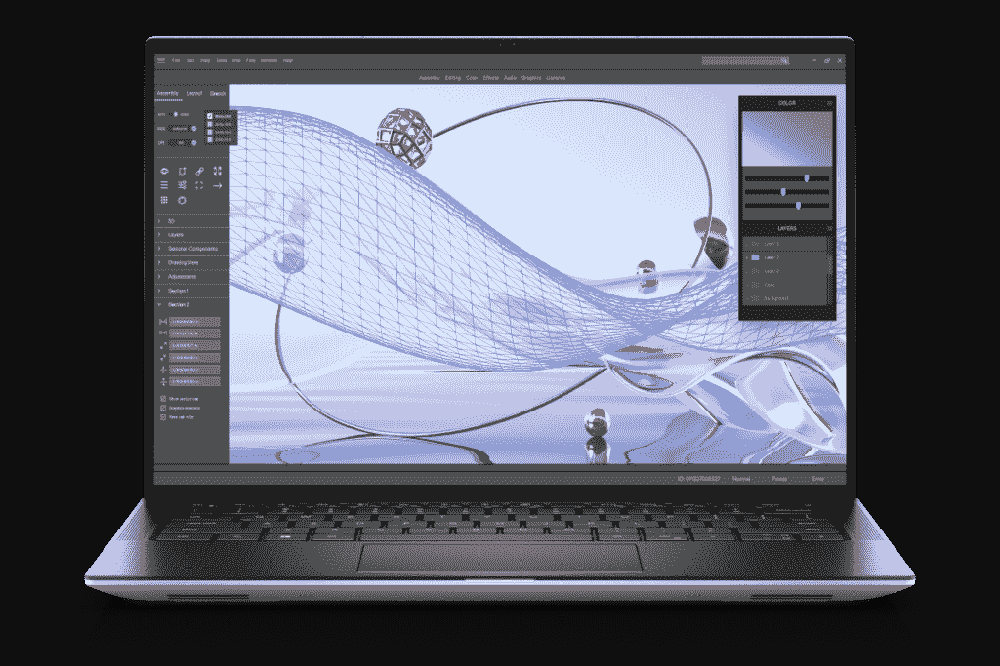
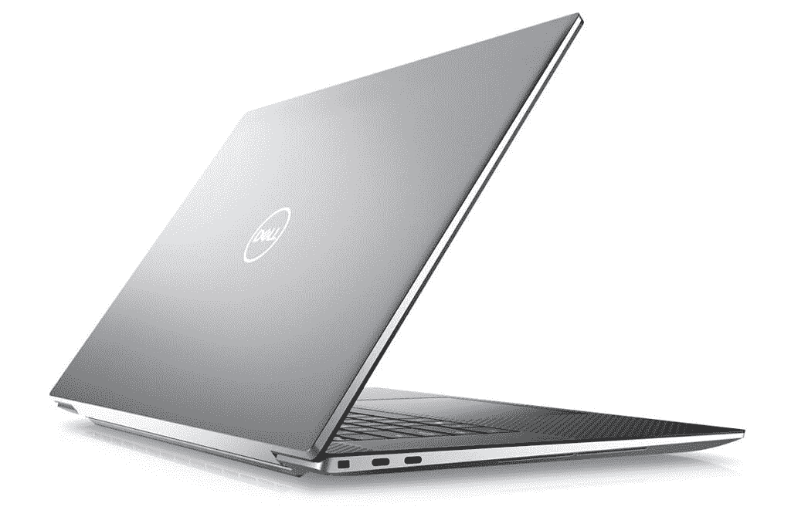
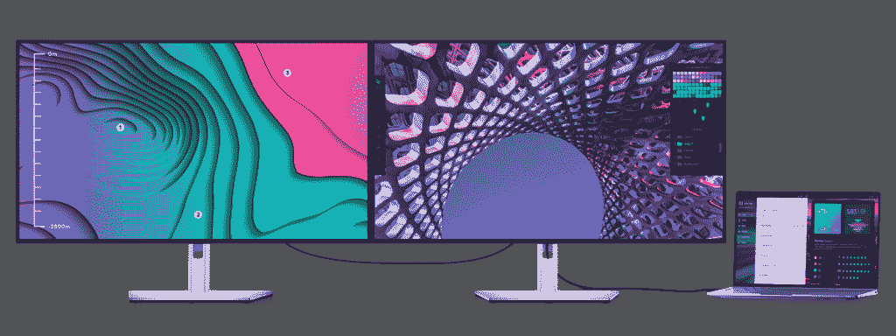
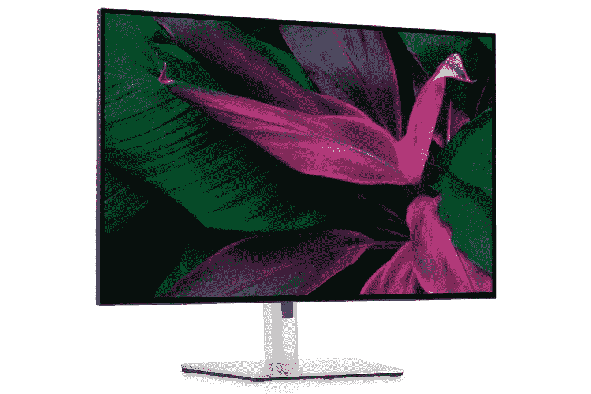

# 戴尔推出 Precision 5470，这是其最强大的 14 英寸工作站

> 原文：<https://www.xda-developers.com/dell-precision-2022-launch/>

戴尔宣布更新其 Precision 系列移动工作站，包括新的 Precision 5470，该公司称之为世界上“最小、最薄、最强大”的 14 英寸工作站。它还推出了 Dell Precision 5570 和 5770，以及 Precision 3570 和 3571。这些都是由英特尔的第 12 代处理器和专业的 NVIDIA 显卡驱动的。除了这些笔记本电脑，戴尔还为商业用户推出了新的 Latitude 系列产品。

## Dell Precision 笔记本电脑

此次展会的明星是 Dell Precision 5470，这是戴尔产品阵容中的一个新成员。它配备了英特尔第 12 代 H 系列酷睿处理器，是第一款符合英特尔 Evo 规范的处理器，同时还支持英特尔博锐技术。此外，你可以为它配置高达 NVIDIA RTX A1000 GPU，这是本月早些时候推出的[新移动 GPU 之一。此外，您还可以获得高达 64GB 的 DDR5 内存和 4TB 的内置存储空间。两个较大的型号，Dell Precision 5570 和 5770，配备了更强大的 GPUs 在 Precision 5570 上配备了 NVIDIA RTX A2000 8GB，在 5770 上配备了 RTX A3000 12GB。](https://www.xda-developers.com/nvidia-launches-rtx-creator-gpus-omniverse-cloud/)

 <picture></picture> 

Dell Precision 5470

为了保持冷却运行，戴尔设计了一种新的冷却系统，它仍然适合相对紧凑的机箱，具有两个相对的出口风扇和一个改善排气的粘合铰链体系结构。Dell Latitude 5470 起始重量仅为 3.26 磅，对于一台工作站来说是相当轻的。Precision 5570 和 5770 也是戴尔各自尺寸中最轻的工作站。

在显示屏方面，这三款笔记本电脑都有一个长宽比为 16:10 的 InfinityEdge 面板。Dell Precision 5470 具有四倍高清+分辨率，而两个较大的型号可以配置高达超高清+面板。它们还覆盖了 100%的 Adobe RGB 和 99%的 DCI-P3 色彩空间，非常适合创意工作。此外，它们支持戴尔具有旁观者检测功能的新智能隐私功能，并且戴尔 ExpressSign-In 使安全解锁笔记本电脑变得更加容易。

 <picture></picture> 

Dell Precision 5770

谈到 Precision 3000 系列，我们有 Dell Precision 3571，它也由第 12 代英特尔酷睿 H 系列处理器和高达 NVIDIA RTX A2000 8GB GPU 支持。它还配备了高达 64GB 的 DDR5 内存和 4TB 的存储空间。该显示器采用更传统的 16:9 宽高比，最高可达超高清分辨率。如果您想要电池续航时间更长的产品，precision 3570 配备了英特尔的 U15 和 P 系列处理器，而不是 H 系列，它还有可选的独立 NVIDIA 显卡，最高可配 RTX A500。

所有这些笔记本电脑都将在 4 月上市，但价格信息没有提到。

## 戴尔 UltraSharp 显示器

除了新的 Precision 笔记本电脑，戴尔今天还推出了一些外围设备，首先是新的 UltraSharp 显示器。首先，有新的戴尔 UltraSharp 32 (U3223QE)和 27 (U2723QUE) 4K 显示器，这是世界上首批使用新 IPS 黑科技的显示器。这提供了 2，000:1 的对比度，高于大多数 IPS 面板，此外，显示器覆盖 100%的 sRGB 和 98%的 DCI-P3，具有出色的色彩再现能力。它们还符合 VESA DisplayHDR 400 认证。顾名思义，它们支持 4K，总分辨率为 3840 x 2160，宽高比为 16:9。

 <picture></picture> 

Dell UltraSharp 32 4K Monitors

两款显示器都支持倾斜、侧转、旋转和高度调节，以增加便利性，并在背面提供简化的操纵杆控制。除了典型的显示输入，包括 DisplayPort 和 HDMI，显示器可以通过 USB Type-C 连接，除了显示信号，该连接还可以传输数据和高达 90W 的功率，使您的笔记本电脑保持充电状态。显示器有四个 USB Type-A 端口、一个 USB Type-C(下游)端口和 RJ45 以太网端口，所有这些端口都通过多功能一体 USB Type-C 端口连接到您的笔记本电脑。

如果您想要不那么传统的东西，Dell UltraSharp 30 USB-C 集线器显示器(U3023E)可能适合您。这是一款 30 英寸显示器，宽高比约为 16:10，分辨率为 WQXGA (2560 x 1660)，更适合工作效率。颜色方面，它仍然覆盖了 100%的 sRGB 和 95%的 P3 DCI，所以看起来会很棒。显示器支架也支持与上述两台显示器相同的所有调整，并且它具有类似的端口设置，当您通过 USB Type-C 连接到笔记本电脑时可以使用。当然，您仍然可以选择 DisplayPort 1.4 或 HDMI 1.4。

 <picture></picture> 

Dell UltraSharp 30 USB-C Hub Monitor

所有这些显示器现在都可以买到。戴尔 UltraSharp 27 4K 显示器的起价为 724.99 美元，而 32 英寸显示器的起价为 1，149.99 美元。戴尔 UltraSharp 30 USB-C 集线器显示器的起价为 1，049.99 美元。

## 戴尔外围设备

除此之外，戴尔还推出了一系列更小的外设。首先，有戴尔双充电坞站(HD22Q)，这是一个用于笔记本电脑的 USB-C 坞站，它还支持为智能手机进行 12W Qi 无线充电(外加向笔记本电脑本身提供 90W 功率)。它有 DisplayPort、HDMI、四个 USB Type-A 端口和一个 USB Type-C 端口，用于将其他外围设备连接到笔记本电脑。它将于 5 月 12 日上市，售价 368.99 美元。

此外，新的戴尔通用坞站(UD22)配有四个 USB Type-A 端口、两个 USB Type-C 端口和四个视频输出端口，因此您最多可以连接四台显示器。此外，它支持高达 96W 的功率输出。今天也有售，售价 459.99 美元。

最后，最新的戴尔 Thunderbolt 坞站(WD22TB4)配备了两个 DisplayPort 连接(外加一个带 DP 信号的 USB-C 端口)、HDMI、三个 USB Type-A 端口、一个 USB Type-C 数据端口、RJ45 以太网和两个 Thunderbolt 4 下游端口。它支持为戴尔商用笔记本电脑提供高达 150 瓦的功率，或为其他系统提供 90 瓦的功率。它将在第二季度的某个时候推出，价格为 469.99 美元。

对于会议室，戴尔宣布了超薄会议条形音箱(SB522A)和戴尔扬声器(SP3022)，两者都经过了微软团队的认证。他们有一个团队按钮来访问通知和会议，此外他们还使用 LED 灯来显示诸如是否有正在进行的呼叫、麦克风是否静音等等。另外，他们都使用人工智能来减少背景噪音，使声音更清晰。戴尔超薄会议条形音箱今天的价格为 79.99 美元，而戴尔扬声器的价格为 99.99 美元。

最后，戴尔还推出了最新版本的戴尔 premier 可充电活动笔(PN7522W)。这种新的主动笔承诺充电后的电池寿命可达 40 天，它支持 4096 级压力，并有三个可编程按钮，一个在顶部，两个在侧面。它支持蓝牙连接，可在 Windows 上快速快捷，它是世界上第一款具有磁贴集成功能的主动式笔。这样即使你把笔落在很远的地方，你也能很容易地找到它。现在售价 109.99 美元。