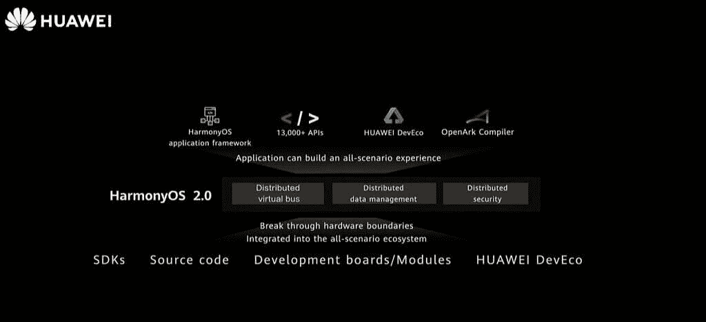

# 2020 年华为开发者大会上，开发者最感兴趣的应该是发布的公告

> 原文：<https://www.xda-developers.com/developers-hdc-together-2020/>

华为开发者大会。Together 2020 对于全球的开发者来说是一个激动人心的事件。华为将在这里发布一些与开发相关的重大公告。今年是特别激动人心的一年，发布了鸿蒙系统 2.0 和 EMUI 11。对于使用 HMS 开发应用程序的人来说，也有令人兴奋的消息。我们将回顾 HDC 给开发者带来的最激动人心的消息。在一起 2020。

点击此处观看完整的主题演讲。

## HMS 核心 5.0 更新

HMS Core 是一套开发套件，旨在帮助简化您的下一个应用程序项目。华为一直在增加这个套件集合，因为他们不断改进他们的选择。现在华为宣布 HMS Core 5.0，有很多新的强大的开发套件。如果您使用 HMS Core 进行开发，您可以访问以下所有开发套件:

## 鸿蒙系统 2.0 突破硬件界限

为华为新的鸿蒙系统平台开发比以往任何时候都更容易。智能设备有各种形状和大小，无论是手机、平板电脑、汽车还是手表，开发人员都可以为每个设备创建优化的应用程序，在鸿蒙系统 2.0 中，华为的目标是消除为不同设备重新构建应用程序的需要。硬件边界的新突破意味着你将能够只制作一个版本的应用，兼容所有设备。

 <picture></picture> 

HarmonyOS 2.0

华为表示，鸿蒙系统 2.0 将面向所有硬件制造商。这就是这个特性如此重要的原因。作为开发人员，您希望您的应用程序能够兼容尽可能多的设备。如果你为鸿蒙系统开发你的应用程序，你的应用程序现在可以在多种不同尺寸的设备和显示器上使用。从某种意义上来说，它也让你的应用程序面向未来。如果新设备以不同的形式出现，你不会发现自己回到绘图板重新设计。

开发人员现在可以利用分布式虚拟总线、分布式数据管理和分布式安全性。这使得鸿蒙系统不仅仅是安卓的替代品。而是为人工智能生活设计的分布式操作系统。

## 鸿蒙系统发展发展公司

开发人员应该对 DevEco 被用于鸿蒙系统开发感到兴奋。DevEco 是一个完整的解决方案开发工具，将帮助您轻松地为平台创建应用程序。这是一个一站式开发、编译、调试和刻录的集成解决方案。

基于芯片或开发板创建项目，使用推荐的外设驱动和特定于设备类型的应用组件，以提高生成项目代码时的效率。

 <picture></picture> 

HUAWEI DevEco Device Tool

在**[device.harmonyos.com/cn/ide](https://device.harmonyos.com/cn/ide)**了解更多关于华为 DevEco 设备工具的信息。

## HMS Go 全球联盟

过去一年，在华为的帮助下，超过 1 万款应用进入了全球市场。现在，他们宣布成立 HMS Go 全球联盟，旨在帮助像您这样的开发者将您的应用扩展到全球受众。对于希望走向海外的中国开发者来说，华为利用其在海外的大型业务，帮助这些开发者探索全球机遇。对于希望进入中国的开发者，华为提供相关的咨询服务、本地化和集成、营销和活动服务。仅去年一年，华为就帮助超过 700 款应用进入中国市场。

HMS Go 全球生态系统联盟由华为和国内其他知名公司联合成立，包括网易、完美世界、Cocos、BabyBus、网龙网络、Globalegrow、FunPlus、DO Global、VivaVideo、OPPLE Lighting、SinoInteractive、Testin。通过聚合所有这些公司的最佳能力，HMS Go 全球生态系统联盟构建了“go-global 服务能力引擎”，提供中国开发者在全球分发其应用时所需的所有服务，涵盖所有场景的产品和服务。HMS Go 全球生态系统联盟擅长解决中国应用走向全球面临的三个问题——产品本地化、本地合规和本地推广——以帮助合作伙伴在全球范围内拓展业务，同时促进生态系统的增长。

如果您是一名开发人员，并且想要申请该计划，请使用此处的信息[向华为发送电子邮件。](https://consumer.huawei.com/en/partners/go-global/)

HDC 还有更多内容和大量其他主题演讲可供探索。在一起 2020。请务必关注活动，并在官方活动页面[点击](https://developer.huawei.com/consumer/en/events/hdc2020/)观看现场直播。

###### 我们感谢华为赞助这篇文章。我们的赞助商帮助我们支付与运行 XDA 相关的许多费用，包括服务器成本、全职开发人员、新闻撰稿人等等。虽然您可能会在门户内容旁边看到赞助内容(这些内容将始终被标记为赞助内容),但门户团队对这些帖子不承担任何责任。赞助内容、广告和 XDA 仓库完全由一个独立的团队管理。XDA 绝不会通过接受金钱来赞扬一家公司，或以任何方式改变我们的观点或看法，从而损害其新闻诚信。我们的意见不能被收买。