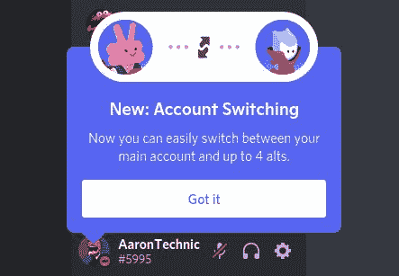

# Discord 的新帐户切换器可以让你轻松地在多个帐户之间切换

> 原文：<https://www.xda-developers.com/discord-account-switcher-rolling-out/>

# Discord 开始为拥有多个账户的用户推出易于使用的账户切换器

Discord 已经开始推出帐户切换器功能，我们在去年 10 月的一次拆解中发现了这一功能。请继续阅读，了解更多信息。

去年 10 月，我们[在 Android 版 Discord 应用](https://www.xda-developers.com/discord-may-let-you-switch-between-accounts/)的拆解中发现了一个即将推出的功能。该功能旨在帮助用户向 Discord 应用程序添加多个帐户，并在它们之间无缝切换。它现在已经开始向用户推出，下面是它的工作原理。

此前，Discord 应用程序不允许用户使用多个帐户登录。如果你想向应用程序添加另一个帐户，你必须先注销当前帐户。这使得在应用程序上切换账户变得很麻烦。通过其新的帐户切换器，Discord 应用程序现在可以让你添加多个帐户，只需轻按几下就可以在它们之间切换。该功能已经开始向一些用户推出，但正如在一个新的常见问题页面中指出的那样，它目前只对少数用户可用。如果你是少数幸运者，当你打开应用程序时，你应该会在右下角看到一个新的帐户切换弹出窗口(见附件截图)。

 <picture></picture> 

Credit: u/AaronTechnic

要使用该功能，只需点击左下角的头像图像，然后选择新的“切换帐户”选项。点击溢出菜单中的“管理账户”,然后添加更多账户。您可以使用帐户切换器登录五个帐户。一旦完成，当你点击“切换账户”选项时，你应该会看到你所有的账户。点击任何一个账户都会立即切换到那个账户。

请注意，帐户切换器不会向其他用户显示您要切换到的帐户。在帐户之间切换时，某些偏好设置可能不会存储，包括一些外观设置。

目前，还不清楚该功能是否会在所有平台上推广到 Discord 应用程序。我们可以确认它在 Windows 的 Discord 应用程序上可用，但目前在我们的任何 Android 或 iOS 设备上都不可用。

* * *

**来源:** [不和](https://support.discord.com/hc/en-us/articles/4412732047127-Discord-Account-Switcher-FAQ)

**Via:**Reddit

*感谢 XDA 资深会员 [Some_Random_Username](https://forum.xda-developers.com/m/some_random_username.8234677/) 的提示！*