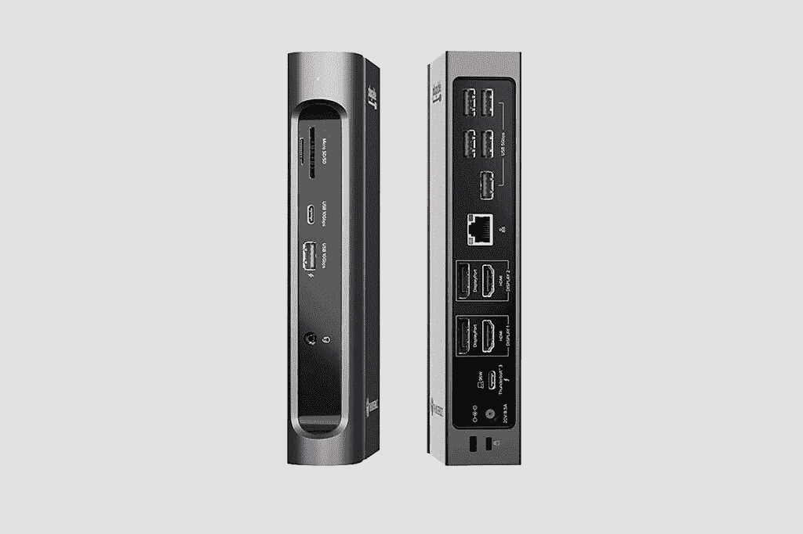
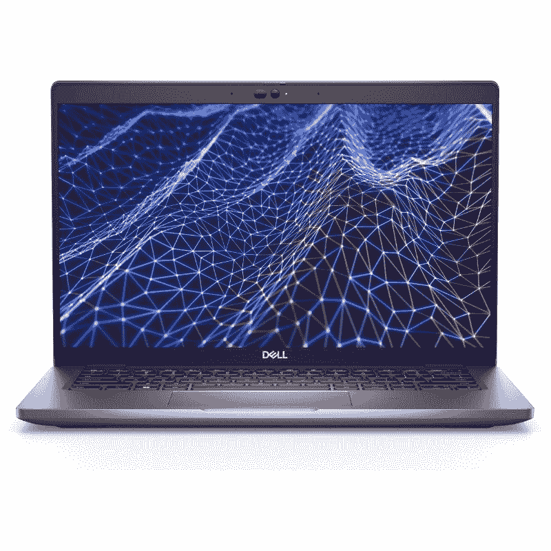

# 戴尔 Latitude 5430 有迅雷吗？你需要它吗？

> 原文：<https://www.xda-developers.com/does-dell-latitude-5430-thunderbolt/>

戴尔最近推出了 Latitude 系列的一系列笔记本电脑，包括更主流的 Latitude 5430。这在很大程度上是一款[商务笔记本电脑](https://www.xda-developers.com/best-business-laptops/)，这意味着除了可维修和可升级的设计之外，您还可以获得英特尔博锐处理器、Windows 11 Pro 等功能。商务笔记本电脑往往擅长的另一件事是连接，这也不例外。如果您想知道 Dell Latitude 5430 是否支持 Thunderbolt，那么您很幸运，它支持 Thunderbolt，您甚至可以获得两个端口。这两个端口都是 Thunderbolt 4，这是目前可用的最新版本。

## 你为什么需要 Thunderbolt 支持？

Thunderbolt 的重要性可能不是每个人都能立即意识到的，但我们是来提供帮助的。Thunderbolt 是由英特尔开发并授权的接口，除了供电之外，它还可以通过 USB Type-C 端口实现非常高带宽的数据传输。最新版本的 Thunderbolt 4 提供 40Gbps 的带宽，这是个人电脑声称支持 Thunderbolt 4 的最低要求。

一个 Thunderbolt 信号可以承载传输文件，连接外部显示器，甚至使用[外部 GPU](https://www.xda-developers.com/best-external-gpus-for-your-laptop/)的数据。是的，你可以在笔记本电脑外面安装一个 GPU，并使用 Thunderbolt 端口连接它。借助 Thunderbolt，您可以将 Dell Latitude 5430 用于游戏或密集型创造性工作负载，即使笔记本电脑本身只集成了英特尔显卡。

 <picture></picture> 

Plugable TBT3-UDZ Thunderbolt 3 Docking Station

不仅如此，您还可以使用 Thunderbolt dock 连接大量外围设备，而只需使用笔记本电脑上的一个端口。扩展坞并不完全基于 Thunderbolt，但由于高带宽，Thunderbolt docks 可以连接多个高速外设，甚至可以同时为两个 4K 显示器供电，所有这些都通过笔记本电脑上的一个端口实现。他们甚至可以给你的笔记本电脑充电。

除此之外，还有一些外围设备，如显示器和某些外部存储设备使用 Thunderbolt 作为其接口，因此它们支持极高的速度。使用 Dell Latitude 5430 上的两个 Thunderbolt 端口之一，所有这些都是可能的。

## Dell Latitude 5430 上还有哪些端口？

虽然当您使用坞站或其他 Thunderbolt 外设时，Thunderbolt 4 可以提供极大的灵活性，但戴尔仍然确保您在 Latitude 5430 上有其他选择。除了两个 Thunderbolt 4 端口，你还可以获得两个 USB Type-A 端口、HDMI、千兆以太网、一个 microSD 读卡器和一个耳机插孔，所以你拥有所有的基本功能。如果你没有任何花哨的迅雷配件，你仍然可以连接所有你需要的基本外设。

当然，作为一台商务笔记本电脑通常意味着你可以获得蜂窝支持，这里也是如此。Dell Latitude 5430 可以配置可选的 4G LTE，支持 LTE 的配置还将包括 nano-SIM 卡插槽。

* * *

如果您还没有，可以使用以下链接购买 Dell Latitude 5430。与 Latitude 系列一样，它在处理器、RAM、存储、显示器等方面提供了广泛的配置选项。它可能看起来不像现在市场上的一些最好的笔记本电脑那样昂贵，但它对于需要可靠性和可维修性的商业用户来说是理想的。

 <picture></picture> 

Dell Latitude 5430

##### Dell Latitude 5430

Dell Latitude 5430 是一款高度可配置的商用笔记本电脑，采用第 12 代英特尔处理器。它有两个 Thunderbolt 4 端口，这使它更加通用。