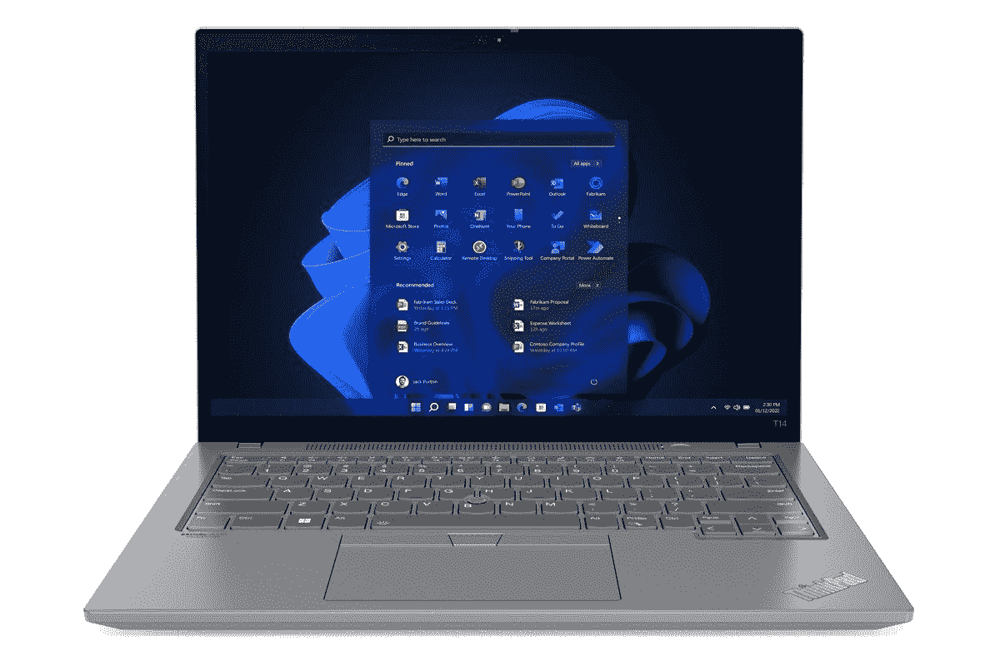

# 联想 ThinkPad T14 Gen 3 运行 Linux 吗？你能安装它吗？

> 原文：<https://www.xda-developers.com/does-lenovo-thinkpad-t14-gen-3-run-linux/>

ThinkPad T14 Gen 3 T1 是联想 2022 年最主流的 T2 商务笔记本电脑 T3，它的一些功能对这个市场非常有吸引力。与去年的型号相比，最大的改进可以说是显示屏，现在具有更高的 16:10 宽高比，这对生产力来说是非常棒的。当然，也有更强大的处理器，更好的网络摄像头等等。像大多数笔记本电脑一样，联想 ThinkPad T14 Gen 3 开箱即可运行 Windows 11，但如果你想使用 Linux 呢？好消息和坏消息都有。

坏消息是，与联想的其他一些商务笔记本电脑不同，你不能选择购买开箱安装 Linux 的 ThinkPad T14 Gen 3。像 ThinkPad X1 Carbon Gen 10 这样的笔记本电脑给了你这样的选择，但这个没有。好消息是，这并不意味着你根本不能运行 Linux。事实上，在 Windows 上运行 Linux 应用程序现在是可能的，这可能非常令人兴奋。

## 使用 Linux 的 Windows 子系统

在 Windows 10 以及随后的 Windows 11 中，微软为 Linux 添加了一个叫做 Windows 子系统的东西。这使得在 Windows 中运行 Linux 发行版成为可能，并且您可以很容易地从微软商店安装 Ubuntu、Kali Linux 和其他 Linux 发行版。为此，您需要启用 Linux 的 Windows 子系统可选功能，这可以通过在开始菜单中搜索**打开或关闭 Windows 功能**来实现。或者，你可以[从微软商店](https://apps.microsoft.com/store/detail/windows-subsystem-for-linux-preview/9P9TQF7MRM4R)安装 Linux 预览版的 Windows 子系统，这实际上可能更容易。

一旦您启用了这个特性(需要重启)并安装了您喜欢的 Linux 发行版，您就可以使用它来运行所有种类的 Linux 应用程序。最初，它只能运行基于 CLI 的应用程序，但有了 Windows 11，你实际上也可以运行 GUI 应用程序。操作系统本身仍然是基于文本的，所以你不会看到典型的 Linux 桌面，但你运行的应用程序可以有一个图形界面，它们就在你的 Windows 应用程序旁边打开。

 <picture></picture> 

Linux apps running on Windows 11

我们会说这是在 Windows 上运行 Linux 应用程序的最佳方式，因为你不必冒任何风险去修补你当前的操作系统安装或管理分区。它无风险且易于安装-

## 在联想 ThinkPad T14 Gen 3 上安装 Linux

如果您真的想切换到获得完整的 Linux 体验，您有这个选择，您可以通过两种方式之一来实现。最没有风险的方法是使用虚拟机(VM ),它在 Windows 中模拟您选择的 Linux 发行版。这听起来可能类似于 Linux 的 Windows 子系统，但它实际上为您提供了您想要的发行版的完整 Linux 桌面，并且您可以获得与您的 Linux 应用程序更一致的体验。你可以使用 Windows 11 Pro 内置的 Hyper-V 功能，或者使用 VMware Workstation Player 之类的程序，然后下载你喜欢的 Linux 发行版的 ISO 文件，比如 [Ubuntu](https://ubuntu.com/download/desktop) 。我们已经有了关于[如何创建 Windows 11 虚拟机](https://www.xda-developers.com/how-to-install-windows-vm/)的指南，如果你也想创建一个 Linux 虚拟机，过程通常是相似的。

如果您想以完全的本机性能运行 Linux，或者完全脱离 Windows，事情会有点棘手，但这肯定是可能的。令人欣慰的是，Linux 社区在确保大多数设备与 Linux 兼容方面做得很好，而且为您的笔记本电脑获取驱动程序相对容易，因此一切正常。如果你只是想尝试 Linux，而不是完全摆脱 Windows，我们有一个关于如何在同一台 PC 上双启动 Linux 和 Windows 11 的指南，这样你就可以随时使用你喜欢的操作系统。如果这样做之后，你想让 Linux 成为你唯一的操作系统，你可以删除 Windows 分区(确保备份你的数据),这样你就只有一台 Linux PC 了。

有一点需要注意的是，对于 Linux 的任何问题，你都无法从联想获得支持。这款笔记本电脑不与 Linux 一起销售，因此也不支持 Linux。如果你真的那么想安装 Linux，你可能已经知道如何使用 PC 了，而且很有可能你会弄清楚，但是这是需要记住的。

* * *

关于你能否在联想 ThinkPad T14 Gen 3 上运行 Linux，你只需要知道这些。虽然我们认为大多数用户可能会在 Windows 11 上运行 Linux 应用程序，但也有充分的理由完全切换到 Linux，所以你有这个选择。你这样做可能会冒一些风险，但可能性是存在的。

你可以购买下面的联想 ThinkPad T14 Gen 3，尽管在撰写本文时只有英特尔驱动的型号可用。如果你对装有 Linux 操作系统的笔记本电脑感兴趣，你可能想看看联想生产的其他 ThinkPads 产品，因为它们中的一些可以直接通过 Ubuntu 下载。你可能还想查看一下[最佳笔记本电脑](https://www.xda-developers.com/best-laptops/)，看看有没有更多选择。

 <picture></picture> 

Lenovo ThinkPad T14 Gen 3

##### 联想 ThinkPad T14 Gen 3

联想 ThinkPad T14 Gen 3 是一款商务笔记本电脑，采用英特尔第 12 代或 AMD 锐龙 6000 处理器。默认情况下，它不运行 Linux，但是如果你喜欢那个操作系统，有办法让它工作。