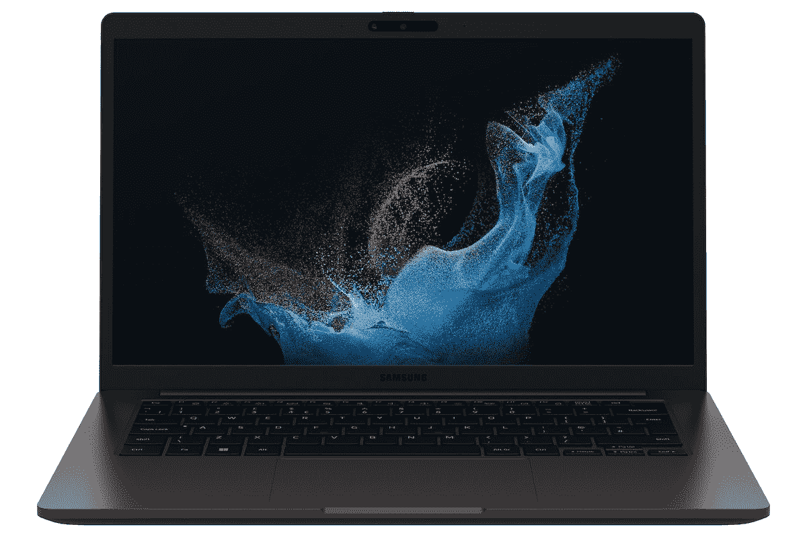

# 三星 Galaxy Book 2 商家保修好吗？

> 原文：<https://www.xda-developers.com/does-samsung-galaxy-book-2-business-good-warranty/>

三星最近推出了 [Galaxy Book 2 Business](https://www.xda-developers.com/samsung-galaxy-book-2-business/) ，这是其第一款专用的[商务笔记本电脑](https://www.xda-developers.com/best-business-laptops/)。它采用英特尔第 12 代 P 系列处理器，除了您所期望的所有安全和管理功能之外，还具有经典的可升级设计，是需要新笔记本电脑的企业的可靠选择。但企业欣赏的另一件事是良好的保修服务，那么三星 Galaxy Book 2 业务如何堆叠？嗯，这取决于你愿意花多少钱。

开箱后，三星的大多数商务产品都附带标准的一年保修，这意味着如果笔记本电脑在第一年内出现故障，您可以获得维修或更换。三星尚未公布针对 Galaxy Book 2 业务的保修信息，但一年是几乎所有电子设备的标准，所以这很可能是你得到的。但是，如果你想要更多，你也可以看看三星 Care+ for Business，这是一种针对三星 Galaxy Book 2 Business 以及其他[三星笔记本电脑](https://www.xda-developers.com/best-samsung-galaxy-laptops/)的延长保修服务。

## 延长您的三星 Galaxy Book 2 商务保修

Samsung Care+是三星的延长保修服务，企业客户可以获得专门版本的服务，使他们能够在设备出现问题时保持正常运行。Samsung Care+ for Business 提供长达五年的保修服务，让您长时间高枕无忧。这与大多数其他面向业务的保修服务提供的服务是一致的。

三星在 Care+ for Business 下提供了一系列服务包，因此您可以选择更适合您需求的服务包。有一个延长保修计划，可以更长时间地覆盖设备缺陷导致的机械故障，或者一个意外损坏保护计划，也包括液体和跌落导致的损坏。

对于大型企业，还有车队维修和车队更换选项，这些选项包括相同的覆盖范围，但适用于大量设备(至少 1000 台)。车队更换计划甚至可以通过次日发货来更换损坏的设备。

除了保修服务本身，如果您的设备需要任何帮助，三星还提供高级技术支持计划。所有这些计划的定价只能通过直接联系三星获得，并且取决于您试图保护的设备数量。不过，至少你有选择权。

* * *

这就是关于三星 Galaxy Book 2 业务保修选项的所有信息。默认情况下，您可以获得相当标准的保修服务，但如果您想再高枕无忧几年，您可以获得 Samsung Care+。

如果你还没有，你可以直接从下面的三星购买三星 Galaxy Book 2 业务。目前，你仍然需要与三星代表联系进行购买，但很快你就可以直接在网上购买，就像其他 Galaxy Book 型号一样。如果你不相信，也许可以看看你今天能买到的最好的笔记本电脑。

 <picture></picture> 

Samsung Galaxy Book 2 Business

##### 三星 Galaxy Book 2 商务版

三星 Galaxy Book 2 Business 是一款商用笔记本电脑，采用支持博锐技术的英特尔第 12 代 P 系列处理器，具有您所期望的所有安全和管理功能。您还可以获得延长保修服务。