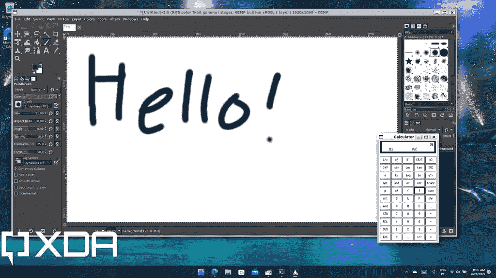

# 三星 Galaxy Book 2 业务运行 Linux 吗？

> 原文：<https://www.xda-developers.com/does-samsung-galaxy-book-2-business-run-linux/>

市场上绝大多数笔记本电脑都运行某种版本的 Windows 操作系统，如果你想购买价格较高的产品，MAC 电脑是一个受欢迎的选择。然而，你不常见到的是基于 Linux 的笔记本电脑。因此，如果你正在考虑新的三星 Galaxy Book 2 业务，你可能会有兴趣知道它是否可以运行 Linux。好消息是技术上可以，但坏消息是你不能这样买。

正如你可能预期的那样，三星 Galaxy Book 2 商务版自带了 [Windows 11](https://www.xda-developers.com/windows-11/) Pro。Windows 11 Pro 包括许多专为企业设计的可管理性和安全性功能，正如我们提到的那样，Windows 更受欢迎。但是，如果您需要访问某些 Linux 应用程序或功能，您可以选择。

## 用于 Linux 的 Windows 子系统

首先要知道的是，Windows 11(以及之前的 Windows 10)附带了一个叫做 Linux Windows 子系统的东西。你可以有效地在 Windows 11 上安装 Linux 发行版，并在 Windows 内部使用 Linux。为此，您需要启用 Linux 的 Windows 子系统可选功能——您可以通过在开始菜单上键入**打开或关闭 Windows 功能**来实现。这将向您显示可选特性的列表，包括 Linux 的 Windows 子系统。或者，你可以从微软商店[安装 Linux 预览版的 Windows 子系统](https://www.microsoft.com/store/productId/9P9TQF7MRM4R)。

 <picture></picture> 

Linux Calculator and Linux version of GIMP running on Windows 11

重启后，你可以在微软商店上找到 Linux 发行版，包括 Ubuntu、Kali Linux、SUSE 等。然后，您可以在任何时候运行 Linux 终端，甚至可以安装在 Windows 内部运行的 Linux GUI 应用程序。不再需要安装 Linux 来代替 Windows 了。

## 在三星 Galaxy Book 2 Business 上安装 Linux

如果您真的想试用特定版本的 Linux 并获得完整的体验，您可以考虑将它安装在虚拟机中。Windows 11 Pro 内置了对 Hyper-V 的支持，允许您通过虚拟化运行其他操作系统。这些不会以最高的性能运行，但是它们仍然可以用于大多数任务。你可以从他们的官方网站上下载你最喜欢的 Linux 发行版的 ISO 文件- [Ubuntu](https://ubuntu.com/download/desktop) 是一个受欢迎的选项。然后，您可以使用 Hyper-V 基于该 ISO 文件创建一个虚拟机。我们已经解释了如何在过去创建一个 Windows 11 虚拟机，但对于其他操作系统来说，这个过程通常是相似的。

你可以尝试的另一个选择是在 Windows 11 旁边双启动 Linux。这允许你以完全的本地性能运行两个操作系统，但是你必须重启电脑才能在它们之间切换。然而，如果你想看看 Linux 是什么样的，这是一个相当容易和安全的方法。我们有一个关于如何双启动 Linux 和 Windows 11 的指南，如果你想走这条路，我们建议你去看看。如果你想完全替换 Windows，或者删除 Linux，你可以随时备份你的数据并删除你不想再使用的分区。

这样做的风险是，如果你决定走这条路，你可能无法获得三星的支持。毕竟，Linux 没有得到官方支持。

* * *

这就是关于在三星 Galaxy Book 2 业务上使用 Linux 的所有信息。是的，有些不幸的是，你不能从盒子里拿出来，但如果你真的想，你可以运行 Linux 应用程序或自己安装 Linux。这只是市场的现状，因为 Windows 如此受欢迎，所以许多应用程序都是为它设计的。

如果想购买三星 Galaxy Book 2 业务，可以在下面购买。如果你还不相信，你可能想看看今天能买到的最好的商用笔记本电脑。其中一些确实给了你选择 Linux 的机会。如果你不一定想要一台商务笔记本电脑，也许可以看看我们列出的[最佳三星笔记本电脑](https://www.xda-developers.com/best-samsung-galaxy-laptops/)或[最佳笔记本电脑](https://www.xda-developers.com/best-laptops/)，看看你是否能找到你喜欢的东西。

 <picture></picture> 

Samsung Galaxy Book 2 Business

##### 三星 Galaxy Book 2 商务版

三星 Galaxy Book 2 Business 专为工作而设计，采用经典设计和第 12 代英特尔博锐处理器。

* * *

由拉里·尤因和西蒙·布迪格设计的 Linux Tux 标志在[知识共享](https://en.wikipedia.org/wiki/en:Creative_Commons "w:en:Creative Commons") [CC0 1.0 通用公共领域专用](https://creativecommons.org/publicdomain/zero/1.0/deed.en)下可用。