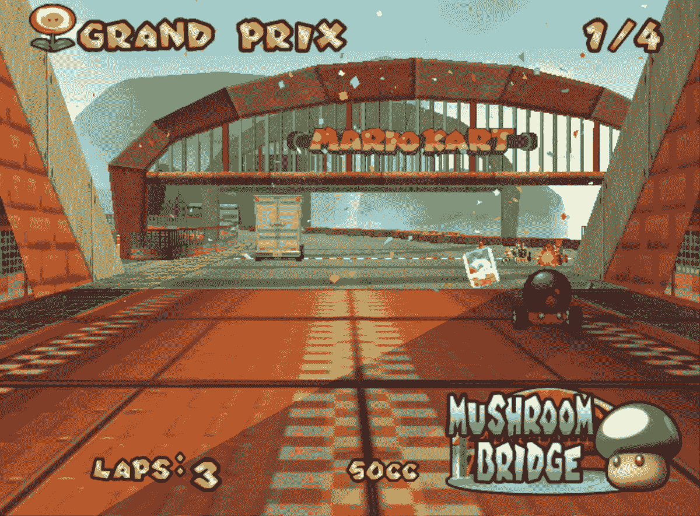

# 海豚模拟器 Android 更新增加了新的保存状态插槽，修复了图形故障

> 原文：<https://www.xda-developers.com/dolphin-emulator-android-update-bug-fixes/>

Android 开源特性的另一个好处是对视频游戏模拟器的强大支持，即模拟游戏控制台硬件的软件。由于开发社区的努力，你可以在 Android 手机、平板电脑和机顶盒上玩任天堂 DS 游戏、PSP 游戏，甚至任天堂 Wii 游戏，前提是它们有足够强大的硬件。

对于 GameCube 和任天堂 Wii 游戏来说，[海豚模拟器](https://www.xda-developers.com/dolphin-browser-beta-with-dolphin-engine-now-available/)无疑是最好的解决方案。但令人恼火的是，它在 Android 上有大量的错误，包括缺少用户界面选项和如果你不小心按下硬件键就会重新加载游戏的倾向。这使得它在某些情况下几乎无法使用，但幸运的是，这些问题和更多的问题已经在最新的更新中得到解决。

* * *

## Android 版海豚模拟器的变化

### 改进的保存状态行为

Dolphin Emulator 现在每当你切换应用程序时都会使用一个特殊的 savestates 插槽，防止你在模拟器发送到手机上运行应用程序的后台时丢失进度。现在，当你在无意中点击了导航键或物理 home 键后返回 Dolphin 时(这相对容易做到——Dolphin 的按钮布局非常接近屏幕的边界)，它会重新加载保存状态。

### 紧急警报支持

当你安装一个 WiiWare 和虚拟控制台 WADs 时，Dolphin Emulator 中会出现 PanicAlerts，WADs 指的是一堆东西。这些“东西”包括横幅、一张“票”(向系统验证应用程序)和游戏内容。如果你试图安装一个没有任天堂签名的 WAD，应该会出现恐慌警报。Android 版 Dolphin 的问题是 PanicAlert 支持被意外遗漏，导致无法在 Android 上启动 WADs。这是固定的-恐慌警报和其他 wad 应该显示在海豚机器人现在。

### 多磁盘支持

 <picture></picture> 

Source: Dolphin

Android 版 Dolphin 现在支持需要多张光盘的游戏，如*合金装备:双头蛇*和*生化危机 4* 。之前 Dolphin 不支持磁盘交换，也不允许你在提示换盘之前保存。现在，它可以在手机和 Nvidia Shield 电视上正常工作。

### 引入了双源着色器混合

为改善 Dolphin 的 GameCube 图形渲染管道而实施的一种方法在一些 Android 设备上得不到正确的支持，并且这种回退(一种不准确的着色器混合方法)导致了图形损坏。令人欣慰的是，这个问题已经得到了解决，增加了双源混合，从而提高了图形质量，减少了破损纹理。

你可以在下面的 Dolphin 网站上查看博客文章，以获得完整的变化列表。如果你有兴趣，一定要试试 Dolphin for Android！

* * *

[**来源:海豚模拟器博客**](https://dolphin-emu.org/blog/2018/02/03/dolphin-progress-report-january-2018/)