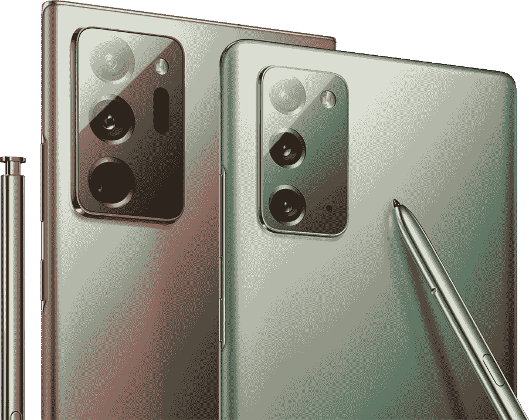

# 以下是你不应该购买普通 Galaxy Note 20 的原因

> 原文：<https://www.xda-developers.com/dont-buy-regular-galaxy-note-20/>

今年的三星 Unpacked 见证了一系列设备同时上市。从[三星 Galaxy Z Fold 2](https://www.xda-developers.com/samsung-galaxy-z-fold-2/) 到新推出的 [Galaxy Note 20 系列](https://www.xda-developers.com/samsung-galaxy-note-20/)，已经有了 *lot* 。然而，有一个强有力的理由表明，没有人应该购买普通的 Galaxy Note 20。三星 Galaxy Note 20 Ultra 只比普通 Note 20 贵 300 美元，那么普通 Note 20 值吗？我认为这可能不是，除非你精打细算，但绝对必须有一张便条。

 <picture></picture> 

Samsung Galaxy Note 20 Ultra | $1,299.99

**XDA 论坛:[三星 Galaxy Note 20](https://forum.xda-developers.com/galaxy-note-20) || [三星 Galaxy Note 20 Ultra](https://forum.xda-developers.com/galaxy-note-20-ultra)**

## Galaxy Note 20 对于一款 1000 美元的旗舰来说有很多妥协

无论如何，999 美元对于智能手机来说都是一个很高的价格。不管规格和竞争对手提供什么，999 美元都是一大笔钱，所以最大化你从中获得的价值是有意义的。考虑到价格标签，许多人希望将旗舰智能手机保留几年，这通常是购买旗舰智能手机而不是中端智能手机的主要理由之一。

不过三星 Galaxy Note 20 做出了很多妥协。可以说，这些妥协远远超出了如此昂贵的智能手机应该做出的让步，尤其是在价格较低的智能手机往往更具冲击力的情况下。

在三星 Galaxy Note 20 的例子中，你不可否认地获得了很多笔记系列的体验。您将获得带 Air Actions 的闪亮新 S-Pen、无线 DeX，以及 Exynos 990 或骁龙 865+中的旗舰芯片组，具体取决于您所在的地区。然而，你也错过了很多东西。回想一下 2020 年已经发布的旗舰产品，即使只是智能手机，如价格比 Galaxy Note 20 低 100 美元的一加 8 Pro T1。

在一加 8 Pro 的情况下，你没有获得任何 Galaxy Note 特有的功能，但 S-Pen 对你来说值 100 美元吗？如果是，你乐意花 1000 美元买一台没有高刷新率显示屏的 2020 旗舰吗？如果 2020 年的旗舰产品有一个塑料(嗯，“glasstic”)背面，前面有一个 2 岁的大猩猩玻璃 5，会怎么样？“只”得到一个 1080p 显示屏值得吗？除此之外，欧洲还有一款潜在的 Exynos 990，性能不佳(无论如何，与骁龙 865+相比)，突然间，它确实变得相当难卖。

有太多的旗舰产品已经使常规的 Galaxy Note 20 看起来相当不够规格，我们甚至没有开始反对预算旗舰产品。理论上，相机看起来还不错，没有什么值得特别兴奋的。正如 Idrees 在他对一加 8 Pro 和三星 Galaxy S20+的广泛比较中指出的那样，一加 8 Pro 是整体上更好的手机。考虑到普通 Note 20 带来的妥协，用 Note 20 代替 S20+不太可能改变结论。

与三星 Galaxy Note 20 相比，三星 Galaxy Note 20 Ultra 似乎提供了更好的价值，多花了 300 美元。Quad HD？检查。120 赫兹？检查。[大猩猩玻璃 7](https://www.xda-developers.com/corning-gorilla-glass-victus-2m-drop-protection-double-scratch-resistance/) ？检查。优质玻璃后盖？检查。更强的相机设置？检查。所有的主要升级都包括在内，但是还有一个**吨**更多。

除了超宽摄像头和自适应刷新率显示器之外，您还可以获得 108MP 主传感器。这只是一个快速入门——自适应刷新率显示屏就像 Apple Watch 显示屏一样。看电子书？屏幕可能会降至 10Hz。启用您的始终显示？屏幕将降至 **1Hz** 。最终用户完全无法区分，但自适应刷新率有可能在消费静态内容或将手机放在桌子上时随着时间的推移获得大量电池电量。即使是很小的事情...普通的 Note 20 对 S-Pen 的响应时间为 26 毫秒，而 Note 20 Ultra 的响应时间仅为 9 毫秒。

但如果这些都不够，请记住，三星 Galaxy Note 20 Ultra **也**提供可扩展存储、**和**超宽带(UWB)芯片。普通的 Note 20 两者都不提供，只配有 128GB 的不可扩展存储空间。没有更高的存储选项。

超宽带芯片能够实现更快的设备到设备连接，从而实现更快的文件传输。你可以将 Galaxy Note 20 Ultra 指向另一台 Note 20 Ultra(或其他未来采用 UWB 芯片的三星手机，但**不是**普通 Note 20 ),以优先连接到该特定设备，利用该技术实现的精确室内定位功能。三星表示，在未来，UWB 将用于更精确的 AR 技术，甚至可能允许你使用手机作为数字钥匙来解锁你的家。

牢记在心；你多花了 300 美元，有人会说这对于巨大的收益来说是很小的增长。Note 20 和 Note 20 Ultra 的定价之间的差值低于它们的规格和整体体验之间的差值。Note 20 Ultra 是否值得其 1300 美元的起价还有争议，但对于普通的 Note 20，人们可能会发现 1000 美元的价格标签是不合理的。

知道还有什么东西有 60Hz 的显示屏，塑料背面和出色的摄像头吗？新发布的谷歌 Pixel 4a T1 标价 349 美元。Note 20 在 Pixel 4a 上还有其他旗舰功能，如更快的有线充电和 Exynos 990，但重点是 Note 20 的许多体验都可以以更低的价格找到。如果你想要感觉更高档的东西，那么三星 Galaxy Note 20 Ultra 可能会更好地为你服务。三星有机会对 Note 20 进行更积极的定价，并向更广泛的受众介绍 S Pen 体验，但他们似乎浪费了它。

如果你想购买 Galaxy Note 20，我们建议你购买 Galaxy S20+或 Galaxy Note 20 Ultra。第一个给你一个更好的交易；第二个给你一个合适的旗舰体验。Galaxy Note 20 两者都没有。

**别忘了一个案例:[最佳三星 Galaxy Note 20 Ultra 案例](https://www.xda-developers.com/best-galaxy-note-20-ultra-cases)**

 <picture></picture> 

Samsung Galaxy Note 20

##### 三星 Galaxy Note 20 Ultra

如果价格是一个问题，通过三星自己的商店，以旧手机折价，你可以立即节省高达 650 美元。这可以将 Note 20 Ultra 的价格降至 649 美元，比普通的 Galaxy Note 20 便宜得多。