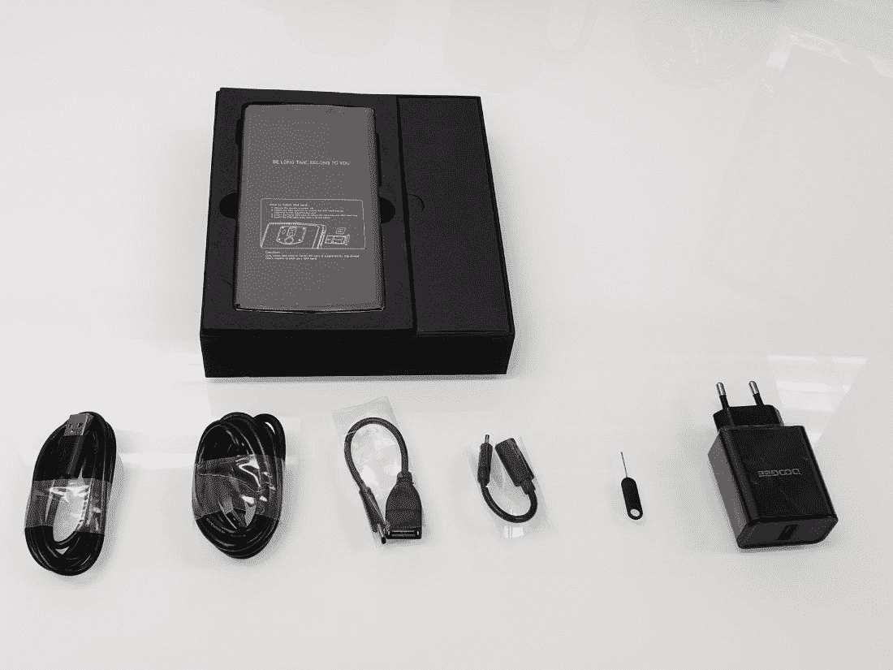
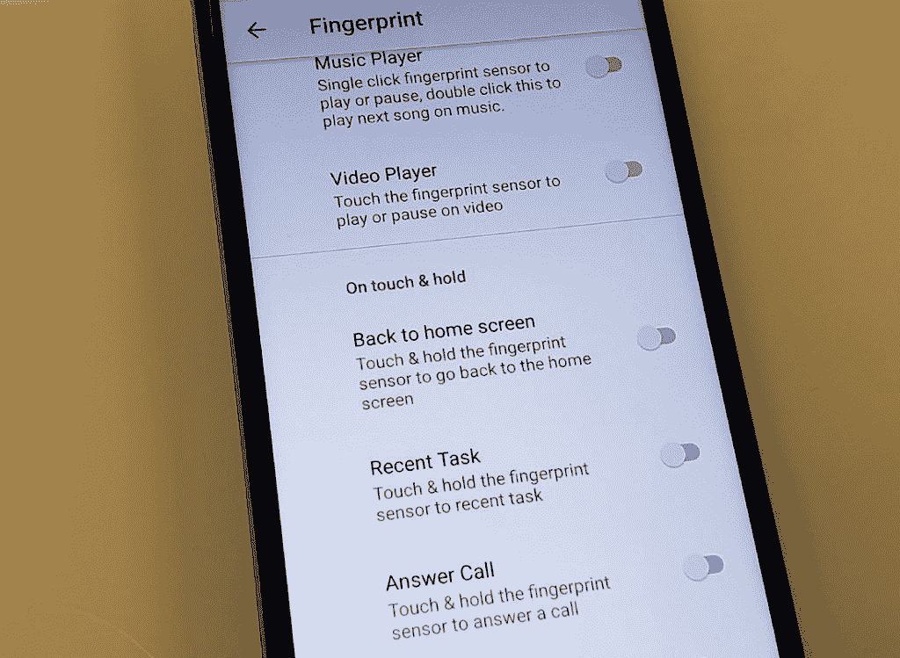
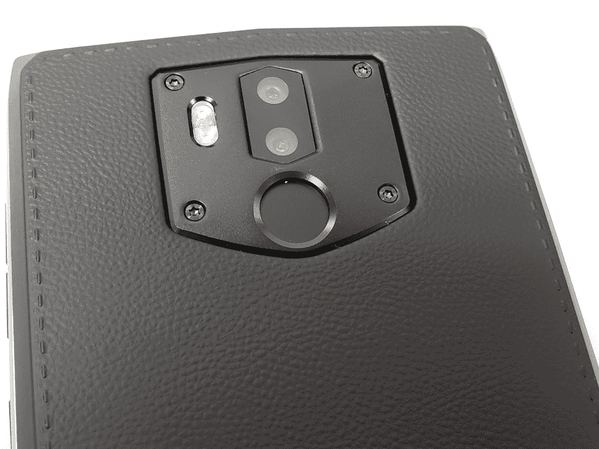

# Doogee BL9000 是一款配有 9000 毫安时大电池的手机

> 原文：<https://www.xda-developers.com/doogee-bl9000/>

Doogee 已经着手制造一款拥有大得离谱的 9000 毫安时电池的手机。这款手机被称为 BL9000，它是为那些想要一次充电可以持续几天的大手机的人而设计的。这款手机不是轻薄的，也不是假装成大电池的手机。

| 

BL9000

 | 

规范

 |
| --- | --- |
| 显示 | 5.99 英寸 FHD+ |
| 芯片集 | 赫利奥·P23 |
| 随机存取存储 | 6GB |
| 储存；储备 | 64GB |
| 照相机 | 12+5 百万像素 |
| 电池 | 9000 毫安时 |

 <picture></picture> 

The BL9000 with Box and Cables

为了给这个超大电池供电，你会得到一个充电器，它可以在 10 分钟内将你的手机充电到 30%，并在 70 分钟内充满 100%。这项技术被称为 Pump Express 4.0。

您也可以选择使用无线充电。它兼容 5V 2A 无线充电器，是第一款支持无线充电的大电池手机。

 <picture></picture> 

Use the Fingerprint Sensor to navigate or launch specific apps.

手机出奇的重和厚。它旨在通过烟熏黑和银边颜色选项获得商务/专业外观。

 <picture></picture> 

The BL9000 Features a 12+5MP Camera

18:9 FHD+显示屏是 LG 制造的屏幕，具有高色彩饱和度和出色的图像质量。

至于性能，Doogee 选择了 P23 芯片组和 Mali-G71 GPU。这与 6GB 的内存搭配使这款手机即使在压力下也能表现得非常好。随着软件接近库存的 Android，使用这款手机是一个很好的体验。

许多软件功能甚至可以进一步增强性能，比如可以在屏幕关闭时清除应用程序。

如果你正在寻找一部大电池、高性能的手机，并且不介意它有点重和厚，这是一个很好的选择。

在 Flipkart 或 BangGood 上获取₹21,000 的 Doogee BL9000。

点击此处了解更多关于 Doogee BL9000 的信息。

[**在邦古德**上获得 bl 9000](https://www.anrdoezrs.net/links/100122946/type/dlg/sid/UUxdaUeUpU21082/https://www.banggood.com/collection-5954.html)