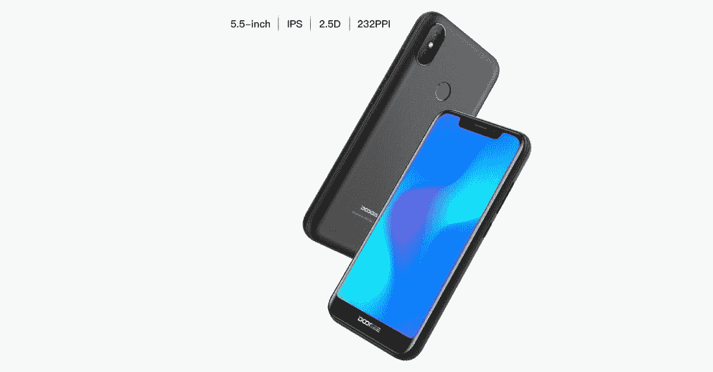
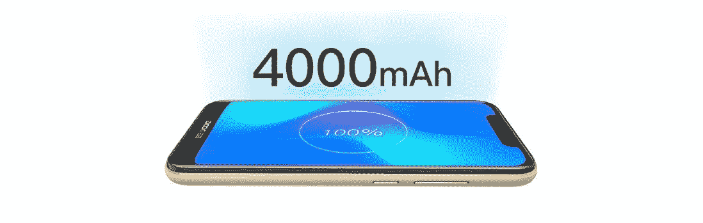
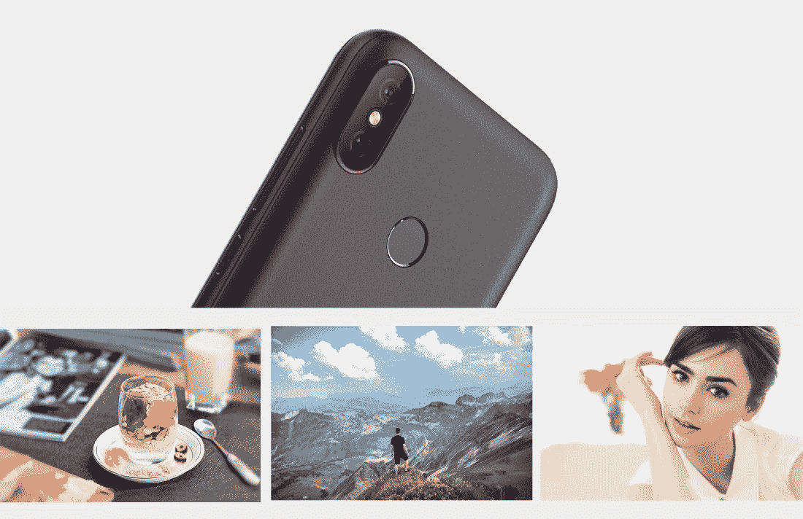

# DOOGEE X70 是一款 19:9 5.5 英寸、4000 毫安时的手机，售价不到 80 美元

> 原文：<https://www.xda-developers.com/doogee-x70/>

DOOGEE 以低价提供智能手机而闻名。他们的预算阵容包括从游戏手机到超级耐用的坚固手机。现在，他们推出了 DOOGEE X70，作为一款完全专注于尽可能负担得起的手机。DOOGEE X70 在全球速卖通的售价仅为 79.99 美元。

 <picture></picture> 

DOOGEE X70 Specs

即使在 79.99 美元的低价位，这款手机也包括双镜头摄像头、4000 毫安时大电池、19:9 显示屏、指纹传感器和人脸识别等功能。屏幕分辨率为 540x1132p。处理器是四核 MTK6580 Cortex-A7，配有 2GB 内存和 16GB 存储空间。还有一个高达 128GB 的可扩展存储选项。

 <picture></picture> 

DOOGEE X70 Display

4000mAh 大电池是这款超实惠手机最令人印象深刻的功能之一。这款手机纤薄的机身内置一块电池，容量比之前的型号多 20%。您可以期待令人印象深刻的 300 小时待机时间和 30 小时通话时间。

 <picture></picture> 

DOOGEE X70 Battery

X70 上的双后置摄像头有 5+800 万像素传感器。有 5 种拍摄模式可用于默认的相机应用程序，包括单声道、专业、模糊、面部美容和全景。使用 80°广角相机拍摄令人印象深刻的照片。自拍相机配有一个 5MP 传感器。

 <picture></picture> 

DOOGEE X70 Camera

阿里快递正在进行限量销售，你可以以更低的价格买到 DOOGEE X70。如果您在 2018 年 9 月 7 日之前拿到这款手机，还可以节省 7%的费用。

###### 我们感谢 DOOGEE 赞助这篇文章。我们的赞助商帮助我们支付与运行 XDA 相关的许多费用，包括服务器成本、全职开发人员、新闻撰稿人等等。虽然您可能会在门户内容旁边看到赞助内容(这些内容将始终被标记为赞助内容),但门户团队对这些帖子不承担任何责任。赞助内容、广告和 XDA 仓库完全由一个独立的团队管理。XDA 绝不会通过接受金钱来赞扬一家公司，或以任何方式改变我们的观点或看法，从而损害其新闻诚信。我们的意见不能被收买。