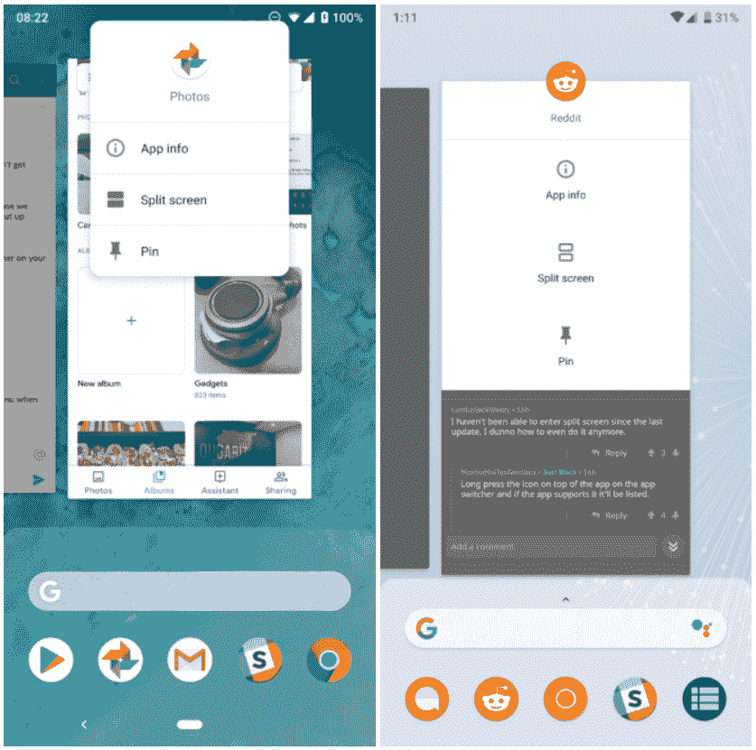

# 下载:谷歌 Pixel 3 的谷歌 Pixel 启动器

> 原文：<https://www.xda-developers.com/download-google-pixel-launcher-pixel-3/>

# 下载:谷歌 Pixel 3 的谷歌 Pixel 启动器

Pixel 3 的下一个更新的 APK 是 Pixel Launcher，现在可以安装在 Pixel，Nexus 和 Android One 设备上。

Pixel 3 和 Pixel 3 XL 是昨天终于[公布的，也就是说更新的 apk 开始冒出来了。昨天，来自 Pixel 3 的谷歌相机](https://www.xda-developers.com/google-pixel-3-google-pixel-3-xl-specs-features-pricing-availability/)[可以在旧设备上下载](https://www.xda-developers.com/google-camera-pixel-3-apk-download/)。下一个更新的应用程序是 Pixel Launcher，现在可以安装在 Pixel，Nexus 和 Android One 设备上。

你可能还记得谷歌在 [Android P 开发者预览版 5](https://www.xda-developers.com/android-p-beta-4-google-pixel/) 中移除了 Pixel Launcher 搜索栏中的语音搜索快捷方式。[我们发现谷歌正在测试一个谷歌助手快捷方式](https://www.xda-developers.com/download-pixel-launcher-google-assistant-search-bar-pixel-3/)，这正是它在 Pixel 3 上的样子。这几乎是这个 APK 唯一的主要变化。一个小细节是，所有应用程序都强制使用自适应图标，因此无论如何，你都会有一个统一的外观。

 <picture></picture> 

Before / After

还有一些其他小的视觉调整。最引人注目的是应用程序切换器屏幕上的应用程序信息面板。旧的样式是出现在图标后面的弹出窗口。新的外观是一个覆盖应用程序预览的下拉面板。在你的 Pixel、Nexus 或 Android One 设备上从 APK 镜像下载 [Pixel Launcher v9-4902955。如果您发现任何其他差异，请告诉我们！](https://www.apkmirror.com/apk/google-inc/pixel-launcher/pixel-launcher-9-4902955-release/)

* * *

[**Via:安卓警察**](https://www.androidpolice.com/2018/10/09/pixel-launcher-pixel-3-brings-assistant-button-back-forces-adaptive-icons-apps-apk-download/)