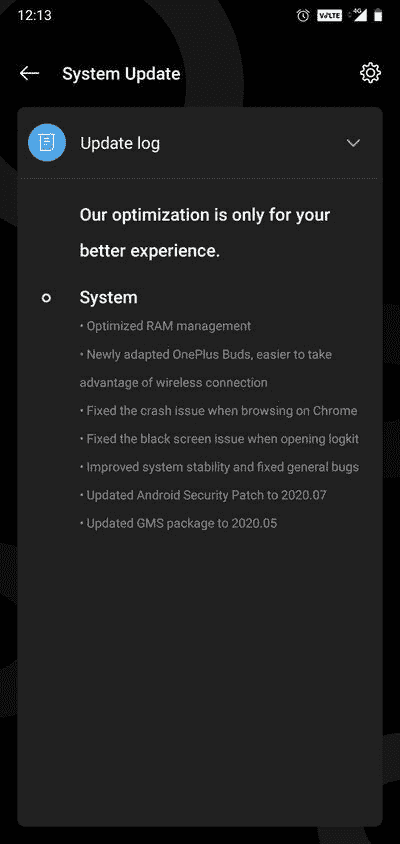

# 下载:OnePlus 6 和 6T 接收 OxygenOS 10.3.5，具有 RAM 优化、一加 Buds 支持等功能

> 原文：<https://www.xda-developers.com/download-oneplus-6-6t-receive-oxygenos-1035-ram-optimizations-buds-support-more/>

# 下载:OnePlus 6 和 6T 接收 OxygenOS 10.3.5，具有 RAM 优化、一加 Buds 支持等功能

最新的 OxygenOS 更新推出了 OnePlus 6 和一加 6T，支持一加芽和 2020 年 7 月的安全补丁。请继续阅读！

一加最近为[一加诺德](https://www.xda-developers.com/oxygenos-10-5-2-for-the-oneplus-nord-adds-oneplus-buds-support/)和[一加 8 家族](https://www.xda-developers.com/oneplus-8-pro-latest-update-support-for-oneplus-buds-july-2020-security-patches-more/)推出了新的 OxygenOS 更新，为他们的第一对真正的无线耳塞[一加耳塞](https://www.xda-developers.com/oneplus-buds-tws-earbuds-launch-30-hour-battery-life/)带来了必要的支持。以类似的方式，OnePlus 6 和一加 6T 现在已经获得了 OxygenOS 的新稳定版本，不仅使官方能够支持设备 duo 上的一加 Buds，而且还带来了 2020 年 7 月的安全补丁。

**[一加 6 XDA 论坛](https://forum.xda-developers.com/oneplus-6) || [一加 6T XDA 论坛](https://forum.xda-developers.com/oneplus-6t)**

[根据一加社区论坛](https://forums.oneplus.com/threads/oxygenos-10-3-5-for-the-oneplus-6-and-6t.1266795/)最近的一篇帖子，OEM 已经开始为 OnePlus 6 和一加 6T 逐步推出 OxygenOS 10.3.5。除了 Android 安全补丁级别(SPL)的提升，更新还解决了与这些手机上谷歌浏览器频繁崩溃相关的问题。此外，OxygenOS 的新版本包括对打开一加 Logkit 应用程序时黑屏错误的修复。对于那些不熟悉一加日志工具包的人来说，这是一个方便的内置诊断应用程序，可以通过在股票拨号器中拨打`*#800#`来收集设备日志。

您可以在下面找到此更新的完整变更日志:

## 适用于 OnePlus 6 和 6T 的 OxygenOS 10.3.5 变更日志

*   系统
    *   优化的 RAM 管理
    *   新改编的一加芽，更容易利用无线连接
    *   修正了在 Chrome 浏览器上浏览时的崩溃问题
    *   修复了打开日志包时的黑屏问题
    *   改进了系统稳定性并修复了一般性错误
    *   将 Android 安全补丁更新至 2020.07
    *   将 GMS 包更新至 2020.05

 <picture></picture> 

Thanks to OnePlus Community user [MMuralidhar](https://forums.oneplus.com/members/mmuralidhar.1241703/) for the screenshot!

* * *

## 为 OnePlus 6 和 6T 下载 OxygenOS 10.3.5

该公司正在遵循一种交错推出模式，这意味着他们首先向少数用户推出更新。如果在初始阶段没有关键问题出现，在接下来的几天里，推广将逐渐扩展到更多的设备。但是，您可以从下面的索引中获取适合您的型号的更新包，并立即免费下载。

### OnePlus 6 的 OxygenOS 10.3.5

### 适用于一加 6T 的 OxygenOS 10.3.5

* * *

*感谢 XDA 资深会员 [Some_Random_Username](https://forum.xda-developers.com/member.php?u=8234677) 的下载链接！*