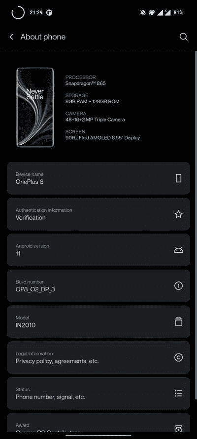

# 下载:一加 8 和一加 8 Pro 接收基于 Android 11 开发者预览版 3 的 OxygenOS 11

> 原文：<https://www.xda-developers.com/download-oneplus-8-oneplus-8-pro-oxygenos-11-android-11-developer-preview-3/>

就在一天前，一加为一加 8 系列发布了基于 Android 11 的 HydrogenOS 11“开发者预览版”。事实上，类似的 OxygenOS 11 预计在同一天[抵达](https://www.xda-developers.com/oneplus-android-11-final-developer-preview-oxygenos-11/)，但由于漫长的审批过程，它被推迟了一点[。等待终于结束了，因为 OEM 已经发布了基于 Android 11 Beta 3 的一加 8 和一加 8 Pro 的 OxygenOS 11 版本。](https://forums.oneplus.com/threads/some-exciting-updates-on-oxygenos.1270310/page-52#post-21956491)

**[一加 8 场 XDA 论坛](https://forum.xda-developers.com/oneplus-8) || [一加 8 场 XDA 职业论坛](https://forum.xda-developers.com/oneplus-8-pro)**

与之前发布的 HydrogenOS 11 开发者预览版相似，新的 OxygenOS 11 版本大部分功能完整。由于 HydrogenOS 和 OxygenOS 在 UI 和核心功能方面非常接近，HydrogenOS 11 的所有改进 UI 元素和[新功能](https://www.xda-developers.com/oneplus-hydrogenos-11-comes-with-redesigned-weather-app-always-on-display-and-more/)(除了中国特有的功能)也在 OxygenOS 11 中得以实现。

**从 Amazon.in 购买:[一加 8](https://www.amazon.in/Test-Exclusive-547/dp/B078BNQ318/?tag=xdaportalin-21) || [一加 8 Pro](https://www.amazon.in/Test-Exclusive-750/dp/B07DJCYBVK/?tag=xdaportalin-21)**

以下是这个新版本的一些关键更新元素:

*   新的视觉设计(包括天气应用程序，启动器，画廊，笔记)
*   新布局使单手操作更加舒适和方便
*   始终显示功能，包括 11 种新的时钟样式
*   根据一天中的时间变化的动态壁纸
*   提高可读性的新一加 Sans 字体
*   优化的黑暗模式，包括自动开关和快速设置中的快捷方式
*   3 个新的禅宗模式主题，更多的时间选择，和新的小组功能，让您体验禅宗模式与您的朋友
*   新的图库功能，可根据您的照片和视频自动创建每周故事

 <picture></picture> 

Thanks to OnePlus Community member [Ching_Nam_Ip](https://forums.oneplus.com/members/ching_nam_ip.1605198/) for the screenshot!

* * *

## 下载:基于 Android 11 Beta 3 的 OxygenOS 11，适用于一加 8 和一加 8 Pro

您可以从以下链接下载构建版本:

**下载 OxygenOS 11 (Android 11 Beta 3): [一加 8](https://oxygenos.oneplus.net/OnePlus8Oxygen_15_OTA_0030_all_2008081530_4dc587d23b294492.zip) || [一加 8 Pro](https://oxygenos.oneplus.net/OnePlus8ProOxygen_15_OTA_0030_all_2008081530_9a9db011689d490a.zip)**

下载适合您手机的软件包后，进入设置>系统>系统更新，然后点击右上角的图标，选择本地升级选项。从那里，选择您已经下载的更新包并继续。更新应该会在您的设备上成功刷新。

如果你想恢复到基于 Android 10 的稳定发布渠道，请下载适用于你的型号的相关降级包，并使用如上所述的内置更新程序模块进行闪存。

降级软件包下载链接:

*   一加 8:
*   一加 8 专业版:

强烈建议您在继续之前备份数据，因为更新和降级过程将擦除设备上的所有数据。请注意，上述测试版本与一加 8 系列的威瑞森和 T-Mobile 版本不兼容。

* * *

**来源:[一加论坛](https://forums.oneplus.com/threads/android-11-developer-preview-3-with-oxygenos-11-design-and-features-for-the-oneplus-8-series.1274830/)**