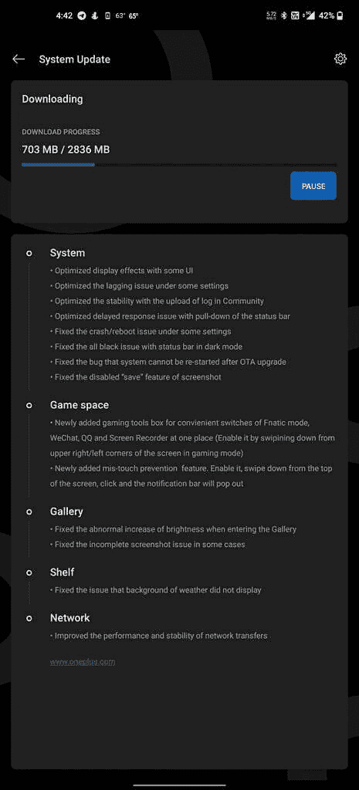

# OxygenOS 11 (Android 11 开发者预览版 4)适用于一加 8/8 Pro

> 原文：<https://www.xda-developers.com/download-oneplus-8-pro-receive-android-11-developer-preview-4-based-oxygenos-11-builds-september-2020-security-patches/>

OxygenOS 11，即一加定制皮肤的即将到来的迭代已经引起了一些人的关注，因为[它改进了设计语言](https://www.xda-developers.com/oxygenos-11-beta-oneplus-8-pro-android-11-update-hands-on/)。新的用户界面首次亮相是在一加 8 系列的 Android 11 第三次“开发者预览版”T2 发布会上。尽管 DP3 被[认为是最终的开发者预览版](https://www.xda-developers.com/oneplus-android-11-final-developer-preview-oxygenos-11/)，一加现在已经提出了另一个基于 Android 11 测试版的版本。那些在他们的一加 8/8 Pro 上运行 DP3 版本的用户现在可以获得开发者预览版 4 作为增量更新。

**[一加 8 场 XDA 论坛](https://forum.xda-developers.com/oneplus-8) || [一加 8 场 XDA 职业论坛](https://forum.xda-developers.com/oneplus-8-pro)**

除了修复大量错误之外，OxygenOS 11 的最新 DP 版本通过引入诸如[浮动窗口和防止意外触摸](https://www.xda-developers.com/oneplus-adding-floating-window-support-gaming-mode-oxygenos/)等功能来改进内置游戏模式。此外，一加已经设法通过此次更新向**发布了【2020 年 9 月】Android 安全补丁**，尽管变更日志对此只字未提。

 <picture></picture> 

Thanks to XDA Senior Member [jeffsga88](https://forum.xda-developers.com/member.php?u=7188028) for the screenshot!

此更新的完整变更日志如下:

*   系统
    *   通过一些用户界面优化显示效果
    *   优化了某些设置下的滞后问题
    *   优化了社区日志上传的稳定性
    *   优化了状态栏下拉的延迟响应问题
    *   修正了某些设置下的崩溃/重启问题
    *   修正了黑暗模式下状态栏全黑的问题
    *   修正了 OTA 升级后系统无法重启的 bug
    *   修正了被禁用的截图“保存”功能

*   游戏空间
    *   新增加的游戏工具箱，可在一个地方方便地切换 Fnatic 模式、微信、QQ 和屏幕录制器(在游戏模式下，通过从屏幕的右上角/左上角向下滑动来启用它)
    *   新增加的防误触功能。启用它，从屏幕顶部向下滑动，点击，通知栏就会弹出

*   走廊
    *   修正了进入画廊时亮度异常增加的问题
    *   修正了某些情况下不完整的截图问题

*   架子
    *   修正了天气背景不显示的问题

*   网络
    *   提高了网络传输的性能和稳定性

* * *

## 下载:适用于一加 8 和一加 8 Pro 的 Android 11 开发者预览版 4，采用 OxygenOS 11 设计和功能

您可以从以下链接下载构建版本:

**下载 OxygenOS 11 (Android 11 开发者预览版 4): [一加 8](https://otafsg1.h2os.com/patch/amazone2/GLO/OnePlus8Oxygen/OnePlus8Oxygen_15.X.05_GLO_0050_2008301845/OnePlus8Oxygen_15_OTA_0050_all_2008301845_397223dd4.zip) || [一加 8 Pro](https://otafsg1.h2os.com/patch/amazone2/GLO/OnePlus8ProOxygen/OnePlus8ProOxygen_15.X.05_GLO_0050_2008282158/OnePlus8ProOxygen_15_OTA_0050_all_2008282158_4f963821281.zip)**

下载适合您手机的软件包后，进入设置>系统>系统更新，然后点击右上角的图标，选择“本地升级”选项。从那里，选择您已经下载的更新包并继续。

值得一提的是，你很可能需要一套新的降级包来还原回稳定发布通道。由于旧的编译时间戳，现有的 zip(如下所列)可能不够用。

降级软件包下载链接:

*   一加 8:
*   一加 8 专业版:

* * *

*感谢 XDA 资深会员 [Some_Random_Username](https://forum.xda-developers.com/member.php?u=8234677) 提供下载链接！*