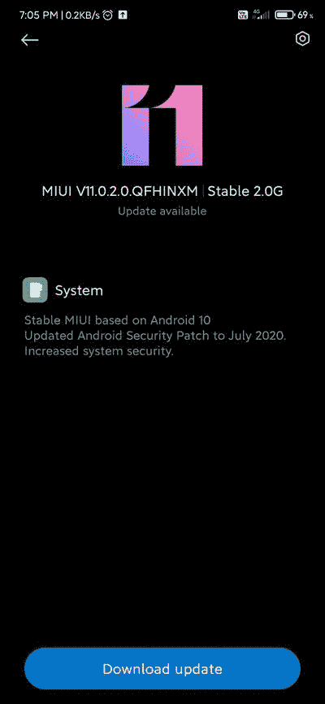

# 红米 Note 7 Pro 随 MIUI 11 接收稳定测试版 Android 10 更新

> 原文：<https://www.xda-developers.com/download-xiaomi-redmi-note-7-pro-receives-stable-beta-android-10-update-miui-11/>

小米[早在 2019 年 2 月就在印度推出了](https://www.xda-developers.com/xiaomi-redmi-note-7-pro-go-india-launch/)红米 Note 7 Pro，并提供了一些可靠的规格，如功能强大的[高通骁龙 675](https://www.xda-developers.com/qualcomm-snapdragon-675-chipset/) SoC，4000 毫安时电池，支持 18W 快速充电，48MP 索尼 IMX586 传感器作为主后置摄像头。手机上的工厂安装的操作系统是 Android 9 Pie 之上的 MIUI 10，但 OEM 厂商决定在随后的 [MIUI 11](https://www.xda-developers.com/download-miui-11-xiaomi-redmi-note-7-pro-poco-f1/) 更新中保持底层 Android 层不变。而现在，小米终于在稳定渠道上为红米 Note 7 Pro 带来了 Android 10 更新。

**[红米 Note 7 Pro XDA 论坛](https://forum.xda-developers.com/redmi-note-7-pro)**

在报道时，稳定的 Android 10 OTA 正在打击这款智能手机的印度版本，但有一个问题。小米最初通过 MIUI 12 的[封闭测试版为这款手机推送 Android 10。后来，与红米 Note 7 Pro 对应的](https://www.xda-developers.com/download-miui-12-closed-beta-xiaomi-redmi-devices/) [MIUI 12](https://www.xda-developers.com/download-miui-12-stable-update-rolling-out-several-xiaomi-redmi-mi-poco-devices/) 的“测试版稳定”频道也升级了基于 Android 10 的版本，但这些主要是针对一群被称为 Mi Pilot 用户的特殊测试人员。另一方面，我们所说的稳定版本仍然是基于 MIUI 11，承载版本号 **V11.0.2.0.QFHINXM** 。它还将 Android 安全补丁级别(SPL)提升至 2020 年 7 月。

 <picture></picture> 

Thanks to Twitter user [@TechnoAnkit1](https://twitter.com/TechnoAnkit1) for the screenshot!

## 红米 Note 7 Pro 的 MIUI 11 Android 10 下载链接(紫色)

您可以等待更新到达您的手机，也可以在下载以下链接的更新包后下载更新:

如果您在尝试加载上述软件包时遇到与 Mi 帐户授权相关的步骤，您可以通过使用自定义恢复(如 TWRP)来刷新恢复 ROM，从而绕过该限制。

小米的更新分发策略确实让普通用户感到困惑。在这种情况下，该公司很可能正在通过两套不同的系统测试 Android 10 固件的稳定性——一套基于 MIUI 12，另一套则使用 MIUI 11 编译。一小部分运行 Android Pie-based MIUI 11 的用户群最初将获得 Android 10 OTA，随着推出逐渐扩展到更多用户。与此同时，小米应该能够利用小米试点用户的输入来评估这款手机基于 Android 10 的 MIUI 12 版本。一旦小米将其标记为足够稳定，他们就准备向大家推送 MIUI 12 风味的 Android 10 更新。