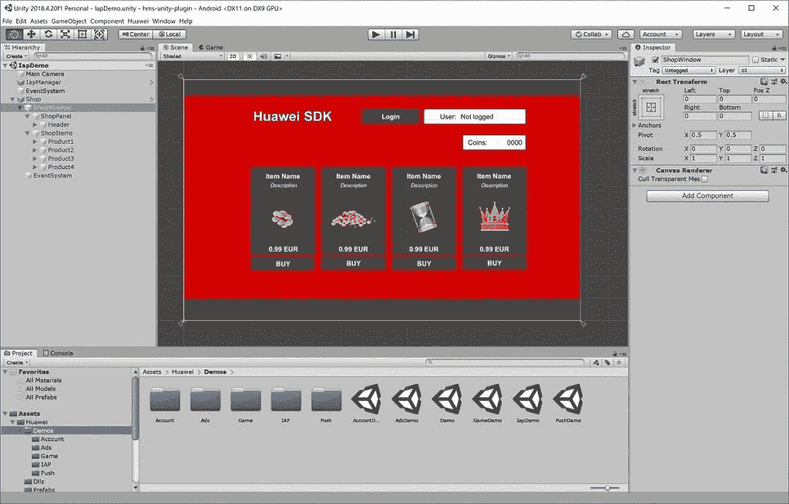
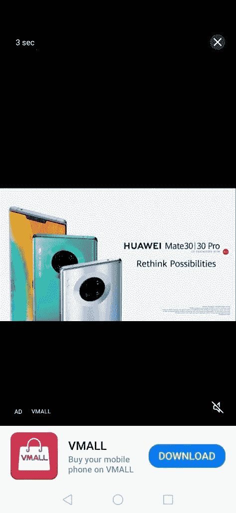
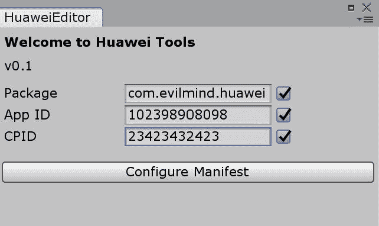
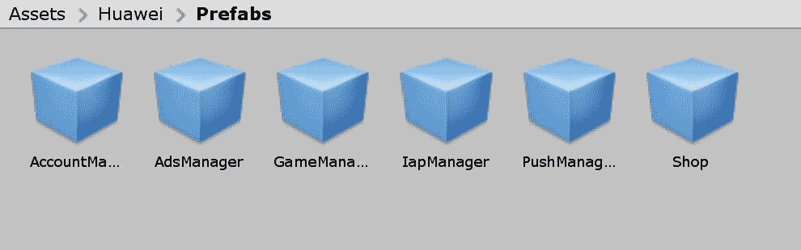
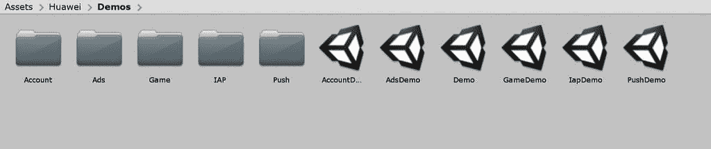

# 使用 HMS Unity 插件轻松将华为移动服务集成到您的 Unity 游戏中！

> 原文：<https://www.xda-developers.com/easily-integrate-huawei-mobile-services-unity-game-hms-unity-plugin/>

华为移动服务(HMS)是华为对 GMS(T1)的替代，由面向用户的应用和核心后台服务组成。华为移动服务背后的理念是提供跨设备一致的体验，并且独立于平台更新。HMS 生态系统的月平均用户数从 2018 年 7 月的 4.2 亿增加到 2019 年 12 月的 6 亿，而同期在该平台上注册的开发者从 45 万增加到 130 万，HMS 核心应用集成从 2 万个应用增加到 5.5 万个应用。根据华为截至 2019 年 12 月披露的其他数据，HMS Core 在全球 170 多个国家(包括中国)拥有 6 亿用户。

这些数字对应用程序和游戏开发者都有帮助，他们都可以通过华为和 Honor 设备上的[华为应用程序库](https://www.xda-developers.com/appgallery-huawei-alternative-google-play-store-android/)向最终用户提供服务。由于华为和 Honor 智能手机在全球的用户数量，应用程序和游戏开发者有很大的动力跳到 HMS 平台和 AppGallery 上。此外，该平台还为他们提供了一些功能，如成本效益，一站式整合的统一门户，以及通过多种推广渠道进行精确的用户定位。

如果你是一名寻求支持华为和荣誉设备的开发人员，华为提供了大量现成的文档，用于在开发人员的资源内轻松集成其 API。游戏开发者也有可用的工具，允许他们整合构建一款手机游戏所需的所有必要功能，这款手机游戏不仅可以作为一款优秀的手机游戏，还具有必要的升级潜力，可以成长为一款成功的游戏。

如果你正在寻找在 HMS 支持下构建你的游戏的方法，你的工作现在会因为这个 [HMS Unity 插件](https://github.com/EvilMindDevs/hms-unity-plugin)而变得更加容易。该插件帮助您将华为移动服务的所有功能集成到您的 Unity 游戏中，允许您利用华为强大的 API，如[华为账户套件](https://developer.huawei.com/consumer/en/hms/huawei-accountkit)、[推送套件](https://developer.huawei.com/consumer/en/hms/huawei-pushkit)、[游戏服务](https://developer.huawei.com/consumer/en/hms/huawei-game)、[广告套件](https://developer.huawei.com/consumer/en/hms/huawei-adskit)和[应用内购买](https://developer.huawei.com/consumer/en/hms/huawei-iap/)。

* * *

## 华为移动服务 API 概述

### 华为账户套件

[华为账户套件](https://developer.huawei.com/consumer/en/hms/huawei-accountkit)允许开发者在游戏中使用现有的华为账户作为有效的登录选项，让玩家减少介绍疲劳，并跳过电子邮件地址和手机号码验证等步骤。得益于安全登录、一键式授权、双因素身份认证支持、数据加密和隐私 GDPR 合规性等特性，它进一步帮助了用户入职流程，并降低了注册和登录期间的用户流失率。

### 推送套件

[Push Kit](https://developer.huawei.com/consumer/en/hms/huawei-pushkit) 允许开发人员从云端向您的用户发送消息，作为一个可靠的实时推送消息平台，覆盖全球，遍布 200 多个国家。游戏开发者可以利用它提供的精确定位功能来提升他们游戏的娱乐性。通过智能消息推送，开发者还可以促进游戏内部的交互和交易。

### 游戏服务

[游戏服务](https://developer.huawei.com/consumer/en/hms/huawei-game)提供了一种简单的登录和追踪游戏成绩的方法。游戏开发者可以为玩家定制多达 200 个成就，所以在游戏中总有一些目标要实现。您还可以获得多样化的玩家数据统计，这将让您定制您的游戏体验，以满足您的玩家的需求和期望。该 API 还可以让您配置事件报告，并让您自定义报告的关键游戏事件，让您从多个维度分析报告的事件。当然，没有排行榜和保存的游戏特性，任何游戏 API 都是不完整的，这个 API 也包括这些。您可以创建多个排行榜，以不同的方式对玩家进行排名，结合成绩跟踪，为玩家继续玩您的游戏提供稳定的激励。您还可以让玩家在 Huawei Drive 上保存他们的游戏进度，让玩家在其他兼容设备上检索保存的游戏数据。

### 广告套件

HMS 中的广告套件是一个重要的盈利媒介，游戏开发者可以利用它通过广告支持来维持一个免费游戏。该 API 提供了独特的设备级广告标识符和广告转换跟踪功能。Ads Kit 利用 OAID(开放广告 ID)解决方案作为非永久广告标识符，允许开发者平衡用户隐私，同时仍然提供个性化广告并准确跟踪广告效果。

### 应用内购买

至于[应用内购买](https://developer.huawei.com/consumer/en/hms/huawei-iap/)，顾名思义，它是负责在一个应用或游戏内集成无缝应用内购买体验的 API。它支持订阅服务、以当地货币为产品自动定价的产品管理、订单管理和相关的促销活动。应用内购买背后的意图是简化支付访问流程，简化访问和交互逻辑，以便开发者可以更专注于开发和完善他们的游戏产品，而不必太担心收入收集流程。

* * *

## HMS Unity 插件

HMS Unity 插件可以非常轻松地将 HMS 功能集成到您的 Unity 游戏中，用于应用内购买、华为登录、推送消息、游戏排行榜和基于广告的货币化。这些功能进一步使您能够融入游戏设计的重要元素，如唯一的玩家身份、消耗品和化妆品的应用内购买、广告支持、推送通知支持、保存游戏支持以及游戏排行榜和成就。

 <picture></picture> 

IAP Demo

该插件仍然以这四个特性为傲:

*   它有清晰的文档，用包含逐步说明的易于遵循的指南来指导开发人员。
*   该插件带有现成的预置。
*   该插件还包含演示场景，以帮助开发人员熟悉一个活生生的例子。
*   该插件还承诺会定期更新新特性，因此您可以放心，一段时间后您的项目将不再依赖过时的工具。

 <picture></picture> 

Video ad demo

集成插件非常容易。所有这一切都需要五个广泛而简单的步骤:

1.  在[华为开发者网站](https://developer.huawei.com/consumer/en/)注册游戏
2.  将插件导入您的 Unity 项目
3.  配置您的清单
4.  将您的游戏与 HMS 管理器连接
5.  将 HMS 回调处理器与您的游戏连接

将 HMS 集成到你的游戏中的第一个要求是向 HMS 本身注册。流程简单明了，从登录开发者控制台开始，在 AppGallery 模块中创建新应用，然后申请 IAP 服务并为您的游戏产品进行配置。

下一步是导入 Unity 插件，你可以[从 GitHub](https://github.com/EvilMindDevs/hms-unity-plugin) 下载。打开 Unity 编辑器并导入自定义包。Unity 中的导入工具会显示所有预先选中的项目，所以你只需点击 Install，Unity 就会将插件部署到你的 Assets 文件夹中。接下来，您需要配置插件，通过在提供的提示中输入您游戏的唯一应用 ID、您的开发者 CPID 和您游戏的包名来为您的游戏工作，插件将自动包括 Android 清单中所有必要的信息。

 <picture></picture> 

Configuring the Manifest

一旦所有这些都完成了，你需要在场景中部署 HMS 管理器预置。在 Unity 编辑器中，找到插件预置文件夹，将 HMS 管理器拖放到场景中，然后按照配置提示进行操作。

 <picture></picture> 

Ready-to-use Prefabs

接下来，通过 onClick 部分调用 HMS 管理器。最后一步是将 HMS 回调处理程序与您的游戏连接起来。文档会指导您完成整个过程，因此您应该不会有任何困难。

 <picture></picture> 

Demo Scenes

正如你所看到的，对于一个游戏开发者来说，登上 HMS 非常容易，如果他们遇到任何困难，可以获得简单的文档和支持。有了庞大的用户群作为激励，HMS 确实为萌芽中的游戏提供了激励，让它们将 HMS 视为首选平台。

如果您想将华为移动服务集成到您的游戏中，请点击下面的 GitHub 项目链接:

**[HMS Unity 插件](https://github.com/EvilMindDevs/hms-unity-plugin)**

* * *

###### 我们感谢华为赞助 XDA。华为很少参与这篇文章的创作或内容。特别是，为了核实事实，征求了他们的意见。表达的任何意见都是作者的意见。我们的赞助商帮助我们支付与运行 XDA 相关的许多费用，包括服务器、开发人员、作家等等。虽然您可能会在门户内容旁边看到赞助内容，但所有内容都会被清楚地标记为赞助内容。XDA 门户网站团队不会因为接受金钱来写一家公司的好话而损害新闻的完整性。我们的意见不能被收买。赞助内容、广告和 XDA 仓库由我们的营销总监管理，而不是编辑团队。