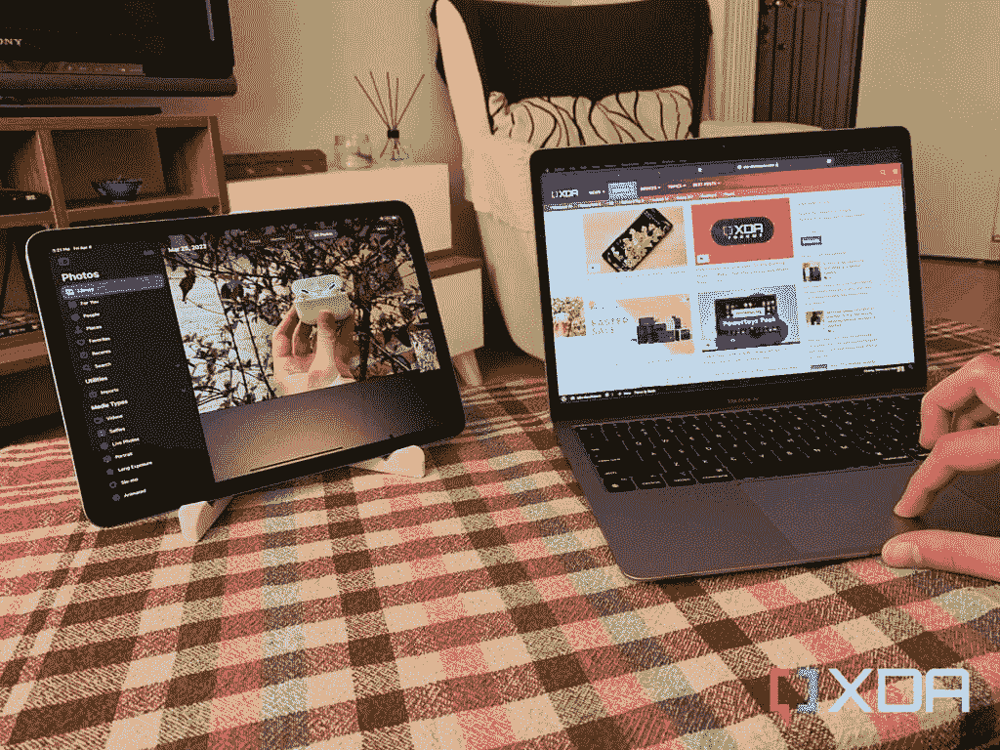
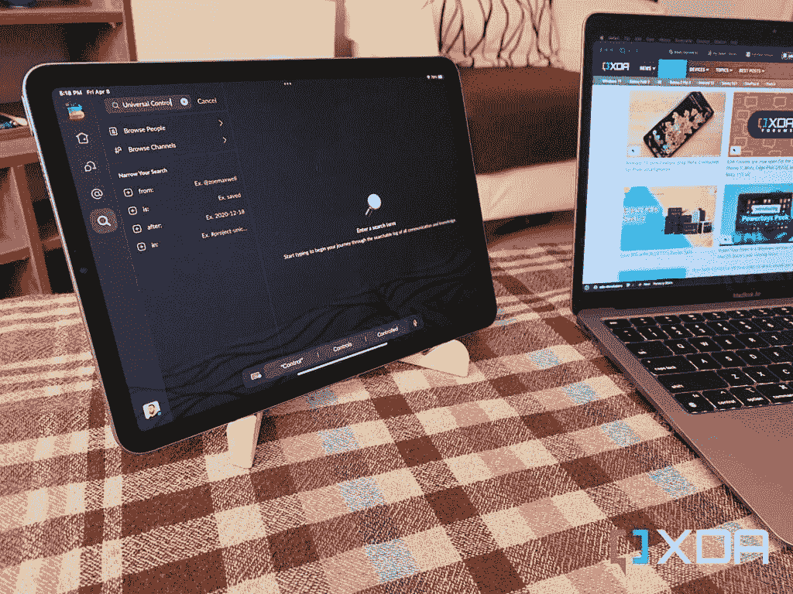

# 通用控制是只有苹果才想出的连续性魔法

> 原文：<https://www.xda-developers.com/editorial-universal-control-is-magic/>

当有人说*苹果*，首先想到的一个词就是~~定价过高~~ *生态系统*。该公司在这方面已经建立了良好的声誉，并赢得了这一特殊的桂冠。无论你是切换到一个新的 iDevice，在公司的产品之间同步你的 iCloud 数据，还是同时使用几个苹果设备作为你工作流程的一部分，这些过程都是无缝的，可靠的，在许多情况下，令人兴奋的**。用 [iPad](https://www.xda-developers.com/best-ipad/) 接电话，通过 [Mac](https://www.xda-developers.com/best-macs/) 发短信，用你的 [Apple Watch](https://www.xda-developers.com/best-apple-watch/) 作为你 iPhone 和 Mac 的密钥，从 iPadOS 复制然后粘贴到 macOS 或 iOS 上，等等。尽管运行着不同的操作系统，这些设备相互理解。很难想象这种紧密的联系是如何实现的。但是它就在那里，以一种非常明显和方便的形式。[通用控制](https://www.xda-developers.com/how-to-use-universal-control/)是苹果最新的连续性功能，在某种程度上是生态系统游戏的缩影。**

 **只有当你暂时使用朋友的设备时，你才会错过苹果的生态系统。我发现自己试图将一项任务从一台非苹果设备移交给另一台设备却徒劳无功的次数不计其数。这个生态系统的特别之处在于，你会忘记它的存在。用起来很有逻辑性，也很直观，所以在你学会了它的基础知识之后，它就慢慢淡出了背景。这就是技术应该做的——我们不应该在执行每一个动作之前想太多。

通用控制提醒人们，苹果真正关注的是进一步整合其设备体验。

通用控制提醒人们，苹果真正关注的是进一步整合其设备体验。不过，有一个问题——你必须放弃其他品牌，牺牲选择的自由。是的，从技术上讲，你可以使用 Mac、iPad 和 Android 手机。然而，随着你习惯了 iPad 和 Mac 配对的额外功能和特权，Android 设备会慢慢感到格格不入——这是你的 Android 手机所没有的。你要么觉得生态系统不完整，要么就投降[买个 iPhone](https://www.xda-developers.com/best-iphone) 。

 <picture></picture> 

Dragging a photo from iPad to Mac

## 什么是万能控制？

通用控制是苹果在 [macOS Monterey](https://www.xda-developers.com/macos-monterey) 12.3 和 iPadOS 15.4 中引入的一项连续性功能。它在 WWDC21 上第一次展示并取笑了这个特性。最初计划于 2021 年秋季推出，直到最近才面世。至少可以说，等待是值得的。

“通用控制”需要一台 Mac 和最多两台其他 iPad/Mac 设备。只要将它们并排放置在附近，就可以消除它们的边框显示屏的边界。它让你可以毫不费力地将光标从一个设备拖到另一个设备上，使用同一个键盘在两个或三个设备上打字，将各种文件从一个屏幕拖放到另一个屏幕上，等等。

 <picture></picture> 

Using Mac keyboard to type on iPad

令人震惊的是，Mac 电脑并没有在 iPad 上镜像其屏幕。苹果已经设法使 iPadOS 和 macOS 完全兼容，允许你在两个运行各自操作系统的独立设备上进行这些操作。你只要把光标拖到 Mac 的边缘，就会发现它神奇地转移到 iPad 上。万能控制毫无意义——以有史以来最好的方式。

## 万能控制如何融入一个人的工作流程？

万能控制不是边车。后者——苹果在 macOS Catalina 中推出——将你的 iPad 变成有线/无线显示器。它实际上并不允许你同时在两个设备和操作系统上工作，而只是让一个设备成为另一个设备的延伸。通用控制，顾名思义，通过一个键盘和触控板/鼠标就可以通用地控制您的兼容设备。这就是为什么它是如此方便的连续性功能。你专注于一套配件来控制你面前的所有苹果产品。在 Mac 上通过[键盘快捷键](https://www.xda-developers.com/keyboard-shortcuts-mac/)复制，将光标移动到 iPad 的屏幕上，并通过你用来复制的同一个键盘触发粘贴快捷键。宇宙控制通过进一步扩大它的限制——或者完全消除它们——建立在一个已经很紧密的生态系统上。

万能控制毫无意义——以有史以来最好的方式。

当你在 Mac 电脑上输入文章时，你可以在 iPad 上打开 Slack 应用程序。拖放同事分享的照片，复制文章的链接预览并与您的主管分享，等等。你也可以用它来跟踪新闻来源——在一台设备上保持列表打开并刷新，同时在另一台设备上完成工作。可能性是无限的！

## 通用控制兼容性

要使用此功能，您应该在最新的 Mac 或 iPad 上运行 macOS Monterey 12.3 或 iPadOS 15.4 及更高版本。此外，您必须在所有设备上登录同一个 Apple ID，启用双因素鉴定，并将它们放在 10 米以内。你还必须在所有设备上启用 Wi-Fi、蓝牙和 Handoff，并确保你没有在 iPad 或 Mac 上共享手机或互联网连接。

通用控制是我认为自己不会很快离开苹果生态系统的原因之一。不可否认的证据是，通过向公司妥协，你可以获得其他公司还在苦苦挣扎的平稳、完美的体验。这家库比蒂诺的科技巨头远非完美，但它非常清楚如何吸引客户——甚至诱使他们购买更多的产品，只是为了继续扩大无缝体验。我的苹果之旅始于仅仅拿着一部 iPhone，喜欢它的构造。慢慢地，我发现自己被卷入了黑暗面，最终拥有了它提供的每一个设备类别(大部分)。这就是为什么要离开这个生态系统是如此的困难——因为你需要完全抛弃它来释放自己。和其他品牌混搭根本行不通，至少对我来说是这样。因此，最终的结果是*全有或全无*。**