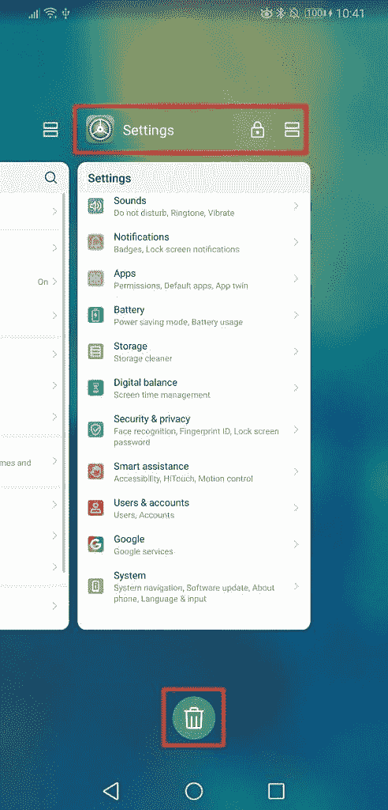
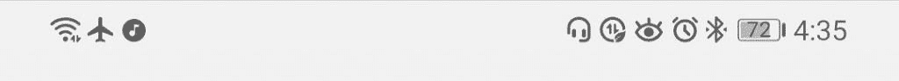
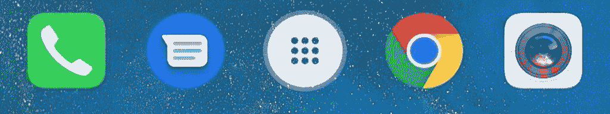
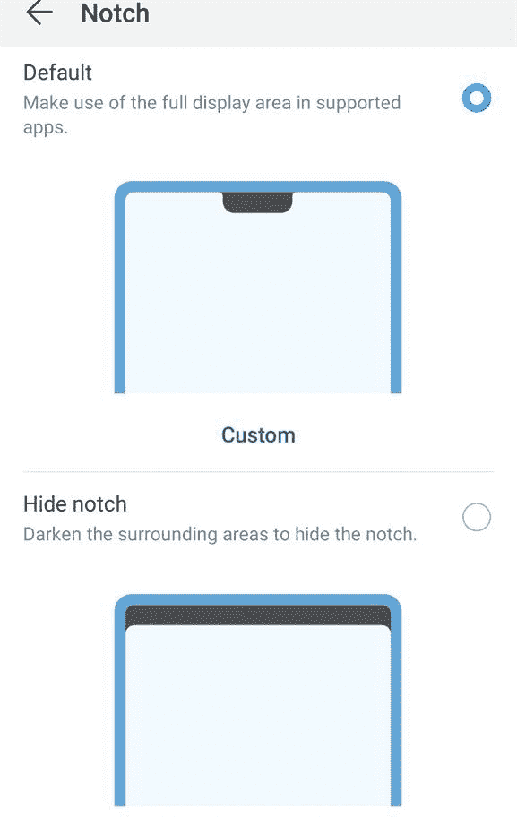

# EMUI 9 回顾:华为/Honor 的 Android Pie OS 的设计和行为

> 原文：<https://www.xda-developers.com/emui-9-review-design-behavior-huawei-honor-android-pie/>

Android 是全球超过 20 亿部智能手机的操作系统。全球销售的很大一部分安卓智能手机来自中国科技巨头华为及其子品牌 Honor。像许多中国竞争品牌一样，华为在其所有智能手机上都搭载了高度定制的安卓系统。该软件被称为“EMUI”，或一度被称为情感 UI。华为的子品牌 Honor 也在其智能手机上安装了 EMUI，不过名称不同，叫做“Magic UI”。

随着华为和 Honor 在中国以外的受欢迎程度上升，EMUI 和 Magic UI 已经发展到可以满足国际观众的需求。如果你从未购买过华为或 Honor 品牌的智能手机，并且希望购买新的 Honor View20、华为 P30、华为 Mate 20 或中国品牌的任何其他设备，你可能会对 EMUI 和 Magic UI 中的众多功能感到不知所措。在这篇评论中，我将涵盖一切——我指的是*一切*——有关于 EMUI 和 Magic UI 的全球版本的知识。在本次评测结束时，您将有望彻底了解您的新华为或 Honor 智能手机的功能。你可能打算把你的新智能手机保留至少一两年，所以如果你想充分利用你新买的智能手机，你肯定想熟悉 EMUI/Magic UI。

华为的 EMUI 早在 2012 年 Android 4.0 冰淇淋三明治时代就已经存在了。7 年后，最新版本是基于 Android 9 Pie 的 [EMUI 9.1](https://www.xda-developers.com/huawei-emui-91-beta-test-mate-20-pro-x-china/) ，首次出现在新[华为 P30](https://www.xda-developers.com/huawei-p30-pro-p30-official/) 系列上。最新的 Magic UI 版本是[2.0 版](https://www.xda-developers.com/honor-magic-2-update-magic-ui-2-0-november-security-patches/)，正如在 [Honor Magic 2](https://www.xda-developers.com/honor-magic-2-review-video/) 和 [Honor View20](https://www.xda-developers.com/honor-view20-review/) 上看到的，尽管 Honor 正在努力将带有 EMUI 9.1 功能的 Magic UI 2.1 带到他们的智能手机上。从华为 Mate 9 上基于 Android 7.0 牛轧糖的 EMUI 5.0 开始我就在用 EMUI 了。我也有在华为 Mate 10 Pro 上使用基于 Android 8.0 Oreo 的 EMUI 8.0 的体验。最后，在过去的 5 个月里，我一直在使用运行基于 Android 9 Pie 的 EMUI 9.0 的[华为 Mate 20 X](https://forum.xda-developers.com/mate-20-x) ，尽管我也使用过运行基于 Android 9 Pie 的 Magic UI 2.0 的 Honor Magic 2 和 Honor View20。因此，我使用 EMUI 已经有很长时间了，我对它了如指掌。

因为这篇评论的长度，我把它分成了 3 篇独立的文章。以下是本次审查所涵盖内容的概述:

#### **目录**

*   **第 1 条- EMUI 9 设计和行为**
    *   **第 1 页-观感**
        *   默认用户界面——用户界面的一般外观
        *   主题——探索内置主题引擎
        *   黑暗模式-简要概述特定设备上内置的全系统黑暗模式
        *   凹口隐藏-在凹口手机上隐藏凹口是什么感觉
        *   全屏设置-强制某些应用程序的最佳显示设置
        *   锁屏/总是显示-什么信息显示在锁屏或总是显示，如果有的话
    *   **第 2 页-行为**
        *   通知-通知的行为和管理方式
        *   内存管理——如何控制 EMUI 积极的内存管理
        *   电源管理——如何从你的手机中挤出一些额外的能量
        *   网络管理-如何有效控制您的数据使用
*   **第二篇- EMUI 9 功能和应用**
    *   **第 1 页-主要功能**
        *   导航手势-使用手势来导航手机
        *   数字平衡——用健康工具抑制你的智能手机瘾
        *   桌面模式-把你的手机变成便携式电脑
        *   应用程序双克隆某些应用程序，以使用多个帐户
        *   游戏模式-使用 AppAssistant 改善您的游戏体验
        *   GPU Turbo 2.0 -华为游戏性能助推器 2.0 版本的工作原理
        *   指纹手势-为指纹滑动分配特定的动作
        *   面部识别-使用面部解锁手机或应用程序
        *   动作控制——在手机上移动或画出特定的动作
        *   语音控制-用你的声音控制你的手机
        *   迷你屏幕视图-单手使用您的手机
        *   简单模式-手机太复杂？以下是如何让它变得更简单
        *   杂项——所有其他我无法放入它们各自部分的特性
    *   **第 2 页-** **分享和隐私**
        *   华为共享-将您的文件共享到 PC 或打印机
        *   密码库-将您的密码存储在密码管理器中
        *   应用程序锁定-将您的应用程序锁定在 PIN 码、密码、指纹或面部 ID 之后
        *   PrivateSpace -设置第二个隐藏的个人资料
        *   文件安全-在存储设备上安全地存储敏感文件
    *   **第 3 页-动车组应用**
        *   相机应用程序-评估相机体验和功能
        *   电话管理器-谈论 EMUI 内置的自动电池和存储管理器
        *   HiTouch/HiVision -将您的摄像机对准一个对象或文本，了解更多信息
        *   Launcher/Huawei Home -了解如何有效使用 Launcher
        *   杂项——所有其他 EMUI 应用程序我都无法放入它们自己的部分
*   **第 3 条 EMUI 9.1 中的新特性**
    *   EROFS——一种新的文件系统，可以带来性能的提高
    *   方舟编译器-华为到底在用美术做什么？
    *   GPU Turbo 3.0 -在 19 款新游戏上实现更好的游戏性能
    *   新图标和助手快捷方式——轻微的重新设计和新的手势
    *   杂项——所有其他 EMUI 9.1 的变化，我都无法放入它们自己的部分
    *   我的手机会得到 EMUI 9.1 吗？-以下是确认获得最新 EMUI 版本的设备列表。

这是评论的第 1 部分，主要关注 EMUI 9 的设计和行为。第 2 部分可以通过本文末尾的链接获得。

* * *

## EMUI 9 的外观

在华为智能手机品牌形成的那些年，该公司的安卓软件与苹果的 iOS 有很多相似之处。华为在模仿苹果的设计方面并不是独一无二的。毕竟，苹果是在中国要打败的智能手机品牌；我想起了一个人卖肾买 iPhone 的臭名昭著的故事。因此，受 iOS 启发的设计无处不在，放弃了谷歌在早期赫萝和材料设计时代做出的大胆 UI 改变。

然而，近年来情况发生了变化。华为是全球舞台上不可忽视的力量，他们现在是中国第一大智能手机品牌，全球第二大品牌。随着该公司智能手机品牌的成熟，其设计形象也越来越成熟。虽然他们没有在其软件的第 9 版中采用新的[材质主题](https://www.xda-developers.com/material-design-revamp-material-theming-tool/)元素，但华为多年来对 EMUI 做了足够多的改变，我觉得它已经成为 Pixel 软件或 OxygenOS 的一个可接受的替代品。如果默认 UI 仍然不合你的胃口，你可以用一个自定义主题来调整它的许多部分，我将在下一节详细介绍。

### 设置

*EMUI 9 中的主要设置页面*

当你阅读这篇评论的其余部分时，你会发现 EMUI 有很多特性。以一种易于使用的方式向用户展示这些特性是很困难的。华为认识到了这一困境，因此他们对 EMUI 8 进行更新的主要目标之一就是清理设置界面。华为试图将功能分配到子菜单中，这样你就不必一直点击，直到找到你想要的功能。总的来说，他们做得很好——你只需要从主设置页面点击 2 到 3 次，就可以到达大多数子设置页面的末尾。如果你在看到主设置页面后认为 EMUI 没有很多功能，我不会责怪你；与三星的 One UI 不同，你不需要浏览一百万个不同的页面或模块来控制你的设备。

不过，我确实对设置应用的布局有些不满:

*   将看似繁杂的选项塞进“更多设置”页面是懒惰的设计，如果重要的选项隐藏在溢出菜单中就更是如此。EMUI 9 中的设置分类太少。华为应该考虑将相似的设置选项分组到具有清晰分割线的部分，通过标题告诉用户该组选项涉及的内容。
*   某些选项的位置不一致。当决定在哪里放置某些设置时，华为似乎在考虑根据系统的相关部分来放置它们。例如，“变暗界面”放在“电池”下，而“应用图标徽章”放在“通知”下。“暗化界面”应该放在显示器下面，而“应用图标徽章”应该放在主屏幕和壁纸下面，因为用户更有可能将这些选项与那些顶级设置页面联系起来。华为正确地将“智能分辨率”放在了显示设置下，尽管我可能看到他们将它放在了电池设置下。最后，所有与锁屏相关的设置，如锁屏签名和总是显示，都位于主屏幕和壁纸中，当它们更适合显示时。
*   在某些情况下，华为将可以合并到一个页面的设置分开。通知的批处理管理就是这样一个例子。EMUI 9 允许您通过批处理管理同时切换多个应用程序的通知访问，但它们也允许您管理前一页上的单个应用程序通知。为什么不把两者合并，这样就可以进行批量管理和个体管理了？电池下的“应用程序启动”设置页面也是如此(顺便说一下，它应该被移到“应用程序”部分)，在较小的程度上，网络访问/高级网络设置菜单也是如此。如果华为在 EMUI 8 和更高版本中的目标是减少混乱，那么他们没有整合这些设置页面只会适得其反。
*   系统导航不应该在系统子菜单下。我知道谷歌和几乎所有其他人都这么做，但是 EMUI 9 已经有了一个有用的子菜单叫做“智能辅助”,可以放在下面。事实上，将“运动控制”重命名为简单的“手势”，并将系统导航与手写(在支持的设备上，如[华为 Mate 20 X](https://www.xda-developers.com/huawei-mate-20-x-giant-phone/) )和 HiTouch 一起放在新页面下。在这一点上，“可访问性”不应该停留在智能援助之下；这是一个非常重要的设置页面，它在大多数其他设备上都是顶级页面。最后，“简单模式”告诉用户它简化了主屏幕布局...然而这个功能是在系统设置下找到的。为什么？
*   某些功能的模糊名称。为什么他们的游戏模式功能被称为“AppGallery Assistant”，而不仅仅是“游戏模式”或其他什么？当功能完全是关于 M-Pen 手写笔时，为什么要称之为“手写”呢？“简易投影”意味着投屏，虽然这是它支持的模式之一，但人们最了解它的桌面模式功能。华为很难给它的功能命名。要么简单，要么真的聪明。现在，这两个名字都不是。

### 导航栏

如果你来自谷歌像素或诺基亚设备，那么当你第一次看到导航栏时，可能会感觉有些不对劲。与 Android 的导航条相比，EMUI 的导航条要简洁得多。back、home 和 recent 应用程序键放置得非常靠近，这样更容易用一只手从屏幕的任何一侧够到所有 3 个键，但也更容易意外按错键。就我个人而言，我从来没有输入错误的问题，我更喜欢紧凑的导航栏，因为它有助于单手使用。

在设置>系统>系统导航>三键导航设置中，您可以从 4 种不同的导航键布局中进行选择。第一个是默认的三按钮布局，而第二个翻转了后退和最近的应用程序键，第三个在右边添加了一个状态栏下拉按钮，第四个是第二个和第三个布局变化的组合。最后，您可以切换“隐藏导航键”选项，在导航条的左侧添加一个向下的箭头；按下时，导航条会隐藏，直到用户从屏幕底部向上滑动。

### 最近的应用

在 Android 9 Pie 中，谷歌决定将负责最近应用概述[的代码从 SystemUI 移到启动器](https://www.xda-developers.com/android-pie-recent-apps-customization/)。这使得他们能够将 [Android Pie 的新手势](https://www.xda-developers.com/android-pie-google-pixel-google-pixel-2/)与水平滚动的最近应用概览卡集成在一起；您可以在快速卷曲栏上左右滑动，以在任务之间快速切换。虽然谷歌的手势控制实现还有很多需要改进的地方，但他们至少考虑了如何最好地利用它们。

相比之下，华为在复制新的水平滚动最近应用列表时没有表现出同样的考虑。(需要明确的是，横向的最近应用列表绝对不是 Android Pie 的必备功能。例如，小米在其基于 Android Pie 的 MIUI 10 软件中有两列垂直滚动的最近应用列表。)移动到水平滚动的更大卡片提供了更大的信息密度，但代价是更慢的任务切换——谷歌的手势解决了这个问题，但华为的手势没有解决。(我将在后面的章节中更详细地介绍 EMUI 的手势。)因此，EMUI 9 中新的最近应用列表虽然比 EMUI 8 中的更美观，但其主要工作——任务切换——却更慢。

不过，我不得不称赞华为在一个方面没有追随谷歌。在股票 Android Pie 中，分屏多窗口选项对用户隐藏。它仍然存在，但你必须长按最近应用概述中的应用图标，才能显示一个菜单，让你进入应用信息页面或切换分屏。谷歌甚至取消了长按最近应用程序键触发分屏的功能！幸运的是，华为两者都没有。在 EMUI 9 中，任何最近应用卡片的右上方都可以看到一个分屏按钮，长按最近应用快捷方式仍然有效。此外，在 EMUI 9 中，最近的应用概述中没有隐藏菜单可言——长按任何应用图标都会将你带到应用信息页面。最后，谷歌将“全部清除”按钮一直放在最近应用概览的最左侧，而华为将该按钮放在概览屏幕的底部。他们甚至可以让你通过向下滑动卡来锁定内存中的应用程序，这样当你点击清除所有按钮时它就不会被清除(见下面截图中出现的锁图标)！

 <picture></picture> 

The actionable areas in EMUI 9's recent apps overview are marked in red.

你可能听说过 Google Pixel 的一些功能，如“[应用程序操作](https://www.xda-developers.com/slices-app-actions-android-p-google-assistant/)”、“智能选择”(在最近应用程序概览上选择文本和图像的能力)，以及推荐应用程序显示在最近应用程序中的能力。(应用程序操作是根据您的使用情况推荐的应用程序特定部分的快捷方式，例如，推荐您与最近联系的朋友打开电报 DM。)尽管前两个特性利用了 Android Pie 中的新 API，但它们[并不被视为标准的 Android Pie 特性](https://www.xda-developers.com/android-p-smart-selection-app-actions-limited-google-pixel-2/)。它们是 Pixel 智能手机专有的“动作服务”的一部分。虽然华为有可能自己复制这一功能，就像他们在 Digital Balance 和谷歌的 Digital Wellbeing 上所做的那样，但不要指望他们会这样做——你将不得不错过这一功能。至于推荐的应用程序没有出现在最近的应用程序概览中，这可以归咎于华为没有将启动器的应用程序抽屉与最近的应用程序概览正确集成。

### 快速设置

虽然快速设置面板是 Android 的主要功能，但基本上每个 OEM 厂商都有不同的实现方式。EMUI 9 中的快速设置图标有 3 种不同的风格:当切换不可访问时(例如，当飞行模式打开时的移动数据)，浅灰色轮廓，当切换可用但当前关闭时，深灰色轮廓，以及当切换打开时的浅蓝色轮廓。默认情况下，快速设置面板的背景是白色的，但在自定义主题或启用内置深色主题时，背景可以是黑色的。)蓝色的强调色看起来很舒服，无论是浅色还是深色背景都很好，所以这是华为的明智选择。

下拉状态栏时，会显示一行 5 个图标。再往下拉，可以看到多达 3 排，每排 5 个图标，总共有 15 个快速设置图块。快速设置磁贴下面是一个亮度滑块，尽管很遗憾没有快速切换自适应亮度的快捷方式(“显示设置”下的“自动调整”)。)快速设置块的左上方是时间和日期；轻按时间会打开闹钟应用，而轻按日期会打开日历应用。右边是一个用户资料切换器，轻触它，就会展开成一个小“用户”像股票 Android 9 派，快速设置磁贴不能再扩展，但至少用户配置文件切换器还可以扩展。旁边的配置文件切换器是快速设置编辑按钮，让您重新安排瓷砖。我认为华为在这方面做了一个聪明的举动，将编辑器变成了一个整页的活动——这避免了像在 Pixel 上一样拖动图标时的笨拙。最后，在右上方有一个设置页面的快捷方式。不，你不能长按图标来显示系统界面调谐器。

### 状态栏

大多数新的华为和 Honor 智能手机都有凹口显示屏，因此 EMUI 通过将一些图标移到左上角来适应可用状态栏空间的损失。与谷歌的 Android Pie 版本不同，EMUI 9 只将 Wi-Fi、飞行模式和移动数据等网络/连接相关的状态栏图标移到了左上角。在“显示”>“更多显示设置”下，你还可以在状态栏和运营商名称中添加一个网速小工具(但是你为什么要这样做呢？)来自应用程序的通知显示在任何网络图标之后的左侧，尽管这可以完全关闭或更改为仅显示待处理通知的数量(在通知>更多通知设置下)。)

虽然隐藏运营商名称和向左移动网络相关图标有助于减少 EMUI 8 和早期版本的状态栏图标垃圾，但你的手机上仍然有很多不同功能的图标。当耳机插上时会有一个图标...这是完全没有必要的，因为它没有告诉你一些你可能没有意识到的事情。有一个数据保护模式，眼睛舒适模式和高性能模式的图标。我觉得让设置应用程序在这些选项启用时警告用户会更好地服务用户；这是谷歌在 Android Pie 和华为在某种程度上开始做的事情，但他们走得不够远。如果你想自己减少图标的数量，我推荐你用 XDA 成员 Zacharee1 的 [SystemUI Tuner](https://forum.xda-developers.com/android/apps-games/app-systemui-tuner-t3588675) 做一点小改动。

 <picture></picture> 

The status bar can easily get cluttered after you turn on a few features.

### 肖像学

 <picture></picture> 

This row of icons shows the inconsistency in shape between the stock Huawei apps (Dialer and Camera) and Google apps (Messages and Chrome).

EMUI 9 中图标不一致。华为的应用程序是带圆角的正方形(对于外面的学究来说，技术上不是松鼠)，而大多数其他应用程序都是圆形的(除了少数例外，如谷歌分析和 ProtonMail 应用程序。)没有全系统应用的圆形图标遮罩，这是华为可以轻松做到的事情，因为 Android 7.1 Nougat 中添加了对此的原生支持[。幸运的是，华为在 EMUI 9.1 中对图标进行了更改，主题已经可以将图标包更改为任何形状。他们也让 EMUI 9.1 中的图标不那么卡通化了。](https://www.xda-developers.com/psa-android-7-1-circular-icon-support-is-determined-by-the-oem/)

在 stock Android 9 Pie 中，电源菜单显示为屏幕右侧的一个栏，很像音量栏。虽然 EMUI 9 的音量栏也显示在右手边，但电源菜单仍然是全屏对话框，就像以前版本的软件一样。背景模糊，圆形按钮居中，但如果你启用“在关机屏幕上显示锁定按钮”，Android Pie 中新的“锁定”选项可以显示。锁定模式使你的手机只能通过输入你的手机的 PIN/密码解锁。

尽管 EMUI 9 的音量栏看起来与 Android 版本没有任何不同，但它失去了快速切换媒体输出设备的能力，但获得了在不输入设置的情况下改变铃声音量的能力。如果你点击音量条顶部的图标足够多次，你最终会看到媒体音量条分裂，并显示一个铃声音量条。

我不介意华为改变的一个领域是共享菜单。Android 的分享菜单是出了名的慢，顶部出现的直接分享快捷方式更是雪上加霜。EMUI 9 的分享菜单弹出很快，因为它不允许你创建快捷方式。我不确定华为是否像谷歌在 Android Q 中那样改变了共享算法，以加快速度，但 EMUI 的共享对话框对我来说一直很快。一个缺点是，没有快捷方式，它可能需要几次左右滚动，直到你找到你正在寻找的快捷方式。

* * *

## 主题

EMUI 最好的特性之一也是最古老的主题之一。主题可让您更改锁屏样式、图标样式、锁屏壁纸、主屏幕壁纸和字体。你甚至可以混合搭配这些不同主题的元素。虽然你不会用一个主题神奇地把你的荣誉视图 20 变成谷歌像素 3，但你至少可以把前面提到的元素变得更像像素。比如我下载的一个“安卓 Q 黑暗主题”，把锁屏时钟改成居中，把字体改成 Google Sans，把设置和快捷设置改成黑暗，把壁纸改成沙滩壁纸，把我所有的 app 图标都做成圆形。

*顶行:我的华为 Mate 20 X 运行 EMUI 9 上的默认主题(仙境)。底排:安卓 Q 黑暗主题。*

华为提供的主题引擎非常强大，但明显有限。开发人员可以构建自定义主题，并提交给华为主题商店或发布。hwt 文件在线。用户可以从主题商店下载并安装主题，或者将它们放在/Theme 文件夹中，然后可以导入主题商店应用程序。可以为多个 EMUI 版本构建主题，有时旧的主题可以在新的 EMUI 版本上使用，但是您的体验可能会有所不同。

华为预装的系统 app 可以主题化，SystemUI、设置、框架也可以。我提到的“Android Q 黑暗主题”甚至做了一些改变，比如取消了设置中的分隔线，以提供一个更具主题感的外观，并且它还在系统范围内对图标进行了圆角处理。通过主题引擎，如果你的设备没有内置的黑暗模式选项，你甚至可以通过使用主题获得完整的系统范围的黑暗模式[。然而，要注意的是，许多深色主题不会正确地修改所有的 UI 元素，导致一些区域在黑色背景上显示黑色文本。](https://www.xda-developers.com/deep-black-dark-theme-emui-9-huawei-honor/)

主题是使用华为的定制主题引擎构建的，而不是索尼的覆盖管理器服务(OMS ),后者已经被谷歌和三星采用。OMS 比华为的主题引擎强大得多，因为它允许开发者在应用程序中覆盖任何资源——允许像三星设备上的降低导航栏高度这样的[变化。然而，谷歌从未打算让用户利用 OMS，所以他们](https://www.xda-developers.com/complete-one-ui-project-substratum-overlay-fix-samsung-android-pie/)[在 Android 9 Pie 中关闭了对它的访问](https://www.xda-developers.com/rootless-custom-themes-android-p/)，三星也[似乎在 One UI 更新中限制未经批准的主题](https://www.xda-developers.com/one-ui-blocks-substratum-swift-installer-samsung-galaxy-s8-galaxy-note-8/)。因此，三星和谷歌一度拥有卓越的主题引擎，但后来两家公司都缩减了开发者可以用它们做的事情，因此华为的主题引擎一直受到限制，现在也不相上下。

* * *

## 深色模式

在某些设备上，EMUI 9 有一个系统范围的黑暗模式，可以在设置、通知面板、音量面板和所有股票 EMUI 应用程序中添加黑色背景。可以在设置>电池>加深界面颜色中启用黑暗模式。您可以在华为 Mate 20 Pro 和华为 Mate 20 X 上启用黑暗模式，但不能在华为 Mate 20、Honor Magic 2 或 Honor View20 上启用。由于荣誉魔法 2 有一个 OLED 面板，我不认为有一个 OLED 面板就能保证你在设置中有全系统的黑暗模式。幸运的是，[自定义主题](https://www.xda-developers.com/deep-black-dark-theme-emui-9-huawei-honor/)可以给你一个系统范围的黑暗模式，如果你在你的设备上错过了它。

*上图:EMUI 9 中默认的灯光主题。下图:EMUI 9 中默认的黑暗主题。*

* * *

## 缺口隐藏

华为或 Honor 在过去一年发布的大多数智能手机都有缺口显示屏。我个人认为水滴刻痕是可以忍受的，但是如果你不喜欢有刻痕的内容，那么你可以在显示设置中隐藏刻痕。如果转到“设置”>“显示”>“更多显示设置”>“凹口”,您可以选择显示(默认)或隐藏凹口。隐藏凹口会使整个状态栏区域变暗。如果你认为某个选项在某些应用中更好看，你也可以在每个应用的基础上隐藏或显示凹槽。最后，尽管名字如此，凹口隐藏也适用于[华为 Nova 4](https://www.xda-developers.com/huawei-nova-4-48mp-rear-camera-display-hole/) 和 Honor View20 的打孔显示。

 <picture></picture> 

Show or hide the notch/display hole - your choice.

这是一个非常简单的功能，所以我们不能完全赞扬华为的独创性。如果我们将凹口隐藏功能与谷歌进行比较，那么我们必须将胜利交给华为，因为[谷歌的凹口隐藏解决方案](https://www.xda-developers.com/google-pixel-3-google-pixel-3-xl-minor-features/)会推下整个状态栏区域，导致可用屏幕空间的损失。EMUI 9 的解决方案也比 OxygenOS 的好，因为后者不允许你在每个应用程序的基础上隐藏缺口。甚至我们自己的 [Nacho Notch 应用](https://www.xda-developers.com/hide-notch-huawei-p20-essential-phone-oneplus-6-asus-zenfone-5/)也不提供这个功能。添加每个应用的凹槽隐藏是一个如此简单的功能，我很惊讶其他智能手机制造商还没有实现它。

*每个应用的凹口隐藏设置*

* * *

## 全屏设置

两年前，我们[抱怨](https://www.xda-developers.com/lg-g6-user-experience-18-9-problems/)LG G6 的 18:9 显示屏，因为用户体验太差。自 LG G6 以来，数十款智能手机推出了 18:9 显示屏。应用开发者有很长时间来[更新他们的应用](https://android-developers.googleblog.com/2017/03/update-your-app-to-take-advantage-of.html)以利用更大的宽高比，Google Play 上的大多数应用在你的设备上看起来都很好。然而，仍然有少数应用程序，主要是有一段时间没有更新的旧应用程序，在底部留下了一个缺口，因为它们没有针对 18:9 显示器进行优化。

如果你遇到这些应用程序，EMUI 9 会让你选择以“全屏显示”模式重新启动应用程序。一个按钮会暂时出现在屏幕底部(如果你处于横向模式，则在右侧)，让你启用应用程序的显示兼容性。如果您第一次错过了按钮，您可以简单地重新启动应用程序来再次查看它。否则，您可以通过前往“设置”>“显示”>“更多显示设置”>“全屏幕显示”来控制哪些应用程序被强制“全屏幕显示”。一般来说，我建议你为任何显示不正确的应用程序启用此模式。该功能会警告你，在启用它的情况下，一些应用程序可能会显示不正确，但我在强制我仍在使用的几个旧应用程序的显示兼容性方面没有遇到任何问题。

* * *

## 锁屏/始终显示

EMUI 9 的锁屏可能不像普通安卓那样美观，但它的功能性要比普通安卓好得多。我认为显示数字时钟、步数计数器和当前日期的默认小部件看起来过时了，但是自定义主题可以很容易地改变小部件的外观。

在媒体播放过程中，锁定屏幕会显示切换播放/暂停、跳到上一首曲目或跳到下一首曲目的按钮。封面艺术显示在中间的一个圆圈中，歌曲的标题和艺术家就在它的上方。背景显示一个模糊的放大版本的封面。当没有新的未读通知时，媒体小工具很大，并位于锁定屏幕的中心。另一方面，当您有新的通知时，媒体小部件会缩小并移动到屏幕的右上角。

根据您的偏好，通知可以完全从锁定屏幕中隐藏，只隐藏邮件的内容，或显示全部内容。如果您选择不隐藏通知，它们将在屏幕中间垂直堆叠，从最近的到最早的。您可以双击任何通知来展开其内容。如果手机还没有解锁，那么它会要求你解锁手机，然后在你锁定手机之前在任何应用程序上显示通知。如果你已经用面部解锁解锁了手机，那么通知堆栈将移动到屏幕顶部，而不会将手机解锁到主屏幕或你之前所在的任何应用程序。和 iOS 一样，EMUI 9 有一个隐藏通知内容的选项，直到你的面部被面部解锁识别出来。在 OxygenOS [中设置一个等效的功能需要使用一个 Xposed 模块](https://forum.xda-developers.com/xposed/modules/xposed-instant-unlock-t3688329)，所以我很高兴华为从苹果那里借用了这个功能，这样我们就不用自己修补框架了(这是[无论如何不可能做到的](https://www.xda-developers.com/xda-huawei-decision-stop-bootloader-unlocking/))。

EMUI 锁定屏幕中一个简洁的安全特性是对访问快速设置面板的限制。谷歌 Pixel 和一加智能手机上的安卓软件可以让你下拉状态栏，切换 WiFi、移动数据和蓝牙等网络设置，即使手机仍处于锁定状态。在 EMUI 中，您必须先解锁手机，然后才能访问快速设置面板。对于 EMUI 来说，这实际上是一个非常新的行为，因为它没有出现在基于 Android 牛轧糖的 EMUI 5 中。事实上，我[在我的华为 Mate 9 上做了一个 app](https://www.xda-developers.com/hide-quick-settings-tiles-lock-screen/) 来隐藏敏感的快速设置磁贴，但现在已经不需要这个了。

不过，当屏幕锁定时，EMUI 仍然允许您访问某些功能。通过从右下角向上拉，你可以立即访问相机应用程序，让你拍照或录像，但限制访问画廊，直到你解锁手机。如果你从左下方或中间拉起，你可以看到两排按钮。第一行中的按钮从左到右，点击时执行以下操作:锁定当前的锁屏壁纸，使其不发生变化，从循环中删除当前的锁屏壁纸，将当前的壁纸保存到您的图库，打开共享菜单以共享当前的壁纸，最后打开杂志解锁设置(更多信息请参见下文)。)第二行从左到右的按钮在被轻击时执行以下动作:启动录音机、切换手电筒、启动计算器应用、启动时钟应用，以及最后启动 HiVision。启动录音机，切换手电筒，启动计算器，以及启动时钟以查看计时器，秒表或世界时钟都不需要解锁手机，尽管访问时钟应用程序中的闹钟或启动 HiVision 需要解锁手机。

对于那些喜欢定期更换壁纸的人，你会喜欢 EMUI 9/Magic UI 2 中内置的壁纸循环程序。这项功能被称为“杂志解锁”，每次打开屏幕时，它都会在锁定屏幕上显示不同的图像。你可以“订阅”华为精选的壁纸，也可以建立自己的相册来循环浏览。像 [Muzei](https://www.xda-developers.com/muzei-3-0-redesign-new-api/) 或 [500 Firepaper](https://forum.xda-developers.com/showthread.php?t=2522588) 这样的第三方应用提供了更多的定制，但我喜欢保持我安装的应用数量最少，所以我更喜欢第三方解决方案。如果你打开手机，你不喜欢你看到的东西，你可以通过向左或向右滑动来手动改变当前的锁屏壁纸。这将在您订阅的杂志中循环显示锁屏壁纸。

如果您拥有华为 Mate 10 Pro、华为 P20 Pro、华为 Mate 20 Pro 或华为 Mate 20 X，您可以在“设置”>“主屏幕与壁纸”中启用“始终显示”。您可以选择始终显示，也可以设定每日时间表。与锁屏的其他方面不同，华为不提供任何形式的永远显示定制。“始终显示”小工具只能显示日期、时间和电池电量。尽管在 EMUI 9.1 中已经有所改变，甚至通知图标也不会显示在“总是打开”显示屏上。文本总是白色的，尽管有时会移动以防止老化。由于没有双击唤醒功能，你必须要么拿起手机，要么按下电源按钮，才能从永远开机状态转换到锁屏状态。

总的来说，与三星提供的相比，EMUI 9 的总是展示令人失望。三星让你添加[gif](https://www.xda-developers.com/samsung-galaxy-s8-galaxy-note-8-always-on-display-gif/)、[定制壁纸和时钟样式](https://www.xda-developers.com/samsung-good-lock-addon-brings-new-always-on-display-lock-screen-clock-designs/)。甚至谷歌的版本更有用，因为它显示了你的通知和正在播放的小工具。

> 继续到[第 2 页- EMUI 9 行为](https://www.xda-developers.com/emui-9-review-design-behavior-huawei-honor-android-pie/2)

## 通知

### 管理

Android 的通知系统无可争议地优于 iOS，干扰它的行为对于 OEM 来说是一个巨大的错误。小米经常因改变通知的工作方式而受到批评，直到他们最终屈服，并在 MIUI 9 中修复了他们的行为，以更好地与安卓系统保持一致。幸运的是，EMUI 9 只是增加了你可以用通知做的事情，尽管你很难理解所有可用的选项。

通过进入设置中的通知菜单，可以在 EMUI 中管理通知。在这里，您可以启用应用程序图标标记，这些标记可以是表示新通知的圆点，也可以是表示未读邮件数量的数字。这两种标记模式都显示在启动器中应用程序图标的右上角，尽管未读消息数量的标记只适用于某些应用程序。应用程序图标标记下方是显示、不显示或显示但隐藏锁定屏幕上敏感通知内容的选项。在“更多通知设置”页面下，有一个选项可以在新通知到达时打开屏幕，或者更改状态栏中通知的显示方式(每个应用程序的图标或许多待处理的通知。)最后，您可以批量打开或关闭通知，也可以单独管理应用程序通知。

如果您选择单独管理某个应用程序的通知，首先会向您显示该应用程序在其生命周期内在您的设备上创建的通知渠道列表。对于消息应用来说，这可能是几个或者非常非常多。对于每个通知通道，您可以选择在状态栏或锁屏中显示或隐藏它，显示或隐藏它的弹出窗口，或更改它的提醒行为(它是否在请勿打扰模式下打断您，它可以发出什么声音，以及它是否振动设备。)

*在 EMUI 9/Magic UI 2 中管理通知通道。*

### 行动

看一下实际的通知，我们看到了一些来自 Android 行为的变化。虽然 EMUI 9 保留了 Android 8 Oreo 的通知打盹功能，但你不能在平视通知上半滑动以使打盹图标出现。相反，当状态栏被拉下时，你只能通过半滑动通知来显示暂停和管理通知按钮。接下来，解锁你的手机将清除任何未读通知出现在锁定屏幕上，如果你还没有采取行动。除此之外，通知行为保持不变。通知照常按应用程序分组，您可以通过单个手指向下滑动操作来扩展分组的通知。EMUI 对通知的唯一补充是插入了一个分屏按钮，当你在全屏应用程序中时，它会最小化弹出通知；这可让您在不离开当前应用程序的情况下打开通知进行回复。

* * *

## 内存管理

华为和 Honor 销售电池寿命令人难以置信的智能手机。我的华为 Mate 20 X 可以轻松地持续使用整整 2 天，屏幕时间在 10-12 小时之间。虽然是的，Mate 20 X 确实有一个 5,000mAh 的大电池，即使是华为和 Honor 的中端手机也有很长的电池寿命。在很大程度上，这要归功于 EMUI 处理后台应用使用的方式——[过于激进](https://www.xda-developers.com/phone-software-killing-apps-background/)。EMUI 在杀死后台应用程序方面是出了名的激进，以至于你经常会错过来自 Discord 或 Slack 等应用程序的即时消息。如果你不把一些应用加入白名单，它们就不会工作。例如，在测试带有音量键的[跳过音轨应用](https://www.xda-developers.com/skip-music-tracks-android-volume-keys-no-root/)时，我不得不处理这个问题。处理起来绝对令人恼火，但不幸的是，EMUI 的后台应用管理可以低调一些。

在 EMUI 9 global 上，你可以进入设置>电池>应用启动来管理 EMUI 如何处理后台运行的应用。(在 EMUI 9 的中文版上，可以在手机管理器 app 中找到等效的设置。)在这里，您可以选择关闭 EMUI 的自动应用程序管理，或者基于每个应用程序禁用它。实际上，我不建议关闭所有应用程序的自动管理，因为我更喜欢让它关闭我不想在后台运行的应用程序。对于任何您不想错过通知的应用程序，您可以点击切换按钮，将设置从“自动管理”更改为“手动管理”您可以选择允许应用程序在启动时或在后台自动启动，允许其他应用程序在后台启动，和/或保持应用程序在后台运行。我建议对重要的应用程序启用这三个选项，因为你永远不知道关闭其中任何一个是否会破坏应用程序的功能。

在应用程序启动设置中点击溢出菜单会给你两个选项:手动管理或启动记录。“手动管理”屏幕会显示您允许哪些应用程序绕过 EMUI 的内存管理，以便您可以轻松切换对这些权限的访问。不可否认，这是你所做的改变的一个非常简洁的可视化。“启动记录”屏幕是一个有用的页面，它会向您显示哪些应用程序已在后台自动启动，是由它们自己启动还是由另一个应用程序启动，一个应用程序已启动多少次，以及该应用程序最近一次启动的时间。你可以参考这个页面，看看某些应用程序是否对你的喜好过于开放。

华为提供应用启动功能有一个很好的理由，那就是因为中国市场。不言而喻，中国缺乏 Google Play 服务意味着没有单一的推送通知提供商(尽管这一点最近有所改变)，因此中国应用程序开发者通常会建立自己的推送通知服务。如果用户安装了一堆应用程序，每个应用程序都有自己的通知方式，这可能会导致不同的应用程序不断 ping 设备，永远不会让它进入深度睡眠。谷歌的 Firebase Cloud Messaging 通过合并通知并在正确的条件下发送通知来解决这个问题，从而将对电池寿命的影响降至最低。华为和小米等中国智能手机制造商经常受到客户的指责，这些客户对他们设备的电池续航能力差感到愤怒，因此这些公司开发了积极的内存管理功能。由于 Google Play 服务的普及，这些功能在中国以外并不必要，尽管可悲的是全球 EMUI 软件仍然保留了这一功能。这是一个简化的总结，解释了为什么 App launch 会存在于 EMUI 9 中，但我仍然不会原谅它的存在，即使我理解它背后的推理。华为应该以一加为榜样，更好地区分 EMUI 中国和 EMUI 全球，因为显然这个功能不是为全球受众设计的。

* * *

## 动力管理

EMUI 的电源管理在尽可能延长手机电池寿命方面做得非常好，但你永远不应该保留默认设置。了解可能的选项，这样你就不会为为什么没有收到你最喜欢的新消息应用程序的通知而挠头了。

在“电池设置”下，您会发现以下选项:

*   优化电池使用:我建议你不要用这个。它可以关闭振动，将屏幕亮度设置为自动，并在后台关闭耗电应用程序(一个单独的功能已经警告你耗电应用程序，所以这是毫无意义的。)它还建议你关闭 GPS、自动旋转、自动同步、触摸振动以及降低屏幕超时，基本上是让你的手机瘫痪以节省一些电量。
*   性能模式:启用更高性能的模式，该模式可能会调整 CPU 和 GPU 调控器以支持更高的频率。
*   省电模式:标准省电模式，限制后台应用程序，禁用自动同步和系统声音，并限制动画。
*   超省电模式:严重限制你的手机可以做什么，以最大限度地延长剩余电池寿命。当你绝对需要依靠手机剩余的最后几分钟来打电话或发短信时，使用这个。
*   应用程序启动:应用程序启动控制着允许哪些应用程序在后台运行，这是一个经常令人沮丧的问题。如果你在乎按时收到通知，你必须学会如何限制应用程序的启动。我将在下面进行更详细的介绍。
*   电池使用:硬件组件(显示器、收音机等)的庞大列表。)而 Android 应用程序到目前为止一直在消耗你的电池寿命。每个硬件组件和 Android 应用程序都列出了它们导致电池寿命缩短的百分比。点击任何条目都会显示更多关于该组件或应用程序如何消耗手机电量的信息。总的来说，EMUI 向你显示的电池使用信息要比股票 Android 多得多。轻按任何应用程序都可以切换其功耗警报(当 EMUI 认为应用程序异常消耗电池时会提醒您的通知)，控制其应用程序启动行为，强制关闭应用程序，或查看详细的功耗分析，其中列出了 CPU，GPS 和移动数据统计数据。
*   功耗细节:更广泛地概述了哪些硬件组件和 Android 应用程序导致了电池消耗。这使用图形和条形图来显示功耗，类似于股票 Android。
*   电池百分比:是在状态栏中的电池图标内显示电池文本，还是在状态栏外显示，或者根本不显示。
*   更多电池设置:你可以在这里找到“耗电应用历史”，它列出了 EMUI 对它认为耗电过多的应用发出的最新警告。你还会发现一个“设备睡眠时保持连接”的选项如果您关闭此功能，当屏幕关闭时，您将不会收到任何通知，因为 Wi-Fi 和移动数据将被关闭。在某些设备上，[这可能是默认关闭的](https://forum.xda-developers.com/mate-20-x/help/stay-connected-device-sleeps-evr-al00-t3866824)，因此如果您遇到问题，请务必检查这是打开的！

总之，关闭任何自动管理应用程序行为(应用程序启动)的功能，但保留任何通过提出建议来帮助您改善电池性能的功能(功耗警报。)谨慎使用省电模式，尤其是超级省电模式。使用性能模式在某些游戏中增加一点性能(特别是在像 Dolphin Emulator 这样的密集型模拟器中。)

* * *

## 网络管理

EMUI 的设计考虑到了有限网络连接上的双 SIM 卡用户。因此，它提供了许多功能来管理您的手机数据连接。

*   Wi-Fi bridge 是一种网络共享形式，允许您将手机的 Wi-Fi 连接共享给其他设备。这对于连接 Chromecast 等无法处理强制网络门户的设备非常有用。当你在按设备收费的酒店时，你还可以使用它来共享与其他设备的连接，这样你就不必限制手机的移动数据了。
*   双卡设置:EMUI 是基于双卡双待(DSDS)设备而构建的。如果您插入了两张 SIM 卡，双 SIM 卡设置允许您切换哪张卡是默认的数据 SIM 卡，哪张卡是默认的呼叫 SIM 卡，是否应该启用双 SIM 卡 4G LTE，或者是否应该完全停用一张 SIM 卡。您还可以启用 SIM 卡之间的呼叫转移功能，以便将其他 SIM 卡上的来电转移到当前 SIM 卡上，这样您就不会错过来电。总的来说，EMUI 的双卡管理远远优于 Android 的，后者最近才开始在 Android Q 中获得基本的双卡支持[。“信息”应用程序(由谷歌开发)确实会在你发送短信之前显示哪个 SIM 卡是活动的，它还会显示哪个 SIM 卡发送了最近的信息。因此，谷歌在 Android 中缺乏适当的双卡管理至少不会扩展到预装的 Messages 应用程序。](https://www.xda-developers.com/android-q-dual-sim-dual-standby-support-pixel-3/)
*   数据使用管理:EMUI 为每个 SIM 卡提供一个图表，显示您每月的数据使用情况。您可以在“更多数据设置”中配置每月数据配额、开始日期和设置使用提醒你也可以启用“显示锁定时使用的数据”选项，它会在每次解锁手机时显示一个通知，告诉你手机锁定时使用了多少数据。最后,“网络访问”页面允许您基于每个应用限制移动数据、Wi-Fi、后台数据和/或漫游数据。这是一个强大的工具来控制网络访问，这是股票 Android 所缺乏的。
*   Wi-Fi+通过自动关闭质量差的 Wi-Fi 连接到移动数据来提高手机网络连接的质量，反之亦然。它还可以自动打开 Wi-Fi，连接到范围内的已知 Wi-Fi 网络，这一功能类似于 stock Android 的“[自动打开 Wi-Fi](https://www.xda-developers.com/android-pie-gets-android-oreo-turn-on-wifi-automatically-feature/)”
*   可以为任何保存的 Wi-Fi 网络创建二维码，允许其他人通过扫描二维码轻松加入您当前的网络。Google [最近在 Android Q 中增加了](https://www.xda-developers.com/android-q-beta-changes-google-pixel/)这个功能。
*   在 EMUI 9 中，管理便携式 Wi-Fi 热点变得更加容易，这要归功于一些额外的功能，如设置数据限制或将某些设备列入黑名单。

除了上述功能之外，EMUI 还拥有其他设备上常见的大多数连接功能。例如，数据保护模式和私有域名系统也是安卓系统中的功能。EMUI 不会改变任何一个功能的行为，谢天谢地，他们没有像小米那样选择隐藏私有 DNS。数据保护是一个开关，启用时，限制哪些应用程序可以在后台使用数据。这是一个临时措施，在漫游时会很有用。私有 DNS 是 Android 9 Pie 中添加的一个功能，允许您设置一个支持 HTTPS DNS 的自定义 DNS 服务器。

然而，EMUI 已经取消了设置计量 Wi-Fi 网络和 VOIP 通话 SIP 账户的权限。后者可以通过安装第三方应用来修复，而前者需要 ADB 命令来修复。

最后，您必须检查的一个重要网络设置是“移动网络>更多”下的“增强型 4G LTE 网络”是否启用。如果没有这一点，你的 LTE 速度将比他们应该慢得多。我的华为 Mate 20 X 默认关闭了这个选项，这导致我只下降了大约 20Mbps，而我应该在我的区域下降 75Mbps。

* * *

## EMUI 9 中的其他变化

*   在 EMUI 9 中，请勿打扰模式被过分简化了。虽然你可以改变“请勿打扰”的行为，只在警报或用户定义的优先级中断时发出警报，就像在普通 Android 上一样，但调度选项已经被取消了。您可以将“勿扰模式”设定为在计时器或日历事件期间触发，但您不能像想看电影一样在设定的小时数内立即启动“勿扰模式”。
*   EMUI 允许您选择 SD 卡作为应用程序数据的默认存储位置。如果你有华为 Mate 20 X，华为 Mate 20 Pro，或者华为 P30 Pro，带 NM 卡，去存储设置试试吧！
*   USB 调试在每次重新启动时被禁用，必须通过转到开发人员选项手动重新启用。这种处理起来很烦人，但更安全，因为它确保了只有在手机解锁后才能访问你的数据。当手机不处于文件传输模式时，USB 调试也被禁用，尽管这种行为可以在开发者选项中更改。

* * *

## 结论

EMUI 9 可能源于谷歌的 Android 9 Pie，但鉴于其外观、感觉和行为的不同，它可能会成为自己的操作系统。华为在决定 EMUI 9 的功能集时做出了许多明智的决定，但在修改现有 Android 行为时也做出了一些有问题的选择。无论如何，华为已经为用户提供了控制 EMUI 的钥匙，一旦你知道事情是如何工作的，你会比以前更喜欢这个软件。

在这篇评论的第一部分，我已经强调了华为为存储 Android 的设计和行为所做的修改。在评论的第二部分，我将基本上回顾 EMUI 9 中的每个功能和预装应用。最后，第 3 部分将介绍 EMUI 9.1 更新中的一些小变化。您可以通过访问以下链接继续阅读评论:

[**EMUI 9 回顾(下):功能和应用**](https://www.xda-developers.com/emui-9-review-features-apps-huawei-honor-android-pie)

**注意:华为和 Honor 已经停止为他们的设备提供官方 bootloader 解锁代码。因此，他们设备的引导加载程序无法解锁，这意味着用户无法 root 或安装自定义 rom。**