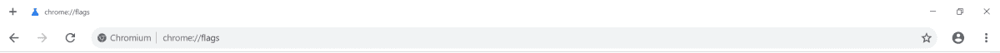

# 用一个 Chrome 标志启用谷歌 Chrome 的新设计

> 原文：<https://www.xda-developers.com/enable-google-chrome-new-design-chrome-flag/>

# 用一个 Chrome 标志启用谷歌 Chrome 的新设计

谷歌 Chrome 正在经历重大的设计变革。材料设计的改进还很遥远，但对于那些有兴趣尝试 Chrome 新设计的人来说，有一个新的 Chrome 标志将启用所有功能。

联想 Thinkpad Chromebook 13 带材质设计新标签页

谷歌 Chrome 浏览器是开源的，所以我们可以很容易地跟踪它的开发进度。我们已经看到 Chrome 如何针对触摸屏设备进行[优化，如](https://www.xda-developers.com/google-chrome-touch-optimized-chrome-os-tablets/)[惠普 Chromebook X2](https://www.xda-developers.com/hp-chromebook-x2-detachable-chrome-os-tablet/) 和[宏基 Chromebook Tab 10](https://www.xda-developers.com/acer-chromebook-tab-chrome-os-tablet/) ，如何进行[主要材料设计改造](https://www.xda-developers.com/google-chrome-material-design-2-android-p/)，以及 Chrome OS 如何接受 Android P-esque [用户界面变化](https://www.xda-developers.com/chrome-os-67-android-p-system-tray/)。我们涵盖了我们发现的最有趣的新 Chrome 标志，但是为了测试所有最新的功能而不得不挖掘和启用多个标志可能会很烦人。谷歌将把谷歌 Chrome 的所有新设计整合到一面 Chrome 旗帜下，让我们更容易做到这一点。

谷歌 Chrome 新的“可触摸刷新”界面是什么样子。可触摸刷新结合了触摸优化和新材料设计的变化。在`chrome://flags#top-chrome-md`启用

这种名为“uifood”的旗帜已经出现在最新的 Chrome Canary 和 Chromium nightlies 中。您可以通过将`chrome://flags#uifood`粘贴到地址栏来启用它。Chrome 标志可用于 Mac、Windows、Linux 和 Chrome OS。

目前，启用它并没有多大作用。自从它在 Gerrit Code Review 中首次出现以来，我们一直在跟踪这个标志的进展，你可以看到 Chrome 团队如何[慢慢开始将对所有新 UI 功能的支持](https://chromium-review.googlesource.com/q/%2522uifood%2522)整合到这个标志中。如果你有兴趣在你的设备上测试最新的 Chrome 设计变化，那么我们建议启用这个标志，让你更容易跟上！