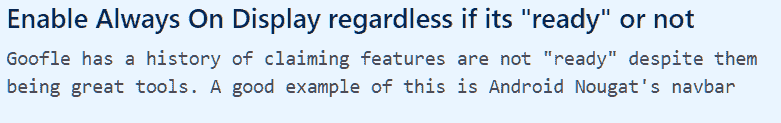

# 谷歌 Pixel 2 的“常开环境显示”现在可以在你的 Android Oreo ROM 上启用

> 原文：<https://www.xda-developers.com/enable-google-pixel-2-always-on-ambient-display/>

谷歌安卓系统的最新更新——美味的安卓奥利奥，为用户提供了很多东西。从将密码管理器与新的[自动填充 API](https://www.xda-developers.com/android-os-autofill-framework-will-finally-resolve-a-long-standing-lag-issue-with-password-managers/) 集成到更多更低层次的变化，如[项目 Treble](https://www.xda-developers.com/googles-project-treble-modularize-android-so-oems-can-update-devices-faster/) ，下一次更新让我们论坛上的许多用户兴奋不已，这是可以理解的。但有时，谷歌喜欢在初始更新中保留某些功能，无论是因为功能不完整还是打算与[下一代设备](https://www.xda-developers.com/source-pixel-2-walleye-and-taimen-specifications-revealed/)一起发布。其中一个功能是**Always On Ambient Display mode**，这是我们在第一代谷歌 Pixel 上首次发现的禁用状态，据推测[将与谷歌 Pixel 2 和 Pixel 2 XL](https://www.xda-developers.com/source-pixel-xl-2-will-have-ambient-display-always-on-squeezing-while-screen-off-multiple-display-profiles-and-more/) 一起推出。

自从我们最初报道这个功能的存在以来，一些用户一直在猜测，永远显示模式可能只会在下个月的第二代谷歌设备中提供(尽管[不会像最初报道的那样在高通骁龙 836](https://www.xda-developers.com/exclusive-no-qualcomm-snapdragon-836/) 中提供)。这很可能是事实，因为我们不知道谷歌计划这一功能的确切细节。然而，与传闻中的可挤压框架不同，永远在线环境显示器似乎已经完全功能化了——前提是你知道如何在 AOSP 中启用它。

你可以把这些质量差的照片归咎于我的摄影能力不足。

新的环境显示设置与三星或 LG 等公司的所有其他“始终显示”模式非常相似。当您关闭屏幕时，您会看到一个时钟停留在设备的屏幕上。当您收到通知时，您会在几秒钟内看到通知的完整内容，然后逐渐消失，只显示时钟下方的应用程序图标。

我正在展示的这种环境显示模式的测试设备是一台运行在 Android 8.0 Oreo 非官方端口上的谷歌 Nexus 6。由于开发者在我们的论坛上的出色工作，这是 Android Oreo 的许多非官方端口之一。在我测试的 ROM 中，在系统 UI Tuner 中已经启用了“始终打开环境显示”选项。

在试图通过使用[无根底层覆盖](https://www.xda-developers.com/andromeda-substratum-custom-themes-oreo/)将[导航栏](https://www.xda-developers.com/customise-the-navigation-bar-android-oreo/)和[锁屏快捷方式定制](https://www.xda-developers.com/customize-lockscreen-shortcuts-android-oreo/)带回系统 UI 调谐器的一些不成功的尝试之后(不幸的是，没有根是不可能的，因为[需要将系统属性`ro.debuggable`设置为 1](https://android.googlesource.com/platform/frameworks/base/+/master/packages/SystemUI/src/com/android/systemui/tuner/TunerFragment.java#48) ),我翻遍了源代码，还发现了[方法](https://android.googlesource.com/platform/frameworks/base/+/master/packages/SystemUI/src/com/android/systemui/tuner/TunerFragment.java#93)，该方法确定是否将在系统 UI 调谐器中显示总是在环境显示[。](https://android.googlesource.com/platform/frameworks/base/+/master/packages/SystemUI/res/xml/tuner_prefs.xml#124)

看来在`AmbientDisplayConfiguration` 中有一个名为“`alwaysOnAvailable`”的[方法，目前被硬编码为总是返回“false”这里有一个注释，说明了它为什么这样做，因为它“还不能正常工作。”也许不会，但是如果不进一步解释为什么它不起作用，我不明白为什么我们不应该让用户随心所欲地使用它。](https://android.googlesource.com/platform/frameworks/base/+/master/core/java/com/android/internal/hardware/AmbientDisplayConfiguration.java#82)

因此，要真正实现“始终在环境中显示”,您所要做的就是修改这个方法，使其始终返回“true”。这正是 [SiXROM](https://forum.xda-developers.com/nexus-6/development/8-0-0r4-s-x-aosp-rom-r3ds-t3670056) 所做的事情，[向 XDA 资深成员](https://github.com/VorVanille/android_frameworks_base/commit/ee7f804a1543bda9e37436c5d35dc58dcfea14af)[welcometothekye](https://forum.xda-developers.com/member.php?u=7009886)借用了 [Vanilla 的 commit](https://forum.xda-developers.com/nexus-6p/development/rom-vanilla-rootless-oms-t3570350) ，一个用于 Nexus 6P 的 ROM 。

 <picture></picture> 

Not sure if "Goofle" is just a misspelling or if it was intentional.

我并不真的把 Nexus 6 作为日常驱动，而仅仅是作为一个测试设备，我很快就把它带回到生活中来做底层教程。因此，我现在不能告诉你它在实践中有多好，因为我还没有使用它超过几天。但是如果你运行的是 Android Oreo 的非官方端口(可能有有机发光二极管显示器)，那么你可能会有兴趣尝试一下。

当然，我们大多数人都不是定制 ROM 的开发者，所以做这样的改变有点超出我们的能力范围。任何想加入这个特性的 ROM 开发者读到这里，希望你现在可以很容易地做到。甚至值得在 Android 框架中[启用环境显示老化保护](https://android.googlesource.com/platform/frameworks/base/+/master/core/res/res/values/config.xml#2526)。