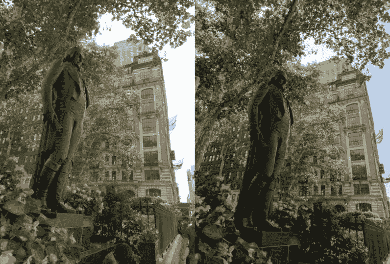
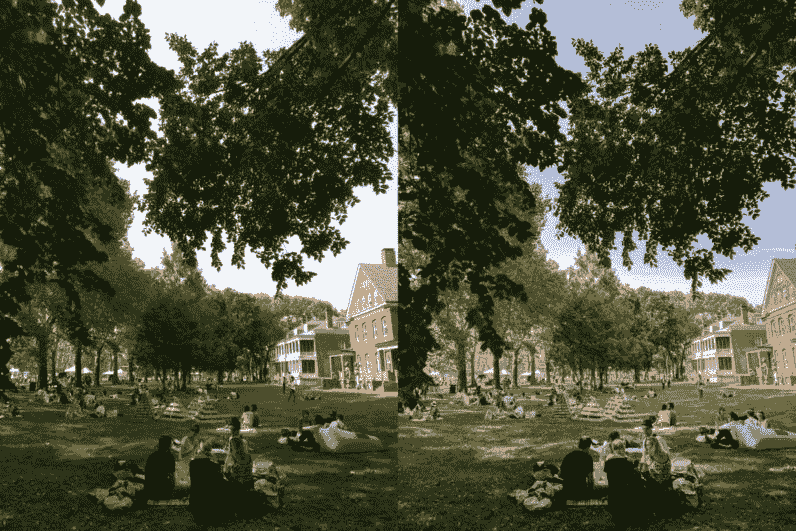

# 有一个简单的方法可以改善手机的拍照质量——谷歌的拍照应用

> 原文：<https://www.xda-developers.com/essential-phone-camera-quality-fix/>

Essential Phone 背后的公司在销售一款外观漂亮、规格相当高端的手机时，做出了一些相当有问题的决定。我们写了一篇[文章，详细描述了我们对这款设备及其背后公司的问题](https://www.xda-developers.com/essential-bleeding-consumer-trust/)。更有甚者，在我们发表那篇文章后不到一天， [Essential 似乎又搞砸了](https://www.xda-developers.com/psa-potential-phishing-alert-essential/)，让一小部分客户处于潜在的危险境地。为了重获用户的好感，[那些收到骚扰邮件的人将获得一部免费手机和一年的生命锁服务](https://www.xda-developers.com/andy-rubin-essential-free-phone/)。

这些只是与公司有关的问题。

这款手机本身看起来相当不错，尤其是软件方面，因为它几乎采用了安卓系统。不精彩，不“必不可少”，只是好。但这款设备最大的问题之一是拍照体验。几乎普遍的是，评论者和这款手机的早期用户都表示，相机体验无法与同类别的其他旗舰手机相提并论。这款手机拍照速度慢，质量差，还有很多不足之处。

* * *

## 软件抑制了基本手机的拍照潜力

谢天谢地，[TheNextWeb.com](https://thenextweb.com/reviews/2017/08/30/essential-phone-review/)上的一篇评论指出，我们报道的[谷歌摄像头 HDR+端口](https://www.xda-developers.com/google-camera-updated-zero-shutter-lag-xiaomi/)在该设备上运行得非常好。不同的是**绝对日夜**，并表明基本手机的摄像头可以节省。正如下面的图片所展示的那样，这种传感器肯定有潜力，这些图片是由评审员[纳皮尔·洛佩兹](https://thenextweb.com/author/napierlopez/)在一台重要的 PH-1 上拍摄的。

在我展示其他图片之前，我只需要指出谷歌相机 HDR+与股票相机相比是多么惊人。相比之下,**的噪音**少得多，而**的细节**却令人印象深刻。这些照片对比足以让我动摇——基本款手机实际上有一个很好的相机，但它被库存相机软件拖了**的后腿。**

 <picture></picture> 

Left is stock, right is Google Camera HDR+ Port. Credits: Napier Lopez \\ TheNextWeb

 <picture></picture> 

Left is stock, right is Google Camera HDR+ Port. Credits: Napier Lopez \\ TheNextWeb

如果你仍然不相信，TheNextWeb 告诉我们，他们将对谷歌相机应用程序上的 HDR+和股票相机应用程序进行更详细的比较，所以一定要检查一下。

至于我们到目前为止看到的照片，当在谷歌相机应用程序上拍摄时，它们的质量更好，颜色更好，细节更多。这表明手机的相机问题实际上来自相机处理软件，而不是相机传感器本身。如果该设备有潜力拍摄如上所示的照片，并能持续做好这些工作，请留意 Essential 未来的软件更新——相机质量仍有提升空间。