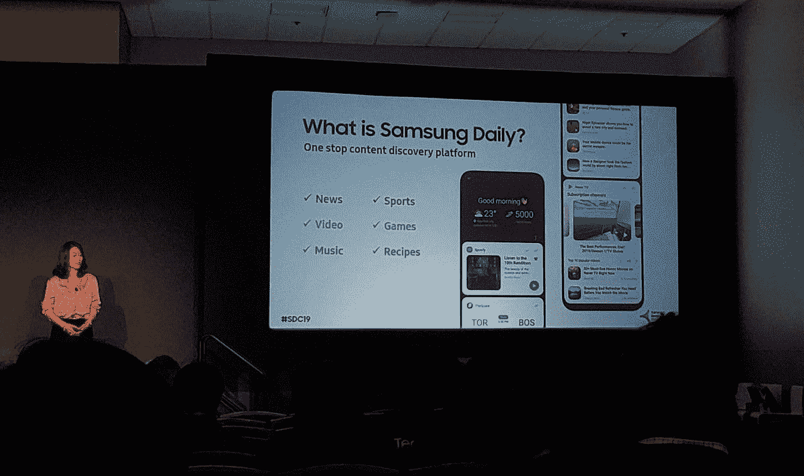

# 三星开发者大会 2019 公布的一切

> 原文：<https://www.xda-developers.com/everything-announced-samsung-developer-conference-2019/>

在过去的几年里，三星会在秋季举办三星开发者大会。这是该公司宣布所有软件的时候了，有时是硬件，它正在推动开发人员与之合作。去年都是关于一个 UI 和 Bixby。今年的主题是 Bixby 胶囊、可折叠产品和 One UI 2.0。

## 一个 UI 2.0

三星认为 One UI 1.0 取得了巨大的成功。他们声称 Galaxy S10 系列的客户忠诚度提高了 15%以上，Moor Insights & Strategy [的 Patrick Moorhead 认为这是因为一个 UI](https://www.forbes.com/sites/moorinsights/2019/10/29/samsung-improves-and-expands-the-mobile-experience-with-one-ui-2/#166a273e5ef3) 。随着 One UI 如此成功，三星希望更多地关注 One UI 2.0。One UI 2.0 旨在提供自然的交互和可见的舒适度，并帮助您更加专注于显示器上的内容。三星再次这样做了，将他们的“聚焦”块移向显示屏的底部，同时保持“观看区域”在顶部。他们本质上是在改进他们的用户界面，使可用性和易用性更好。三星还通过制作一些系统图标的动画来给用户界面增加一点个性，让用户界面看起来更有活力。

## 三星区块链 SDK

在 SDC，三星还宣布了其新的区块链 SDK。这使得开发人员可以轻松地将三星的硬件钱包集成到他们的最新设备中。使用 SDK，开发人员可以创建在设备上创建或访问区块链帐户的应用程序。SDK 还允许开发者接受 Etherium 等加密货币作为应用程序中的一种支付形式。这是对三星用其新的区块链 SDK 开放了什么的一个非常简单的描述。我强烈推荐在三星的开发者网站上阅读更多关于区块链 SDK [的内容。](https://developer.samsung.com/blockchain)

## 三星 SmartThings 规则 API

SmartThings 是三星的物联网平台，用于智能安全摄像机、冰箱、洗衣机、电视等。在 SDC，三星宣布了新的 API 规则。这允许开发人员使用三星 SmartThings 云设置完整的自动化。三星表示，这“意味着，用户可以获得的内置自动化功能的服务和产品数量将会增加。”关于这个新的规则 API 没有太多的信息，除了它可以在互联网中断的情况下运行。三星可能会宣布更多关于新的[规则 API](https://news.samsung.com/global/infographic-get-smart-the-latest-in-what-smartthings-can-do-for-you) [和 SmartThings 更新的信息。](https://news.samsung.com/global/infographic-get-smart-the-latest-in-what-smartthings-can-do-for-you)

## 比克斯比

虽然这不是 SDC 的主要宣布之一，但三星在 Bixby 中有一个新的胶囊来展示 Bixby 的力量。它被称为 Bixby 家庭顾问。它允许你向 Bixby 寻求帮助，解决你在家里可能遇到的任何问题。例如，你可以找一个水管工。Bixby 随后会列出您可能需要帮助的问题或设备的清单，找到最接近和评价最高的专业人员，并让您请求报价。所有这些都发生得非常快，而且都是通过 Bixby 使用 Bixby 胶囊完成的。Bixby 胶囊可供任何开发者为任何装有 Bixby 的三星设备制作。

另一个小改动是在默认的 One UI Home 启动器上的 Bixby Home。三星将用名为 [Samsung Daily](https://www.sammobile.com/news/samsung-daily-replace-bixby-home-content-discovery/) 的新页面取代 Bixby Home。它本质上是一样的东西，但它有一个新的图标和略有不同的设计。据传将于 2 月份发布的 Galaxy S11 可能会推出一个 UI 2.0 或一个 UI 2.1。

 <picture></picture> 

Image from our friends at [SamMobile](https://www.sammobile.com/news/samsung-daily-replace-bixby-home-content-discovery/)

## 三星 Galaxy Book Ion 和 Galaxy Book Flex

虽然 SDC 主要是关于三星的软件，但仍有一些硬件可以炫耀。三星宣布了两款新的笔记本电脑:三星 Galaxy Book Ion 和 Galaxy Book Flex。这些新的笔记本电脑都采用了最新的第十代英特尔 Ice Lake 和 Comet Lake 处理器。这两款笔记本电脑都配备了 1080p 的三星 QLED 显示屏。这些都是你能在三星电视上找到的同样类型的优秀显示器。它们配备了一种新的户外模式，允许显示器达到非常亮的 600 尼特，比最新的 MacBook Pro 和 Surface Book 2 亮近 200 尼特。它们都非常薄，Galaxy Book Flex 和 Ion 的厚度为 13 毫米至 15 毫米。Galaxy Book Flex 非常轻，最小 1.15 千克(2.5 磅)，最大 1.57 千克(3.5 磅)，而 Galaxy Book Ion 最小 0.97 千克(2.13 磅)，最大 1.15 千克(2.78 磅)

三星在 Galaxy Book Flex 和 Galaxy Book Ion 上做的新事情是将无线 PowerShare 融入触控板。本质上，触控板可以为你的手机、耳塞或手表无线充电。Galaxy Book Flex 也配有一支 S Pen。这是 Galaxy Note 10 自带的同一个 S Pen，所以它有所有相同的空中动作。这些笔记本电脑计划于 2020 年初推出。三星尚未宣布这些笔记本电脑的任何价格。

## 银河折叠 2 预告

就像去年一样，三星在 SDC 推出了代号为“bloom”的新款 Galaxy Fold 2。今年，他们展示了一段 24 秒的视频，显示器折叠关闭。这是一个蛤壳式设计，带有一个居中的打孔孔。这很有可能在 2020 年初推出，6.7 英寸的显示屏可以折叠成正方形，正如彭博上个月报道的那样。该型号据传是 SM-F700F，并配有 [256GBs 的存储](https://www.sammobile.com/news/exclusive-new-galaxy-fold-affordable-256gb-storage/)。这款设备的软件开发始于本月初。我们有一整篇关于这种新玩法的文章，所以如果你想知道更多，我推荐你去看看。

## 银河迷你家庭

在 SDC，三星展示了 Galaxy Home Mini。这是他们较小的 Bixby 扬声器。除了它的存在和三星正在展示它之外，我们对这款扬声器了解不多。三星还在韩国启动了一项测试计划，将这些设备播种给用户，让他们在家中进行测试。还有更大的 Galaxy Home，但三星在近 14 个月内没有向我们更新任何关于该设备的新信息。

三星在 SDC 2019 上宣布了许多新产品和软件。作为一个开发者网站和论坛，我们喜欢看到三星在他们的开发者大会上宣布的一切。很高兴看到公司向越来越多的人开放他们平台上的开发。