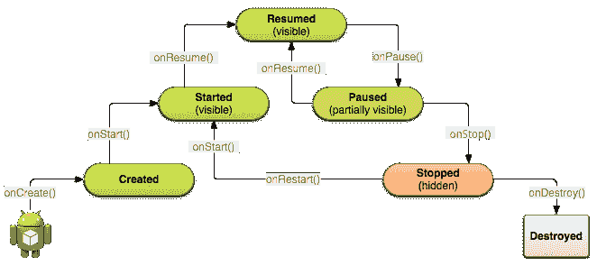

# Android N 中的多窗口:开发者需要知道什么来充分利用它

> 原文：<https://www.xda-developers.com/everything-devs-need-to-know-about-multiwindow-in-android-n-code-examples/>

# Android N 中的多窗口:开发者需要知道什么来充分利用它

我们概述了 Android N 中即将到来的多窗口支持对开发者意味着什么，以及如何充分利用它！

多窗口支持是我们在 Android N 中期待的一个很好的特性，也是我们很久以来就想在所有设备上实现的一个特性。然而，为了让它成为一种愉快的体验，开发者可能需要在他们的应用程序中做一些改变来正确地支持它。

Google I/O 会议之一是让开发者了解新的 API 和多窗口支持带来的系统行为变化。

会议由 Wale Ogunwale 主持，他是 Android ActivityManager 和 WindowManager 框架组件的技术主管，他和他的团队负责 Android 上的多窗口。

你可以在 YouTube 上观看[多窗口模式会话，但我们也在这里提供会话的概述。](https://youtu.be/yEEy_48hoXI)

# 介绍

n 引入了三种不同的多窗口模式:

*   分屏模式:这是默认可用的模式。顾名思义，它允许你同时打开两个应用程序。
*   自由模式:制造商可以在更大的设备上启用该模式，除了分屏模式之外，用户还可以自由调整活动的大小。
*   [画中画模式](https://developer.android.com/preview/features/picture-in-picture.html):针对 Android 电视设备，该模式旨在让视频播放器在固定窗口中运行，同时用户与其他应用程序进行交互。

一文不值

[we've covered multi-window on N before and offered some criticism of the current system](http://www.xda-developers.com/praise-and-criticism-of-ns-multi-window-freeform-from-a-multi-window-fan/)

。考虑到这一点，我们希望自由形式模式更接近画中画模式，因为这将在所有设备上有有用的应用。

# 添加多窗口支持

在您的应用程序中启用多窗口支持很简单:如果您已经面向 N，您不需要做任何事情

`android:resizeableActivity`

清单中的活动属性添加到

`false`

。只有在真正合理的情况下才应该这样做，因为即使用户(或另一个应用程序)试图以多窗口模式启动，它也总是以全屏模式启动，从而使你的应用程序以一种不好的方式突出。值得注意的是，根活动的属性适用于其任务堆栈中的所有活动。

**In other words, if you have an activity that can be started by other apps, make sure it supports multi-window mode**

因为你不能保证其他应用程序会在新任务中启动你的活动

[`Intent#FLAG_ACTIVITY_NEW_TASK`](https://developer.android.com/reference/android/content/Intent.html#FLAG_ACTIVITY_NEW_TASK)

。画中画模式支持必须通过

`android:supportsPictureInPicture`

属性。请注意，如果出现以下情况，此属性将被忽略

`android:resizeableActivity`

是

`false`

。布局属性可用于设置自由形式窗口的默认尺寸和位置，或者指定自由形式和分屏模式的最小宽度或高度:

*   `android:defaultWidth` / `android:defaultHeight`:活动的默认维度(自由形式模式)。
*   `android:gravity`:活动的初始位置(自由形式模式)。
*   `android:minimalWidth` / `android:minimalHeight`:活动的最小维度(自由形式和分屏模式)

您可以在中找到代码示例

[Google's Multi-Window Playground sample app](https://github.com/googlesamples/android-MultiWindowPlayground/)

在 GitHub 上:

[AndroidManifest.xml](https://github.com/googlesamples/android-MultiWindowPlayground/blob/master/Application/src/main/AndroidManifest.xml#L44)

.

# 系统行为变化

随着多窗口支持的引入，您可能需要仔细检查应用程序中的一些内容，以确保它们正确运行。

### 了解活动生命周期

这

[activity lifecycle](https://developer.android.com/training/basics/activity-lifecycle/index.html)

在多窗口模式下不变:



也就是说，活动状态之间的一些细微差异可能会导致您在 n 之前通常不会注意到的意外行为。了解这一点很重要

[`Activity#onResume()`](https://developer.android.com/reference/android/app/Activity.html#onResume())

和

[`Activity#onPause()`](https://developer.android.com/reference/android/app/Activity.html#onPause())

当您的应用程序获得或失去焦点时调用，但不一定在它开始或停止可见时调用。(请记住，在任何给定时间，只能有一个应用程序获得焦点。)对于经常更新内容的应用程序(如视频播放)，请确保在中处理开始和停止内容更新

[`Activity#onStart()`](https://developer.android.com/reference/android/app/Activity.html#onStart())

和

[`Activity#onStop()`](https://developer.android.com/reference/android/app/Activity.html#onStop())

相反。例如，对于视频应用程序来说，

**will mean that playback will only occur if the app is focused**

，这违背了多窗口模式的目的。

[The official YouTube app had a similar problem when the Android N Developer Preview first launched](http://www.xda-developers.com/multiwindow-on-android-n-now-lets-you-watch-videos-uninterrupted/)

.

### 处理运行时更改

当应用程序进入多窗口模式时，一些设备配置会发生变化。您可以允许您的活动重新开始(在这种情况下

[retaining Fragments](https://developer.android.com/guide/topics/resources/runtime-changes.html#HandlingTheChange)

如果您的活动必须在启动时执行密集操作，这可能是个好主意)，或者选择

[handle the configuration changes explicitly](https://developer.android.com/guide/topics/resources/runtime-changes.html#RetainingAnObject)

相反。当进入多窗口模式或在多窗口模式中时，四种设备配置可能会改变:

`screenSize`

,

`smallestScreenSize`

,

`screenLayout`

和

`orientation`

。请参考

[Android Developers documentation](https://developer.android.com/guide/topics/manifest/activity-element.html#config)

有关每个属性的更多信息，但请注意

`orientation`

在这种情况下，不再指设备的方向。相反，它仅仅表明你的活动的宽度是否大于高度(横向)或(纵向)。可以从清单中声明您的活动将处理这些更改:

```
<activity android:name=".MyActivity" android:configChanges="screenSize|smallestScreenSize|screenLayout|orientation" />
```

请记住，这意味着您实际上需要在

[`Activity#onConfigurationChanged()`](https://developer.android.com/reference/android/app/Activity.html#onConfigurationChanged(android.content.res.Configuration))

，通过手动更新视图或重新加载一些资源。

### 多窗口模式下禁用的功能

在多窗口模式下，您的活动不会影响某些系统功能:

*   状态栏和导航栏的更改，如变暗/隐藏系统栏或使用沉浸式模式，将不会产生任何效果。这很有意义，因为你的活动只占据了屏幕的一部分。
*   在多窗口模式下,`android:screenOrientation` activity 属性也不起作用:因为您的 activity 将是可调整大小的，所以它不再有固定的方向。

# 新增 API

为多窗口事件添加了新的回调，以及查询当前状态的方法。

*   `Activity#onMultiWindowModeChanged(boolean inMultiWindow)`:当活动状态从全屏变为多窗口时调用，反之亦然。
*   `Activity#onPictureInPictureModeChanged(boolean inPictureOnPicture)`:当活动状态从画中画模式变为画中画模式时调用。
*   `Activity#isInMultiWindowMode()` / `Activity#isInPictureInPictureMode()`:返回活动是否处于多窗口/画中画模式。
*   对于自由形式的窗口，这个方法可以用来使标题(用来拖动窗口的条)覆盖内容，而不是向下推。

PS。除了

`Activity#overlayWithDecorCaption()`

，这些方法也由

`Fragment`

班级。

### 在多窗口模式下启动活动

*   `Activity#enterPictureInPictureMode()`可用于将活动置于画中画模式。请注意，PiP 模式下的活动不会收到关于输入事件的通知——如果您想处理这样的事件，请使用 [`MediaSession#setMediaButtonReceiver()`](https://developer.android.com/reference/android/media/session/MediaSession.html#setMediaButtonReceiver(android.app.PendingIntent)) 。如果你对 Android N 上的[画中画感兴趣，也一定要去看看 Android 开发者网站。](https://developer.android.com/preview/features/picture-in-picture.html)

*   如果设备处于分屏模式，您可以使用`Intent#FLAG_ACTIVITY_LAUNCH_ADJACENT`标志告诉系统在您的活动旁边启动另一个活动。如果不是在分屏模式下，该标志不起作用。
*   如果设备处于自由模式，可以使用`ActivityOptions#setLaunchBounds()`来指定新活动在屏幕上的尺寸和位置。

有关代码示例，请查看多窗口游乐场示例应用程序:

[adjacent activity example](https://github.com/googlesamples/android-MultiWindowPlayground/blob/master/Application/src/main/java/com/android/multiwindowplayground/MainActivity.java#L70)

,

[launch bounds example](https://github.com/googlesamples/android-MultiWindowPlayground/blob/master/Application/src/main/java/com/android/multiwindowplayground/MainActivity.java#L85)

.

### 拖放

虽然拖放支持在 Honeycomb 之后就出现了，但以前只可能出现在同一活动中。就是现在

[supported in multi-window](https://plus.google.com/+zacharyKewDenniss/posts/PoVZnUcPftD)

也是。实现这一点似乎是

[mostly the same as before](https://developer.android.com/guide/topics/ui/drag-drop.html)

，增加了一些跨活动拖放功能:

*   `View#startDragAndDrop()`

    *   新别名为`View#startDrag()`。
    *   启用跨活动拖拽，传递新标志`View#DRAG_FLAG_GLOBAL`。
    *   如果您需要向接收者活动授予 URI 权限，请根据需要传递新标志`View#DRAG_FLAG_GLOBAL_URI_READ`或`View#DRAG_FLAG_GLOBAL_URI_WRITE`。

*   `View#updateDragShadow()`

    *   替换当前正在进行的拖动操作的拖动阴影。只能由发起拖动操作的应用程序调用。

*   `View#cancelDragAndDrop()`

    *   取消当前正在进行的拖动操作。只能由发起拖动操作的应用程序调用。

# 其他值得注意的补充

*   分别使用`PackageManager#FEATURE_FREEFORM_WINDOW_MANAGEMENT`和`PackageManager#FEATURE_FREEFORM_PICTURE_IN_PICTURE`，通过 [`PackageManager#hasSystemFeature()`](https://developer.android.com/reference/android/content/pm/PackageManager.html#hasSystemFeature(java.lang.String)) 可以检查设备是否支持自由形式或画中画模式。

# UX 最佳实践:

Wale 提供了一些最佳实践来确保您的用户获得最佳体验:

*   处理模式优雅地改变:
    *   **无论方向如何，保持用户界面的一致性**。不要让元素改变位置来实现平滑过渡。
    *   扩展上述内容，**不要在非常不同的手机/平板电脑布局之间切换**。相反，调整平板电脑的布局以适应较小的尺寸，从而保持一致性。
*   **通过[遵循材料设计模式](https://www.google.com/design/spec/layout/responsive-ui.html#responsive-ui-patterns)，确保您的活动适应小尺寸**。
*   在分屏模式下，当有必要获得更愉快的体验时，使用`FLAG_ACTIVITY_LAUNCH_ADJACENT`。
*   **仅在调整后声明尺寸不兼容**。正如我们上面讨论的，否则它会让你的应用程序以一种不好的方式脱颖而出。

# 有用的资源

Wale 在会议结束时提供了一些额外的有用资源: