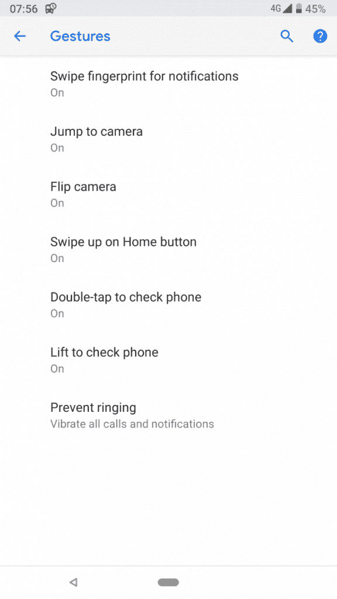
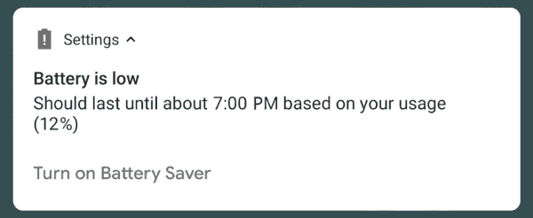

# Android P 开发者预览版 2 中的所有新内容

> 原文：<https://www.xda-developers.com/everything-new-android-p-developer-preview-2/>

谷歌显然正计划与 [Android P](https://www.xda-developers.com/tag/android-p/) 一起进行一次大的方向转变。很明显，这是自[安卓 5.0 棒棒糖](https://www.xda-developers.com/tag/android-lollipop/)和[材质设计](https://www.xda-developers.com/tag/material-design/)首次向公众推出以来，安卓操作系统 4 年来最大的一次更新。虽然对于 Android 7.0/7.1 牛轧糖和 Android 8.0/8.1 奥利奥来说也是如此，但这次我们是认真的:大量的行为变化，新的动画，精致的通知和基于谷歌更新材料设计指南的新的刷新的 UI/UX 让 P 感觉像一个完全不同的野兽。

Android P 的第一个开发者预览版是在三月 T1 发布的，T2 我们已经讨论过所有新的东西了。对于大幅翻新的 Android 版本，最初的反应明显不一:一些人称赞谷歌现有材料设计准则的最终演变，而另一些人则抨击它看起来太像苹果的 iOS。不过，有一件事是清楚的:不管你喜不喜欢，Android 今年看起来会有所不同。

在 Google I/O 2018 期间，[第二个 Android P 开发者预览版在](https://www.xda-developers.com/android-p-beta-program-is-now-available/)面向少数设备推出，将操作系统带入测试状态，并为我们提供了一系列新功能和改进。今天，我们将回顾其中的一些改进。

## 摘要

*   全新的手势导航
*   改进了最近的应用切换器
*   自适应电池和亮度(机器学习)
*   人工智能驱动的应用程序操作
*   应用程序“切片”
*   重新设计的分屏界面
*   更多生物识别安全支持
*   数字福利工具
*   人工智能-请勿打扰

## 导航手势

苹果在 iPhone X 中取消 home 键的解决方案，而不是实现带有虚拟按钮的导航栏，是添加一个手势系统。事实证明，即使对于不懂技术的用户来说，也很容易上手。鉴于这被证明是比虚拟按钮更快、更直观的解决方案，预计 Android 手机制造商将很快开始使用基于手势的导航。[一加](https://www.xda-developers.com/tag/oneplus)和[小米](https://www.xda-developers.com/tag/xiaomi/)是首批在其 Android forks 上实现手势操作的公司之一，但谷歌也将在 Android P 上为 AOSP 添加手势导航功能

 <picture></picture> 

Gesture settings

然而，传统的 Android 实现与我们见过的大多数实现有些不同，与 iOS 相比，它更像 WebOS 手势。我们仍然有一个后退按钮，尽管它是根据上下文显示的。带有手势的导航条仍然比带有虚拟按钮的导航条占据同样多的空间，所以使用手势而不是按钮绝对不会增加屏幕空间。但 Recents 按钮已经被完全移除，home 键被一个手势药丸取代。默认情况下不启用，所以如果你是团队按钮，你可以在 DP2 中保持快乐。

*   快速向上滑动:最近的应用
*   长时间向上滑动:应用抽屉
*   单击:主页
*   长按:谷歌助手
*   向左或向右拖移:浏览最近的应用程序
*   快速向右滑动:打开上一个应用程序

它仍然有点粗糙，但话说回来，我们正在谈论一个测试版，所以手势功能仍然有一些改进的地方。

## 最近的应用切换器

为了配合新的手势，最近的应用程序用户界面已经彻底检修。应用程序卡片的垂直列表已被显示完整应用程序的水平列表所取代。如果 [Pixel 启动器](https://www.xda-developers.com/tag/pixel-launcher)是你的默认启动器，最近的应用程序屏幕也会显示一个[谷歌搜索](https://www.xda-developers.com/tag/google-search/)栏和 5 个你可能会使用的应用程序。在最近的应用程序屏幕上向上滑动将显示完整的应用程序抽屉。

新的最近应用程序屏幕有一个很酷的地方，那就是无需完全跳转就能与应用程序进行交互。您可以长按从“最近使用的应用程序”屏幕中选择文本和图像。这将使多任务处理变得更加容易。

## 自适应电池

Android P 还引入了一些由机器学习支持的聚会技巧来延长手机的电池寿命，因为它引入了谷歌所谓的“自适应电池”。该系统会记录下你经常使用的应用程序，以及你使用它们的频率，然后对你最少使用的应用程序进行限制，以便它们消耗更少的电池。谷歌没有具体提到他们对这些应用程序施加了什么样的限制，但我们猜测，这些限制对那些具有侵入性后台服务的应用程序会产生更大的影响，即使你不使用它们，这些应用程序也会保持运行。

如果一个游戏保留了一个不必要的后台服务，而你又不沉迷于这个游戏，那么这个功能会非常方便，因为这个后台服务虽然不会被完全取消，但会被限制在对你的电池影响可以忽略不计的程度。我们还没有看到这是否会在现实世界的使用中产生影响，但听起来确实很有趣。

 <picture></picture> 

Low battery notification shows what time your phone will power off

## 应用程序操作

Android P 的另一个人工智能功能是[应用动作](https://www.xda-developers.com/slices-app-actions-android-p-google-assistant/)。它的概念非常简单:基于你通常用手机做的事情、你最频繁的联系人和其他使用统计数据，Android 将试图占据主导地位，预测你将要做什么，并为你的手机下一步做什么提供建议——不一定是一个应用程序，但它也可能建议任务、应用程序快捷方式和其他事情。如果你喜欢在 [WhatsApp](https://www.xda-developers.com/tag/whatsapp/) 上与你的另一半聊天，你的启动器上可能会出现该特定聊天的快捷方式。如果你插上耳机，在 [Spotify](https://www.xda-developers.com/tag/spotify/) 上获取你最喜欢的播放列表的动作也会出现。

然而，应用程序的动作将不仅限于启动器:根据谷歌的描述，你可能会在其他地方看到它们，如智能文本选择、 [Play Store](https://www.xda-developers.com/tag/play-store) 、谷歌搜索应用程序，甚至是[谷歌助手](https://www.xda-developers.com/tag/google-assistant/)。同样，我们仍在观察它在日常使用中的实际表现，但它的基础听起来很有趣。

## 部分

[切片](https://www.xda-developers.com/slices-app-actions-android-p-google-assistant/)是一种在另一个应用程序中显示应用程序交互片段的方式。切片是一个交互式片段，显示应用程序外部的应用程序内容。谷歌展示的例子是寻找一个 Lyft。你只需在谷歌中搜索“Lyft ”,就会看到 Lyft 应用程序的搜索结果。当你点击这些结果时，它将直接启动应用程序中的那个动作。这将会节省你进入和退出应用程序的时间。

## 重新设计的分屏界面

自从它与 Android 7.0 牛轧糖一起推出以来，分屏实际上是一个真正令人期待的功能，但由于完全缺乏宣传，它一直没有引起人们的注意。因为它不会在任何地方做广告，唯一的方法就是长按“最近”或从“最近”中拖出一个应用程序，所以对每个人来说都不是很明显。虽然这并不是一个真正被遗忘的功能，因为许多精通技术的用户(包括我自己)每天都在使用它，但它在很大一部分消费者市场上几乎不存在。Android P 改变了分屏的启动方式，我们认为这是为了让它更容易使用。

现在，在更新的 Recents 面板中，只需点击预览窗口顶部的应用程序图标，即可打开上下文菜单，其中包含查看应用程序信息、分屏模式和 Pin 的选项。在我看来，我不认为这将产生多大的差异或影响，但话说回来，我真的不知道谷歌在这背后的推理。

## 自适应亮度

更多的机器学习恶作剧被扔进 Android P，这次是为了完善自适应亮度功能。自适应亮度实际上是在 Android 5.0 Lollipop 中引入的，以取代 4.x 时代的自动亮度功能。虽然自动模式可以完全摆脱亮度栏，只使用环境传感器来控制绝对亮度，但自适应模式可以让你使用亮度栏来选择一个亮度范围——使用环境传感器时，它仍然会变暗或变亮，但你可以手动选择它变暗或变亮的程度。在 Android P 中，这个功能正在通过机器学习进行完善。

根据谷歌的说法，自适应亮度将通过学习你移动亮度条的频率以及在什么情况下调整亮度条来记录你的习惯。然后，它会尝试为你做同样的事情，并在这些情况下进行调整，试图将它调整到完全适应你的环境。因为它是机器学习，当你使用它时，它应该变得更智能和更准确。

## 支持虹膜/面部扫描

虽然指纹扫描是整个 Android 生态系统中使用最广泛的生物识别选项，但制造商也一直在寻求其他生物识别技术。自从推出 [Galaxy Note 7](https://forum.xda-developers.com/note-7) ，[三星](https://www.xda-developers.com/tag/samsung/)在其所有旗舰设备上都配备了虹膜扫描仪，包括 [Galaxy S8](https://forum.xda-developers.com/galaxy-s8) ， [Galaxy Note 8](https://forum.xda-developers.com/galaxy-note-8) ，以及最近推出的 [Galaxy S9](https://forum.xda-developers.com/galaxy-s9) 。随着 iPhone X 完全抛弃指纹进行面部扫描——使用多个传感器来准确识别你的面部——很明显某些原始设备制造商将很快尝试 3D 扫描。

[Android P 将正式支持这些生物识别方法](https://www.xda-developers.com/android-p-new-biometrics-api/)作为指纹的替代品。开发人员现在可以调用 USE_BIOMETRIC，而不是在应用程序中调用 USE_FINGERPRINT 权限，这涵盖了指纹、虹膜和面部扫描仪等。

## 数字福利

谷歌在展示 Android P 时谈论了很多关于“数字福利”的话题。很明显，这是此次发布的重要组成部分。奇怪的是，数字福利就是帮助用户少用手机。谷歌包括了一套新的工具来帮助人们摆脱手机。

仪表盘显示了用户在手机上花了多少时间，以及哪些应用程序用完了这段时间。它甚至显示你收到的解锁和通知的数量。应用程序计时器允许用户限制自己使用应用程序的特定时间。当限制接近时，应用程序图标甚至会变灰。Wind Down 会在晚上让整个界面变灰，提醒你去睡觉。它与“请勿打扰”和“夜灯”配合使用。

## 请勿打扰会阻挡视觉干扰

自从最初出现在 Lollipop 中以来，Stock Android 的勿扰模式已经经历了多次不同的迭代，但它的目的一直保持不变:它会暂时让你的手机安静下来，以避免因通知而分心。虽然它可以让你的手机在口袋里保持平静，但它不能阻止抬头通知，这是在使用手机或玩游戏时分散视觉注意力的一种方式。

从安卓平台开始，视觉干扰也被屏蔽了。观看视频或玩游戏时，提醒通知会妨碍您，因此这是一个非常受欢迎的改进。一般来说，《请勿打扰》在安卓平台上更具攻击性。谷歌正在使用人工智能来了解你不想看到的通知。如果你不采取行动就从某个应用程序中删除通知，安卓会问你是否想完全阻止它们。

## 杂项改进

Android P 还带来了其他一些小的改进，虽然这些改进本身可能并不值得注意，但仍然是提高整体 UX 的非常重要的改进。

#### 利润

[标记截图编辑器](https://www.xda-developers.com/android-p-dp2-google-markup-screenshot-backported/)已经改版，增加了新的共享选项和改进的用户界面。此外，截图现在保存在图片/截图而不是图片中，这意味着原始截图现在丢失了。

#### 水平快速设置

快速设置切换回水平页面，亮度移到顶部。

#### 抬头通知

抬头通知有一个花哨的新动画。

#### UTC timezones

现在，您可以根据时区的 UTC 偏移量来显示和选择时区，而不仅仅是根据时区的位置。

#### 锁屏/环境显示屏上的天气

锁屏和环境显示屏上的天气显示。

#### 活性边

Pixel 2/Pixel 2 XL 设备中的 Active Edge 功能现在可以使抬头通知静音。

#### 通知告诉你是否正在使用摄像头/麦克风

运行应用程序的通知显示他们是否使用麦克风或摄像头。

#### 通知频率

您现在可以看到每天/每周发布通知的频率。

#### USB 控制者

现在有一个“USB 控制的”选项，当你插入你的设备。

#### 管理通知

通知阴影显示“管理通知”按钮。

#### 防止响铃手势

默认情况下，音量增大+电源会将铃声模式更改为振动。它也可以定制为静音手机。该选项位于设置->系统->手势中。

#### 状态栏中的蓝牙图标

断开连接时，蓝牙图标会从状态栏中消失。

#### 音量滑块中的铃声模式快捷方式

音量滑块更小，有了新的铃声模式快捷方式。

#### Pixel Launcher widget 选择器和主屏幕弹出窗口

最后但同样重要的是，Pixel Launcher 有一个新的小部件选择器和主页设置弹出窗口。

* * *

随着我们对这个版本的深入研究，新特性和改进的列表将会继续增加。如果您在使用 Android P 开发者预览版 2 时发现了什么新东西，请告诉我们！你觉得这个版本怎么样？