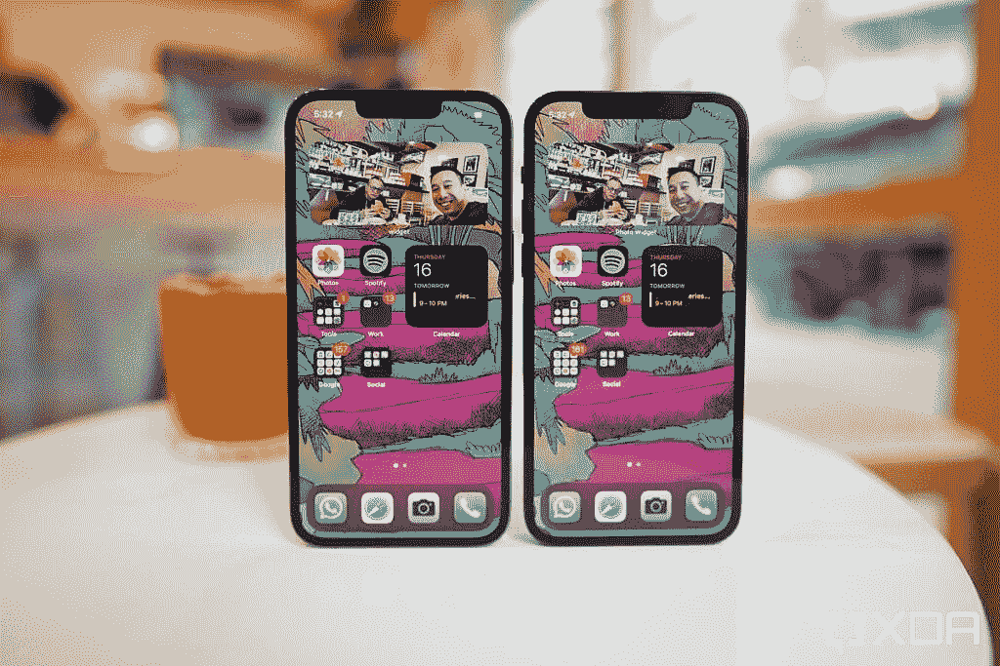

# 这是我们目前所知的关于即将到来的 iPhone 14 阵容的一切

> 原文：<https://www.xda-developers.com/everything-we-know-iphone-14/>

对一些最大的科技公司来说，保守秘密变得有点困难。我们已经习惯于听到准确的谣言和看到即将发布的精确泄漏。在这一点上，标准是在特定事件发生前几个月就知道预期的产品。这给我们留下了复杂的感觉——虽然早期的暗示在正式介绍之前起到了宣传的作用，但它们也破坏了事件，使事件变得有些无趣。iPhone 14 阵容的情况也不例外。关于这个即将推出的高端系列，我们已经听说了很多，尽管还有大约半年的时间。与 [iPhone 13](https://www.xda-developers.com/best-iphone-13-deals/) 相比，这里是我们目前所知的升级和改进。

## iPhone 14 的预期

据彭博的马克·古尔曼称，苹果将会对其通常区分高端机型的方式做出一些改变。今年，Pro 和普通 iPhone 14 变种之间的差异将更加明显——如果传言属实的话。Mark 分享了以下规范的详细信息:

### 处理器

苹果通常会在年度高端 iPhone 发布会上推出一款新的芯片。通常，属于某个系列的所有 [iPhone 型号](http://xda-developers.com/best-iphone)都由同一个 SoC 供电。不过，今年的情况可能会有所不同。我们预计 iPhone 14 Pro 型号将包含全新的 A16 仿生芯片。另一方面，普通的 iPhone 14 型号可能会满足于 iPhone 13 的 A15 仿生。它是一个相同的 A15 仿生芯片还是一个新的变种还是未知的。这背后的原因可能是芯片短缺，苹果决定重新定义什么是 *Pro iPhone* ，或者两者兼而有之。

### 后置摄像头

这家 Cupertino 科技巨头在高端 iPhones 上采用 12MP 宽(主)后置摄像头已经有一段时间了。这个 12MP 今年可能最终会得到显著的提升。不过，问题是，它可能仅限于 iPhone 14 Pro 机型。如果传言事实上是准确的，即将到来的阵容的专业变种将包括 48MP 宽相机。据报道，普通 iPhone 14 型号将坚持 12MP。

### 型号命名/尺寸

自从推出 iPhone 12 系列以来，苹果一直在高端产品上坚持这种安排:

*   5.4 英寸 iPhone Mini
*   6.1 英寸 iPhone
*   6.1 英寸 iPhone Pro
*   6.7 英寸 iPhone Pro Max

据报道，今年库比蒂诺的科技巨头将放弃迷你模型，转而采用:

*   6.1 英寸 iPhone 14
*   6.7 寸 iPhone 14 Max
*   6.1 英寸 iPhone 14 Pro
*   6.7 英寸 iPhone 14 Pro Max

通过推出普通的 Max iPhone，苹果可能会瞄准大屏幕粉丝，他们不一定愿意支付最高端的 Pro Max 机型。然而，通过放弃 Mini，微型显示器爱好者将在今年秋天失望。

### 等级

 <picture></picture> 

iPhone 13 Pro’s notch (left) is smaller than the iPhone 12 Pro’s notch.

第一款 iPhone notch 出现在 2017 年——当时苹果推出了标志性的 iPhone X。从那以后，这个屏幕入侵者就没有太大变化。是的，公司最近确实缩小了，但几乎看不出来。在这个部门，我们有一些好消息和坏消息要告诉那些轻视分数的人。这个技术霸主今年可能会转向打孔(用于摄像头)和药丸(用于传感器)的设计。坏消息是，它最有可能是 iPhone 14 Pro 独占。普通机型可能会采用 iPhone 13 系列中的相同功能。

除了所有这些突破性的变化，苹果可能会给 iPhone 14 系列带来紧急卫星连接。古尔曼指出:

> 最近有迹象表明，苹果公司及其明显的卫星合作伙伴 Globalstar Inc .可能会推出这样的功能。今年 2 月，Globalstar 表示，它达成了一项协议，购买 17 颗新卫星，以帮助为一个“潜在的”——未透露姓名的——客户提供“连续卫星服务”，该客户已向其支付了数亿美元。
> 
> 那个客户是苹果吗？我们可能不到六个月就会知道了。

如果这项功能问世，iPhone 14 用户也许可以获得紧急服务，即使他们在没有手机连接的农村地区。

距离 iPhone 14 发布还有大约半年的时间，仍然有足够的时间让更多的谣言浮出水面。然而，值得注意的是，无论我们非正式地看到了多少，苹果往往会有意想不到的另一件事。

你打算买一部 iPhone 14 吗？如果有，是哪个？请在下面的评论区告诉我们。

* * *

**来源:** [*彭博*](https://www.bloomberg.com/news/newsletters/2022-04-24/when-will-apple-s-aapl-iphone-14-go-on-sale-what-is-new-about-iphone-14-l2dceiyz)