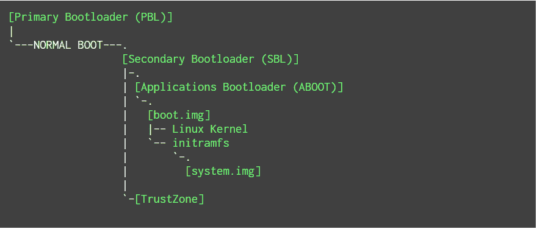
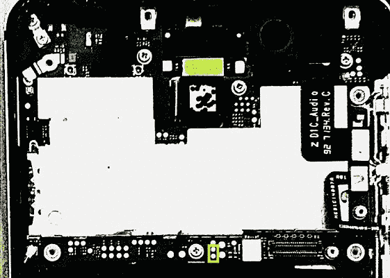
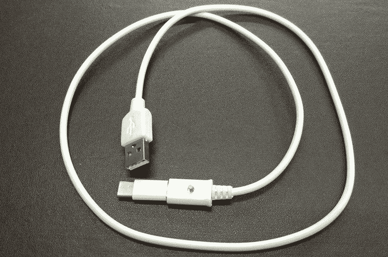

# 漏洞攻击针对高通的 EDL 模式，影响了小米、一加、诺基亚和其他设备

> 原文：<https://www.xda-developers.com/exploit-qualcomm-edl-xiaomi-oneplus-nokia/>

采用高通芯片组的设备有一个主**P**B**oot**l**loader(PBL ),它通常引导 Android 系统，但也包含一种称为 EDL 模式的替代引导模式。EDL 模式是高通的紧急下载模式，允许原始设备制造商(OEM)在设备上强制安装 flash 软件。这不能修改(只读模式)，并且对设备的存储具有完全控制权。包括一加和小米在内的许多原始设备制造商已经发布了利用 EDL 模式和一种称为 Firehose 的协议来解锁设备的工具(称为程序员)，而诺基亚等公司的其他工具已经泄露。Firehose 可以利用许多命令来刷新设备，并能够检查设备内存中的数据。来自 *Aleph Research* 的安全研究人员[Roee Hay](https://alephsecurity.com/authors/roeeh)([@ roe Hay](https://twitter.com/roeehay))和 [Noam Hadad](https://alephsecurity.com/authors/noamh) 发现了使用这种模式的关键设备漏洞，这实际上授予了攻击者**完全访问设备的权限**。**

值得注意的是**这种利用需要物理接触设备，但它仍然非常危险，很可能无法修补**。攻击者利用授予 EDL 模式的访问级别绕过诺基亚 6 的安全启动，击败了信任链，并获得了启动序列每个部分的完整代码执行，包括 Android 操作系统本身。从理论上讲，它在其他设备上也可以以同样的方式工作，研究人员还成功解锁并根接了多个小米设备，而没有任何数据丢失。

## 这种利用会影响哪些设备？

首先是受影响的设备。

### 受影响的设备列表。

*   LG G4
*   诺基亚 6 (d1c)
*   诺基亚 c5
*   Nexus 6 (shamu)
*   Nexus 6P(钓鱼)
*   G4 Plus 摩托车
*   OnePlus 5(芝士汉堡)
*   OnePlus 3T
*   一加 3
*   一加 2
*   OnePlus X
*   一加一
*   中兴 Axon 天机 7
*   ZUK Z1
*   ZUK Z2
*   小米 Note 5A (ugglite)
*   小米 Note 5 Prime (ugg)
*   小米 Note 4(美度)
*   小米 Note 3(杰森)
*   小米 Note 2(蝎子)
*   小米 Mix(锂)
*   小米 Mix 2 (chiron)
*   小米 Mi 6 (sagit)
*   小米 Mi 5s(摩羯座)
*   小米米 5s Plus(纳)
*   小米 Mi 5x(蒂芙尼)
*   小米 Mi 5(双子星)
*   小米 3(癌症)
*   小米 Mi A1(天梭)
*   小米 Mi Max2(氧气)
*   小米红米 Note 3 (kenzo)
*   小米 Redmi 5A (riva)
*   小米红米 4A(玫瑰色)

## 利用安卓手机

### 典型的安卓高通手机的启动顺序

在解释如何利用它之前，首先理解典型 Android 设备的引导序列是很重要的。 **S** 软件**B**oot**l**loader(SBL)是一个数字签名的引导加载程序，在加载到 imem 之前会检查其真实性。imem 是一种用于调试和 DMA(**d**direct**m**emory**a**access)事务的快速片上存储器，为高通芯片组专有。

一些设备有一个 e **X** 可扩展**B**oot**l**loader(XBL)而不是 SBL，但是引导过程几乎是一样的。SBL 或 XBL 随后推出 ABOOT，实现快速启动。随后，TrustZone(基于硬件的安全性)也被加载。TrustZone 通过基于硬件的根证书来检查 ABOOT 的真实性。SBL(或 XBL，在某些情况下)旨在拒绝错误签名(或未签名)的 ABOOT。

一旦通过认证，ABOOT 就会在启动 Linux 内核之前检查/boot 和/recovery 的真实性。一些系统准备工作已经完成，然后代码执行转移到内核。ABOOT 通常被称为“Android Bootloader”，当我们解锁设备的 Bootloader 时，我们在 ABOOT 中禁用了这种真实性检查。

 <picture></picture> 

Boot sequence of a standard Android device visualised. // Source: [Aleph Research](https://alephsecurity.com/2018/01/22/qualcomm-edl-1/?resub)

### 访问 EDL 模式

虽然一些设备有简单的硬件组合(或者更糟糕的是，许多小米设备中都有简单的专有快速启动命令)，但其他设备，如诺基亚设备，需要短路设备主板上的“测试点”引脚。在 2017 年 12 月的安全补丁之前，在许多设备(包括 Nexus 6 和 6P)上简单地运行“adb reboot edl”并进入 edl 模式也是可能的。这一问题已经得到解决。

 <picture></picture> 

Test points are shown in a drawn-on yellow box at the bottom of the device's mainboard. // Source: [Aleph Research](https://alephsecurity.com/2018/01/22/qualcomm-edl-1/?resub)

其他设备也可以使用所谓的“深闪”电缆，这是一种特殊的电缆，某些引脚被短路，以告诉系统转而启动到 EDL 模式。旧的小米设备可以利用这种方法，以及诺基亚 5 和诺基亚 6。当其他设备无法验证 SBL 时，它们也将启动进入 EDL 模式。

 <picture></picture> 

A deep flash cable

### 利用 EDL 模式在 OnePlus 3/3T 上获得完全访问权限

EDL 模式可以在设备上以多种方式使用，主要是通过强制刷新设备来解除设备锁定。如上所述，理论上任何人访问这种模式都是安全的，因为最坏的情况是 ABOOT 会拒绝未经制造商正式签名的软件。虽然这是真的，但在研究人员展示的概念证明中，完全控制 OnePlus 3 或 3T 及其文件实际上是可能的。

这将通过两个非常危险的命令来完成，一加在旧版本的 ABOOT(Android boot loader)中保留了这两个命令，以便解锁设备的引导加载程序(引导时不向用户显示警告)并禁用 dm_verity。dm_verity 也称为验证启动，是 Android 设备上安全启动序列的一部分。这两个命令如下。

```
 fastboot oem disable_dm_verity 
```

```
 fastboot oem 4F500301/2 
```

观察下面简单的 4 步流程，该流程利用了消防软管协议。

1.  首先，引导设备进入 EDL 模式。这可以通过 OxygenOS 5.0 或更低版本上的 adb 来完成，也可以通过使用简单的硬件组合键来完成。
2.  下载 OxygenOS 4.0.2 以下的旧系统镜像。
3.  通过 firehose 刷新 aboot.bin(记住 aboot.bin 实现了快速启动，正如我们前面提到的)
4.  您现在可以禁用安全引导并解锁引导加载程序**,而无需擦除设备**,只需使用上面的两个快速引导命令。

如果你还记得，一加曾被发现在近一年前留下了两个危险的快速启动命令，一个解锁了引导装载程序，另一个禁用了安全启动。虽然攻击者**确实无法在设备**上安装恶意软件，但他们可以**将设备**降级，使**变得更旧，更容易受到攻击软件**的攻击。只需运行上述快速启动命令，攻击者就可以对设备拥有**完全访问权**。

就这样，引导加载程序解锁，安全引导关闭，绝对没有数据丢失。如果攻击者想更进一步，他们可以刷新一个恶意的自定义内核，允许用户以 root 用户身份访问设备，而用户永远不会知道。

Firehose 通过高通撒哈拉协议工作，该协议接受 OEM 签名的程序员，这就是上述攻击将如何执行。当连接到设备时，它充当 USB 上的 SBL。大多数程序员使用*消防软管*在 EDL 模式下与手机通信，这是研究人员用来获得完全设备控制的。研究人员还利用这一点**简单地通过闪烁解锁引导加载程序的修改图像**来解锁小米设备。然后，他们刷新了一个自定义内核，该内核提供了 root 访问权限，并在许可模式下启动 SELinux，还从设备中提取了加密的用户数据映像。

## 结论

不知道为什么原始设备制造商从高通释放这些程序员。诺基亚、LG、摩托罗拉和谷歌程序员泄露而不是被释放，然而研究人员通过类似的利用方法成功打破了诺基亚 6 的整个信任链，并获得了完全的设备访问权限。他们确信攻击可以被移植到任何支持这些程序员的设备上。如果可能的话，原始设备制造商应使用硬件 qfse 来防止软件回滚，方法是在设备硬件回滚时熔断，并警告用户回滚已经发生。感兴趣的人可以看看下面完整的研究论文，也可以阅读完整的诺基亚开发。

* * *

[**资料来源:Aleph Research**](https://alephsecurity.com/2018/01/22/qualcomm-edl-1/)