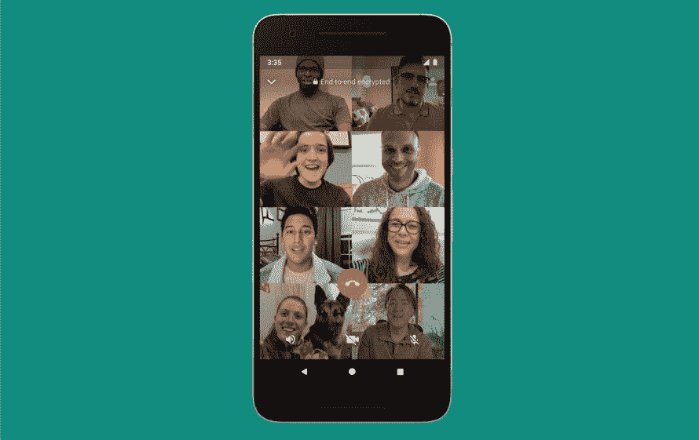

# [更新:推出] Facebook Messenger“房间”是多达 50 人的视频聊天

> 原文：<https://www.xda-developers.com/facebook-messenger-rooms-group-video-chats-50-people/>

**更新(美国东部时间 5/14/20 @下午 2:10):**Facebook Messenger Rooms 现已在美国和加拿大上线，并将于下周在全球推广。

我相信我不必再提为什么我们大多数人被迫呆在家里:我们都知道外面有一个疫情，我们需要保持安全，遵循世界卫生组织的建议，并随时保持社交距离以防止新冠肺炎的传播。但是练习社交距离并不意味着我们必须与我们的朋友和熟人断绝关系。大多数面对面的会议和课程已经被多人同时视频聊天所取代。过去几周，最常见的选择是 Zoom，但这款应用最近也受到了一些隐私和安全问题的困扰。

因此，对竞争对手的需求正在上升。举例来说，Discord 已经开始提供视频通话服务，但脸书正在用其新的“房间”服务提升档次。

[Facebook Messenger Rooms](https://about.fb.com/news/2020/04/introducing-messenger-rooms/) 给现有的视频通话服务带来了变化，事实上它是专门针对我们生活的时代以及这些时代需要的措施而设计的。Rooms 的主要卖点是可以同时加入同一个“房间”的人数:该服务提供多达 50 人的视频通话。举例来说，Zoom 允许多达 100 人连接到单个会话，因此它仍然有优势。然而，对于大多数虚拟会议来说，50 个人应该足够了。

脸书也将隐私作为 Messenger Rooms 的一个重点，因为他们也发表了一篇单独的博客文章，详细介绍了这项服务的隐私方面，试图将自己定位为 Zoom 的一个更安全的替代方案，Zoom 目前因几个安全相关的争议而进入公众的视线。脸书自己在隐私部门也没有什么好名声，所以这应该也有助于消除一些疑虑。

这是[脸书最近提供的众多不同的新功能之一](https://www.xda-developers.com/facebook-messenger-for-desktop-windows-macos/)，以使[在家订单不那么无聊](https://www.xda-developers.com/facebook-messenger-kids-expands-70-new-countries/):举个例子，WhatsApp 也扩展了他们的视频聊天功能，允许最多 8 个人连接一个电话，而不是 4 个人。

 <picture></picture> 

WhatsApp extended group calls

脸书表示，其客房服务现已在几个国家推出，并将很快支持更多国家。

* * *

## 更新:推出

Facebook Messenger 聊天室现在对美国和加拿大的所有人开放。这是脸书试图让 Messenger 视频通话更多地关注群体和社交互动。马克·扎克伯格[谈到了](https://www.facebook.com/zuck/posts/10111913828903171)大多数流行的群组通话服务是如何适应工作和生产力的。它们是定位房间和一个更休闲和社交的选择。客房没有时间限制，最多可容纳 50 人。您可以创建私人房间，或者在您的新闻订阅源上发布一个房间供任何人访问。下周将在全球范围内提供客房。

**来源:[脸书](https://messengernews.fb.com/2020/05/14/messenger-rooms-is-now-available/)**