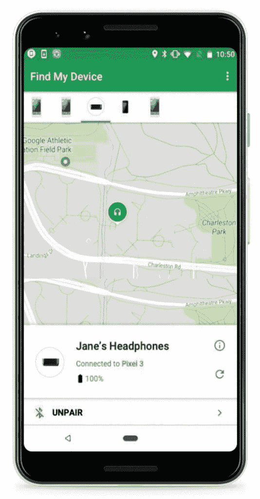

# “查找我的设备 2.4”准备添加对查找蓝牙快速配对配件的支持

> 原文：<https://www.xda-developers.com/find-my-device-2-4-find-bluetooth-fast-pair-accessories/>

# “查找我的设备 2.4”准备添加对查找蓝牙快速配对配件的支持

“查找我的设备 2.4”正在准备添加对查找蓝牙快速配对配件的支持，以防您丢失它们。继续阅读，了解更多信息！

回到 2019 年 5 月的谷歌 I/O，谷歌宣布了许多新的软件、设备和功能。他们发布的一个这样的[公告](https://android-developers.googleblog.com/2019/07/whats-new-with-fast-pair.html)与[谷歌快速配对服务](https://www.xda-developers.com/fast-pair-quick-bluetooth-pairing-headphones/) (GFPS)整合“查找我的设备”有关。GFPS 是 Google Play 服务的一部分。Fast Pair 或多或少地做到了它在 tin 上显示的内容，并允许设备所有者快速将他们的智能手机与蓝牙设备配对。快速配对的设备会同步到用户的谷歌帐户，这样它们就可以通过一个共享的谷歌帐户连接到多部手机，而不需要在每个单独的设备上完成配对过程。根据应用程序中添加的新字符串，Find My Device v2.4 朝着增加对快速配对附件的支持迈出了一步。

APK 拆卸通常可以预测应用程序未来更新中可能出现的功能，但我们在这里提到的任何功能都可能不会出现在未来的版本中。这是因为这些特性目前还没有在实时构建中实现，并且可能会被开发人员在未来的构建中随时引入。

```
 <string name="accessory_status_connected_device">Connected to %1$s</string>
<string name="accessory_status_disconnected_device">Last connected to %1$s at %2$s</string>
<string name="unpair">Unpair</string>
<string name="unpair_message_body_1">Your %1$s will be disconnected.</string>
<string name="unpair_message_body_2">Your %1$s will be disconnected from %2$s.</string>
<string name="unpair_result_fail">"Couldn't unpair headphone"</string>
<string name="unpair_result_success">Unpaired</string>
<string name="unpair_title">Unpair headphone?</string> 
```

当然，它不会尽善尽美，最终仍将依赖于在某个时候与智能手机配对。谷歌在他们的声明中说，你可以在地图上看到他们最后被发现的大致位置，尽管这将由他们配对的手机报告。您将能够看到您最后一次与他们建立联系的时间，但仅此而已。谷歌还提到的一个非常酷的功能是，一旦进入智能手机的范围，就可以设置快速配对设备响铃。

 <picture></picture> 

“Find My Accessories” in the Find My Device app. Source: Google.

这项功能何时实现还没有真正的时间表，但如果谷歌在 6 个月前宣布后准备增加对它的支持，那就不会太远了。我们将密切关注这一特性，虽然它在某些方面可能有所限制，但总比没有好。

* * *

*感谢 PNF 软件为我们提供了使用许可 [JEB Decompiler](https://www.pnfsoftware.com/?aid=xdadev) ，这是一款针对 Android 应用的专业级逆向工程工具。*