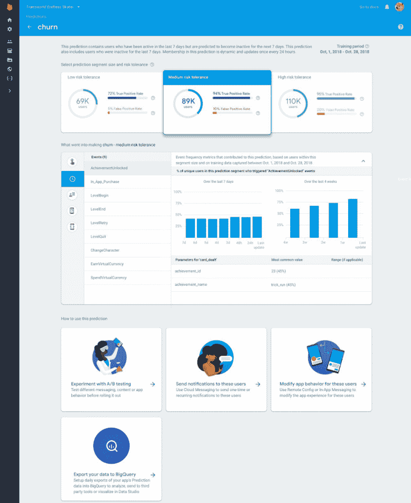

# Firebase 获得了企业支持、新的 REST API，以及 iOS 测试实验室和预测的普遍可用性

> 原文：<https://www.xda-developers.com/firebase-enterprise-support-rest-api-ios-test-lab-predictions/>

Firebase 是谷歌的一个平台，帮助移动和 web 应用团队在开发 Android 和 iOS 应用程序时获得最佳体验。Firebase 团队已经为开发者可能需要的几乎所有东西推出了必要的工具。今天，在布拉格的 Firebase 峰会上，谷歌的 Firebase 团队宣布了一系列新的工具和功能，将会给你带来更多的帮助。我们采访了 Firebase 的产品负责人 Francis Ma，他很乐意与我们的社区分享这些公告。

Firebase 现在拥有超过 150 万个月活跃应用。如果你认为 Firebase 对于开发者来说是可选的，那么这是一个令人印象深刻的指标。该指标证明 Firebase 是一个有用的开发工具。这里总结了该平台的新增功能。

## 企业支持

虽然 Firebase 完全可以被独立或自由开发者使用，但许多大公司也使用它。这意味着需要企业支持，而 Firebase 团队已经做到了。付费的谷歌云支持用户将享有 SLA 保证、关键问题时的 24/7 技术支持以及 Firebase 的专门技术经理等好处。

Firebase 问题将通过[谷歌云平台支持控制台](https://cloud.google.com/support/)回答。如果你已经支付了 GCP，Firebase 企业支持是完全免费的。企业支持又是可选的，所以如果你愿意，你可以继续免费使用 Firebase。谷歌计划在今年年底之前在测试版中加入 Firebase Enterprise 支持。

## 火情管理 API

下一个重要特性是 [Firebase 管理 API](https://firebase.google.com/docs/projects/api/reference/rest) ，这是一个 REST API，允许您以编程方式创建和管理 Firebase 应用程序。您还可以轻松地将 Firebase 与其他系统集成。两个基于 web 的 ide，Glitch 和 Stackblitz，现在有一个选项可以自动检测和部署你的应用到 Firebase 主机，这是由上面提到的 API 实现的。您还可以将其集成到 CI/CD(持续集成/持续交付)系统中。下面是实际部署的视频。

## iOS 测试实验室

[Firebase 测试实验室](https://firebase.google.com/products/test-lab/)是一个基于云的解决方案，用于轻松测试您的应用。即使谷歌在谷歌 I/O 2018 期间宣布了 iOS 测试版的测试实验室，但普遍可用性仅适用于 Android。iOS 支持现已移至稳定通道。您可以在模拟和物理设备上使用它，通过一次操作来测试您的应用。你将能够在 Firebase 控制台中看到日志、视频和截图，因为 iOS UI 已经集成。测试实验室支持最新的 iOS 12，以及旧版本。

## 火情预测

对于任何认真对待应用体验的开发者来说，用户反馈都是至关重要的组成部分。如果使用正确，任何类型的反馈，无论是手动的还是自动的，都将帮助您极大地提高应用程序的稳定性和功能性。 [Firebase Predictions](https://firebase.google.com/products/predictions/) 帮助开发人员获得一个关于用户如何与他们的应用程序交互的机器学习驱动的数据模型。这消除了团队中 ML 专业人员的需要，因为几乎所有事情都是自动化的。自上次 Firebase 峰会以来，该功能一直处于 alpha 阶段，但最近已进入 beta 阶段。从今天开始，它现在很稳定，准备向所有人推出。

Firebase 预测现在给你一个完整的故事，关于谷歌的 ML 是如何做出某些预测的。这包括发生的事件、设备、用户数据等等。所有这些都将帮助你了解给定预测的细节，所以你不必完全相信 Firebase 预测，并根据详细列表自己做出决定。Firebase 团队还宣布了将数据导出到 BigQuery 的能力。这是关于风险承受能力和模型性能的官方文件。

 <picture></picture> 

Google now offers a details page that shows developers what factors the ML model considers when creating a predictive segment (like an ingredient list). These inputs include event frequency, volume, and parameters as well as other data like device language, freshness of app install and more!

## 使用 ML 套件增强人脸检测

[ML Kit](https://firebase.google.com/products/ml-kit/) 在 Google I/O 2018 上[推出](https://www.xda-developers.com/google-ml-kit-machine-learning/)。它让开发者能够在没有深入了解 ML 的情况下开发高质量的应用。开箱即用的 ML Kit APIs 非常友好，您可以在各种 ML 支持的应用程序中使用它们。如果你有更高级的 ML 知识，也可以用自己的 TensorFlow Lite 模型。现在，Firebase 团队刚刚宣布了一个更新的 ML 工具包 API，它增强了人脸检测功能。新的 API 将让你在脸上投影 100 多个细节点，这样它就能够轻松地检测和克服眼镜等配件。此处提供了[文档。](https://firebase.google.com/docs/ml-kit/face-contours)

## 提高云 Firestore 和实时数据库的安全性

根据 Firebase 团队的说法，许多开发人员表达了他们对云 Firestore 安全性的不确定性。该团队现在为云 Firestore 和实时数据库 T1 发布了一个本地模拟器。模拟器可以内置到您自己的 CI 中，这将帮助您在本地进行开发和测试，让您更有信心。文档可以在链接找到[。](https://firebase.google.com/docs/firestore/security/test-rules-emulator)

## 实时远程配置

[远程配置](https://firebase.google.com/products/remote-config/)是一种改变应用程序行为和界面的好方法，无需在谷歌 Play 商店上推出更新。我们称之为服务器端的改变通常是通过远程配置实现的。到目前为止，唯一的缺点是应用程序无法知道远程配置何时更新。他们必须每隔几个小时获取更新，这可能会使用更多的网络带宽和设备电池。

现在，远程配置集成了[云功能](https://firebase.google.com/products/functions/)和 [Firebase 云消息](https://firebase.google.com/products/cloud-messaging/)。这将让应用程序知道何时实时获取服务器端更新。这也将有助于您在有新的远程配置更新时通过 Slack 更好地通知您的团队。这是关于[实时远程配置](https://firebase.google.com/docs/remote-config/propagate-updates-realtime)的文件。

## 性能监控

[性能监控](https://firebase.google.com/products/performance/)是另一种工具，旨在帮助您识别应用程序的问题。不管你的 QA 团队有多好，经常会有一些错误和问题被忽视，最终会损害用户体验。您可以在下面的屏幕截图中看到，当图像加载到应用程序中时，性能监控如何检测到 CPU 使用率的峰值。这将有助于开发人员更好地查明和修复他们的应用程序的问题。

Firebase 控制台也可以让你静音、关闭和重新打开问题，很像 GitHub。此功能将帮助您更好地确定首先要修复的问题的优先级。如果你想处理一个特定的 bug，你可以暂时将其他的 bug 静音。一旦修复了 bug，就可以关闭它，以表明问题已经解决。如果 bug 再次出现，Firebase 会通知你。

问题可能在任何时候发生，不管你是在工作还是在度假。这就是每当出现严重的性能或稳定性问题时，有必要提醒开发人员的原因。从今天开始，Crashlytics 将检测它认为会对应用程序的稳定性造成负面影响的问题，[page duty](https://www.pagerduty.com/)将向团队发送电子邮件。

## BigQuery + Data Studio

Crashlytics 和 BigQuery 集成帮助开发人员对崩溃数据进行更深入的分析。现在，Firebase 团队整合了一个[数据工作室](https://cloud.google.com/solutions/business-intelligence/)模板。它将为您提供定制报告、模拟数据和共享数据的能力。功能[的文档可以在这里找到](https://cloud.google.com/solutions/mobile/mobile-firebase-analytics-bigquery#visualizing_exported_crashlytics_data_with_data_studio)。

## 动态受众

Google Analytics for Firebase 是开发人员根据事件、设备和许多其他组件将用户划分为受众的一种方式。它的问题是，这些受众是变化的目标，但名单是静态的。从今天开始，默认情况下，所有受众都是动态的。Firebase 现在会自动删除不再符合条件的用户，并添加新用户。Google Analytics for Firebase 也增加了排除和会员期限功能。所有这些都将有助于你更好地理解你的用户群并与之互动。例如，您可能希望将访问过购物车但在一定时间内没有购买或完成某个操作的用户作为目标。

## 自动云消息传递

你的用户有时可能需要提醒才能回到应用程序。Firebase 云消息已经被用于向用户发送一次性消息有一段时间了。从现在开始，你将能够设置自动消息。开发人员可以通过动态受众锁定特定用户，并发送各种通知。更新的通知控制台支持更复杂的活动。你可以在这里看到[新用户界面](https://console.firebase.google.com/u/0/project/_/notification?pli=1)。

* * *

那是一个包裹。这是自谷歌 2014 年收购该公司以来的第三次 Firebase Dev 峰会。上面提到的所有功能都已经在 Firebase 中提供了，所以你可以开始使用它们来开发令人惊叹的应用程序和项目。请务必与我们分享，或在 [XDA 论坛](https://forum.xda-developers.com/android/apps-games)上分享。