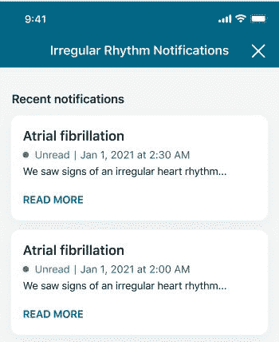

# Fitbit 在特定设备上推出不规则心律通知

> 原文：<https://www.xda-developers.com/fitbit-irregular-heart-rhythm-notifications/>

本月早些时候，[谷歌获得了美国美国食品药品监督管理局(FDA)的心律检测许可](https://www.xda-developers.com/fitbit-ecg-detection-us/)，可以在其 Fitbit 可穿戴设备上进行心律检测。该功能现在正在推出，现在我们知道它在哪些设备上可用。

Fitbit 设备现在可以监测一个人血管中血液量的变化，并使用这些数据来确定心率。有了这个基线，可穿戴设备可以检查不规则性和可能的房颤迹象，这种情况与心力衰竭、痴呆症和中风的风险增加有关。 [Fitbit 自己从 2020 年开始的研究](https://press.fitbit.com/press-releases/press-release-details/2020/Fitbit-Announces-Large-Scale-Study-to-Identify-Atrial-Fibrillation/default.aspx)报告称，其算法可以以 98%的成功率识别房颤，基于五个月期间 455，699 名参与者的数据。

 <picture></picture> 

Credit: Fitbit

现在可以通过打开 Fitbit 应用程序，找到评估和报告部分，点击“不规则心律通知”，然后选择“立即设置”来启用不规则心律通知谷歌建议尽可能经常佩戴 Fitbit，尤其是在睡眠期间，以获得最佳的基线计算和监控。

### 支持不规则节律通知的 Fitbit 设备

*   Fitbit Charge 3 运行固件版本 20001.49.45 或更高版本
*   Fitbit Charge 4 运行固件版本 20001.78.33 或更高版本
*   运行固件版本 20001.141.4 或更高版本的 Fitbit Charge 5
*   运行固件版本 20001.98.14 或更高版本的 Fitbit Inspire 2
*   运行固件版本 58.20001.130.17 或更高版本的 Fitbit Luxe
*   Fitbit Sense 运行固件版本 44.128.1.42 或更高
*   运行固件版本 35.68.9.7 或更高版本的 Fitbit Versa 2
*   Fitbit Versa 3 运行固件版本 36.128.1.42 或更高
*   Fitbit Versa Lite Edition 运行固件版本 38.33.1.30 或更高版本

支持大多数最新的 Fitbit 设备，包括 Charge 3 和更新版本、Versa 2 和更新版本以及 Luxe。谷歌在一份支持文件中提到，只有在多次读数中检测到不规则节律的迹象后，才会发送通知，以避免误报。

新功能可能需要几周时间才能在所有设备上出现，所以如果你在 Fitbit 应用程序中还没有看到该选项，请耐心等待。

**来源:** [Fitbit 帮助](https://help.fitbit.com/articles/en_US/Help_article/2467.htm)

**Via:** [9to5Google](https://9to5google.com/2022/04/25/fitbit-irregular-heart-rhythm-notifications-rollout-device-support/)