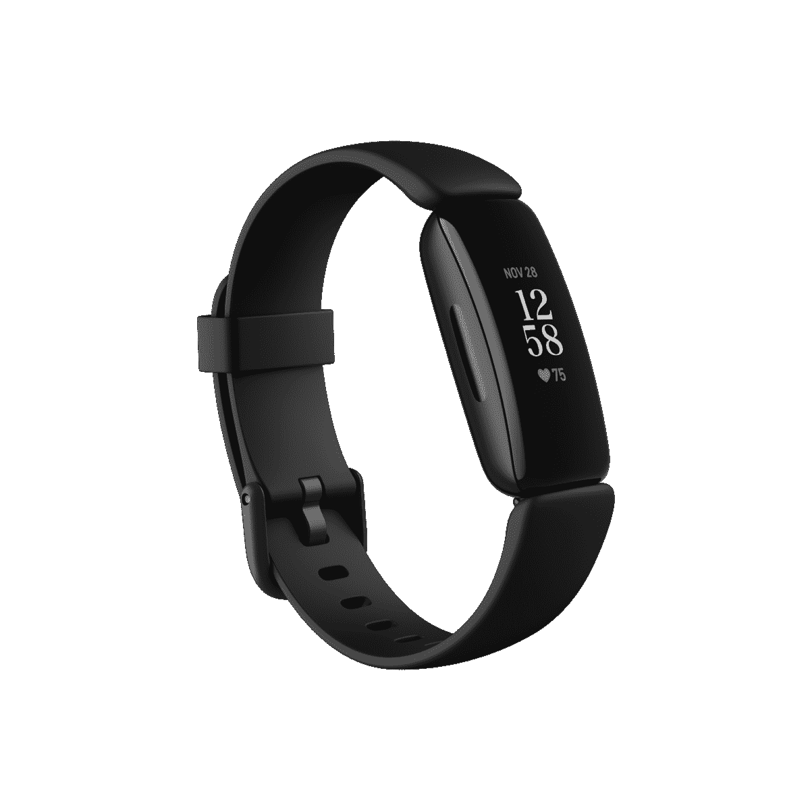

# Fitbit 宣布推出 Sense、Versa 3 和 Inspire 2 健身跟踪可穿戴设备

> 原文：<https://www.xda-developers.com/fitbit-sense-fitbit-versa-3-fitbit-inspire-2-fitness-tracking-wearables/>

Fitbit 周二[发布了](https://www.businesswire.com/news/home/20200825005373/en/)两款新的智能手表和一款负担得起的健身追踪器，以帮助在这些不确定的时期管理你的身体健康，正如[所预期的](https://www.xda-developers.com/fitbit-versa-3-sense-inspire-2-leaked-renders-next-wearables/)。智能手表包括 Fitbit Sense 和 Fitbit Versa 3，前者配备了心电图(ECG)监视器，尽管该功能仍在等待 FDA 的批准。Inspire 2 是新款健身追踪器的名称。

Fitbit Sense 是 Fitbit 新款智能手表中最先进的一款。这款可穿戴设备的价格为 329 美元，除了前面提到的心电图应用程序之外，还具有一系列传感器。Sense 提供了一个用于管理压力的皮肤电活动(EDA)传感器、手腕上的皮肤温度传感器和先进的心率跟踪技术。在压力是常态的世界里，EDA 传感器尤其有趣。将你的手掌放在 Sense 的显示屏上，EDA 将读取你的皮肤温度，并根据你的压力水平给你打分。随着时间的推移，这种感觉可能会向你推荐管理压力的方法。

购买者还可以免费试用 Premium 六个月，这是一项跟踪心率变异性(HRV)、呼吸频率和 SpO2 等信息的服务。这些见解将为用户提供数据，以改善他们的健康和福祉。

除此之外，Sense 和 Versa 3 都配备了许多你期望从智能手表中获得的功能:内置 GPS、有机发光二极管显示屏、防水深度可达 50 米，以及至少 6 天的电池续航时间。这两款设备还支持 Fitbit Pay [和谷歌助手](https://www.xda-developers.com/fitbit-google-assistant-support/)(即将于 2020 年冬季推出)。

此外，该公司还宣布了 Inspire 2，这是一款小型健身追踪器，提供长达 10 天的电池寿命和新的触摸屏。虽然没有 Sense 或 Versa 3 先进，但选择 Inspire 2 的消费者将免费试用一年的 Premium(价值 79 美元)。

 <picture></picture> 

Fitbit Inspire 2

最后，Fitbit 推出了 Premium + Health Coaching，这项服务将为用户提供虚拟一对一指导。这项服务的特点是认证的健康专家可以根据 Fitbit 数据提出个性化的健康计划。

Fitbit Sense 将提供 329 美元的碳/石墨不锈钢或月球白/软金材质。Fitbit Versa 3 将以 229 美元的价格提供黑色/黑色铝、粉色粘土/软金铝和午夜/软金铝。Fitbit Inspire 2 售价 99 美元，有黑色、月球白和沙漠玫瑰三种颜色。您现在就可以预订这些设备，从 9 月下旬开始全球发售。