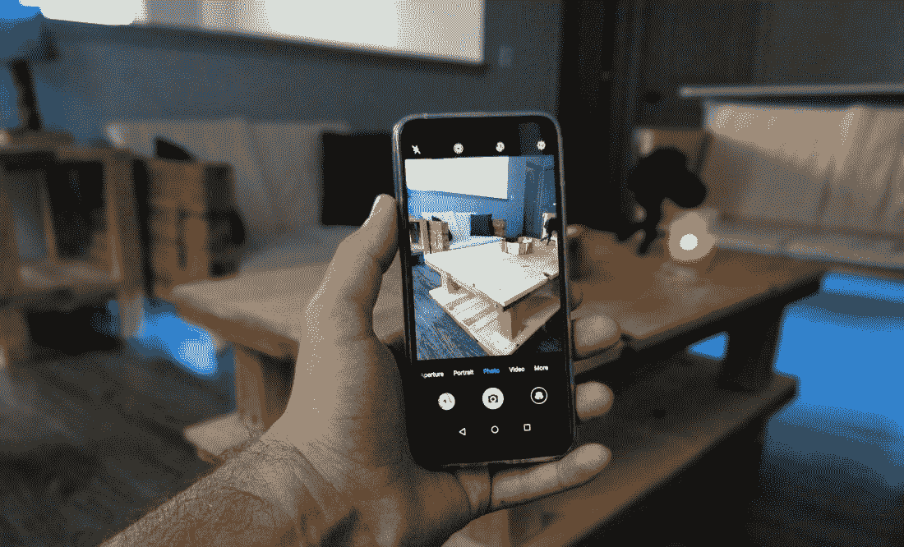
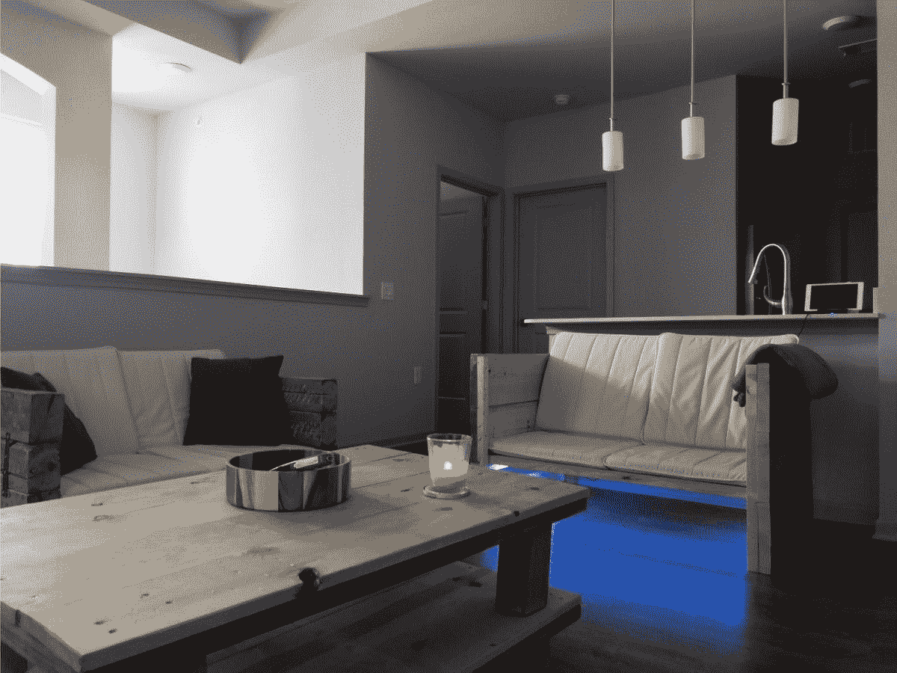
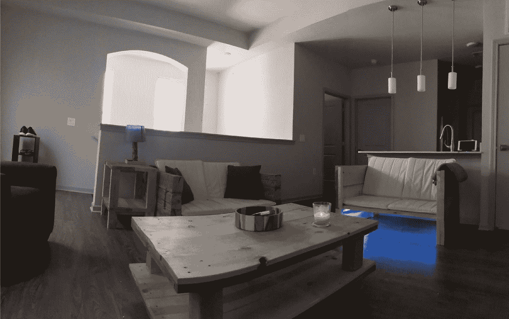
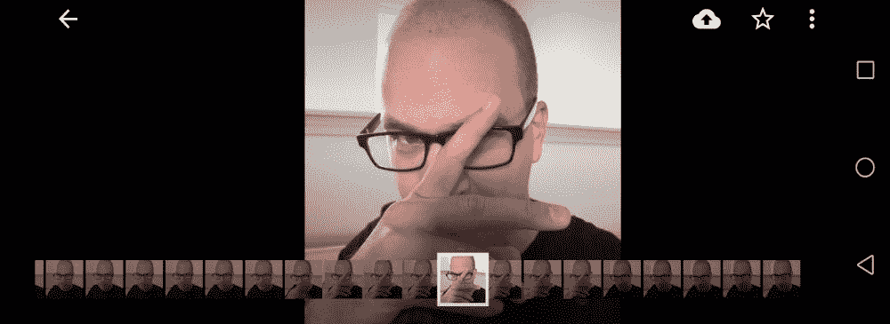
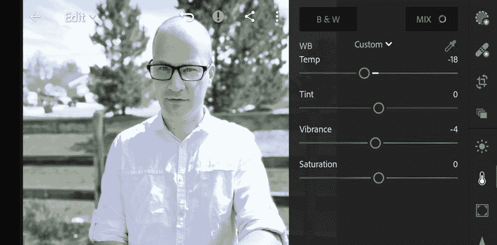

# 你可能忘了使用的安卓五大相机技巧

> 原文：<https://www.xda-developers.com/five-camera-tricks-for-android-you-probably-forgot-to-use/>

每年，Android 手机都会推出一些让你对新的相机技术感到兴奋的排序或技巧或花招。然而，似乎他们想出的所有功能都被遗忘了，因为人们倾向于使用默认的照片模式。在这个视频中，我们将重温一些最好的 Android 相机功能，你可能不会经常使用。

 <picture></picture> 

Honor 10 with the default camera app from EMUI 8.1

为了展示这些摄影技巧，我们使用了 Honor 10 及其令人惊叹的人工智能相机，但你可以在拍摄照片时使用任何 Android 手机来实现这些技巧。

## 短全景

大多数人在手机上保留了全景功能，用于拍摄全景照片或 360 度全景照片。全景功能实际上提供了最好看的照片时，在较短的锅使用。

看下面的照片，看看如何用一个短的全景来适应照片中的整个房间。

 <picture></picture> 

Standard Photo Mode

 <picture></picture> 

Panorama Mode

## 宽孔径模式

 <picture></picture> 

Wide Aperture Mode

如果你的手机有双镜头设置，默认的相机应用程序可能会带有 Honor 10 的宽光圈模式的某种变体。在近距离拍摄物体时，这种效果会产生最佳效果。我的水龙头的这张照片能够模糊背景，同时保持前景物体在焦点上。

您甚至可以在事后编辑照片，以调整模糊的强度，并重新聚焦到不同的对象。

## 突发镜头

我经常发现人们快速地按下快门来拍摄多张照片。当拍摄试图保持静止的生物时，尝试养成使用连拍模式的习惯。我发现当你试图用后置摄像头自拍时，它最有用。没办法看到我拍的是什么，不如用连拍，事后选择最佳帧。

 <picture></picture> 

Burst Shot Mode

## 生拍

如果您计划在发布照片之前对其进行任何形式的编辑，您最好启用 raw 照片模式。这将保存照片的未压缩版本，可以在专业应用程序中编辑，如 [Lightroom](https://play.google.com/store/apps/details?id=com.adobe.lrmobile) 。

Lightroom 适用于 Android，是一个非常强大的应用程序。如果你想要更专业的照片，远离 Instagram 上的滤镜，尝试自己编辑它们。

 <picture></picture> 

Editing Raw Photo in Adobe Lightroom

## HDR 模式

当拍摄风景、城市建筑、航拍或任何有强烈阴影和光线的场景时，不要忘记使用 HDR 模式。“高动态范围”摄影旨在减少照片中亮度的较大动态范围。这意味着黑暗的阴影会更明显，并且在你的照片中会有一致的照明水平。

观看 XDA 电视台 YouTube 视频来看看这些相机技巧的运用。