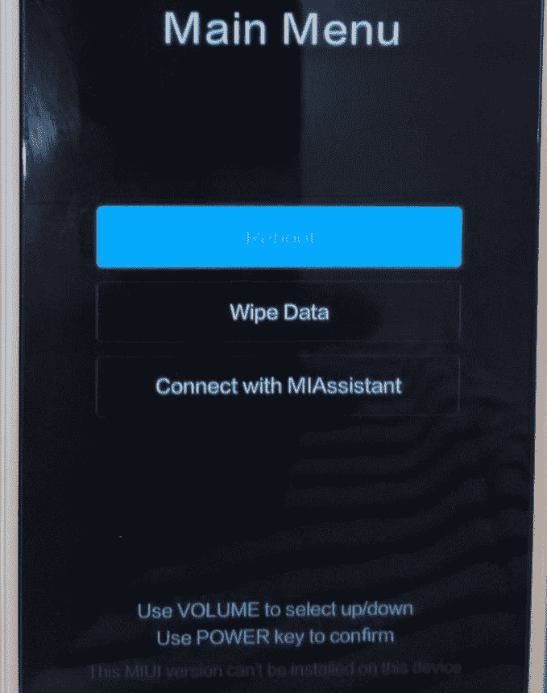
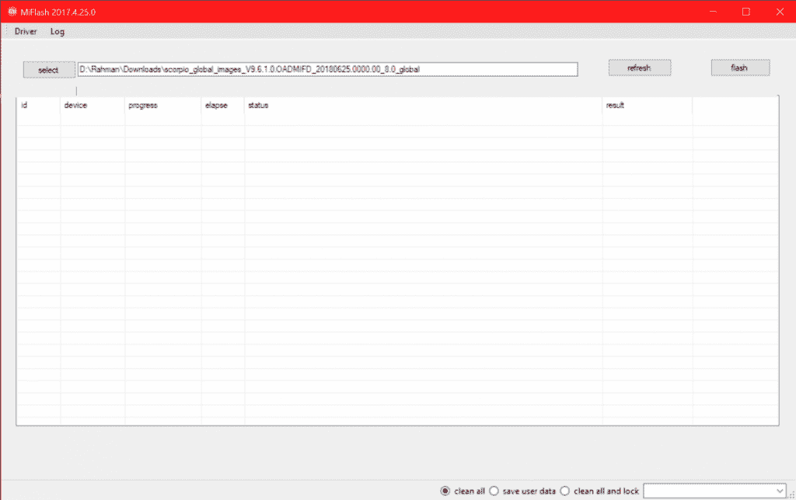

# PSA:在这些小米设备上闪烁 MIUI Global 可能会砖块你的设备

> 原文：<https://www.xda-developers.com/flash-miui-global-locked-bootloader-xiaomi-brick/>

中国电子产品制造商小米不仅在他们的祖国中国，而且在印度和其他亚洲国家都是巨头。他们最近也开始向欧洲扩张。他们的智能手机和平板电脑因其性价比而大受欢迎。你可以以与新 iPhone 相同的价格获得最新的小米智能手机、笔记本电脑、腕带和蓝牙耳机[。他们产品令人难以置信的价值使得许多人将他们的产品进口到其他国家。第三方零售商利用小米在经销商市场的人气，向客户承诺他们将获得中国小米设备的“全球”版本，即使全球版本实际上并不存在。小米已经开始打击这些经销商，在他们的最新举措中，他们正在阻止他们的设备启动区域外的 MIUI 设备。](https://www.xda-developers.com/xiaomi-offer-smartphone-laptop-wearable-headset-same-price-iphone/)

我们最近谈到了[小米的防回滚保护](https://www.xda-developers.com/xiaomi-anti-rollback-protection-brick-phone/)，以及如果你在降级到早期 MIUI 版本时不小心，它会如何损坏你的设备。在那篇文章中，我们还提出了其他可能意外损坏小米设备的方式。其中一种方法是在中国销售的某些小米设备上安装 MIUI Global ROM。这样做会导致你的手机卡在 MIUI 恢复屏幕上，错误信息“此 MIUI 版本无法安装在此设备上。”

 <picture></picture> 

This is what happens if you try to flash a MIUI Global ROM on Chinese Xiaomi hardware with a locked bootloader. Credits: [physicien007](http://en.miui.com/thread-974069-1-1.html)

用户遇到这个问题已经有几个月了，他们不清楚为什么会发生这种情况。几周前，MIUI 官方论坛[的一名管理员宣布](http://en.miui.com/thread-3831680-1-1.html)这一行为是故意的。来自论坛帖子:

**关于国产闪灯 Mi 手机的重要公告！**

在你刷新或者更新 ROM 之前，这里有一些非常重要的事情。

1.为中国市场制造的小米手机无法运行 MIUI 全球 ROM。

2.为全球市场制造的小米手机无法运行 MIUI 中国 ROM。

我们强烈建议您通过官方或授权销售渠道购买小米手机，并在闪烁或更新前仔细检查系统信息。

虽然很高兴终于看到小米解决了为什么人们通过闪现区域外 MIUI 版本来阻止他们的设备，但我们感到失望的是，该公司没有详细说明哪些设备受到这一限制的影响。幸运的是，[小米工具](http://www.xiaomitool.com/adb)的开发者，XDA 的初级成员 [franztesca](https://forum.xda-developers.com/member.php?u=8229896) ，自己承担了找出哪些设备受到影响的任务。他发现了负责阻止区域外 MIUI 安装的代码，我们能够自己验证这一点*。所发生的是 MIUI 检查系统属性以确定 MIUI 版本是否匹配设备的区域。如果不匹配，系统会重启你到 MIUI 恢复，并显示错误信息。你没有办法避开这个错误信息，因为每次启动都会把你踢回 MIUI 恢复。(幸运的是，如果你有一个解锁的引导程序，这种检查不会发生，所以你可以自由安装一个区域外的 MIUI 版本或自定义 ROM。)

* *对于那些好奇的人，相关的类是 com . Android . server . systemserverinjictor，您可以在/system/framework 中的 services.vdex 中找到它。*

## 具有区域外 MIUI 限制的小米设备列表

由您决定是否了解您的设备所在的地区，但只要您从官方渠道购买设备，如该地区的官方零售/在线合作伙伴或您所在地区的官方 Mi 商店/网站，这应该很容易做到。如果你从第三方零售商那里购买设备，那就有点棘手了。第三方零售商可能会对他们卖给你的设备撒谎。例如，一家第三方零售商可能声称他们卖给你的是全球小米 Mi Max 3，而实际上他们卖给你的是中国小米 Mi Max 3。务必检查包装盒和设备上的任何标签。

无论如何，这里是受这种区域外限制影响的小米设备。我们列出了每种设备的市场名称以及它们的代号。

列表中有些设备可能看起来不合适。例如，小米 poco phone F1[只在国际上销售](https://www.xda-developers.com/xiaomi-poco-f1-specs-pricing-availability-india/)，而 [Mi Pad 4](https://www.xda-developers.com/xiaomi-mi-pad-4-official-specifications-features/) 和 [Mi 6X](https://www.xda-developers.com/xiaomi-mi-6x-china-dual-cameras-snapdragon-660/) 只在中国销售。因此，区域外限制没有意义，因为不可能刷新区域外的 MIUI 版本。我们假设列出这些设备是为了完整性，因为这些设备将来可能会在其他市场推出。

### 提示避免砖你的设备

如果您有一个解锁的引导加载程序，您可以使用 TWRP、快速引导或 MiFlash 工具安全地刷新区域外的 MIUI 版本。但是，在闪存区域外软件时，请务必在 MiFlash 中选择“flash_all”而不是“flash_all_lock”。如果您选择后者，您的引导加载程序将在刷新后锁定...也就是说你的设备会被屏蔽。

 <picture></picture> 

Pro-tip: Always uncheck "clean all and lock" before flashing with Mi Flash. This will prevent your bootloader from being locked when flashing.

### 如果您的设备被拦截，该怎么办

如果你最终得到了一个被屏蔽的设备，你现在唯一的办法就是进入 EDL 模式，为你的设备刷新正确的 MIUI 版本。不幸的是，小米已经锁定了 EDL 模式，因此只有授权的小米账户才能访问它。

* * *

小米地区闪购政策的任何变化，我们都会及时通知你。该公司通常不会详细说明他们为什么实施某些限制，尽管通常情况下，原因可以归结为挫败可疑的第三方零售商，而不是伤害爱好者群体。