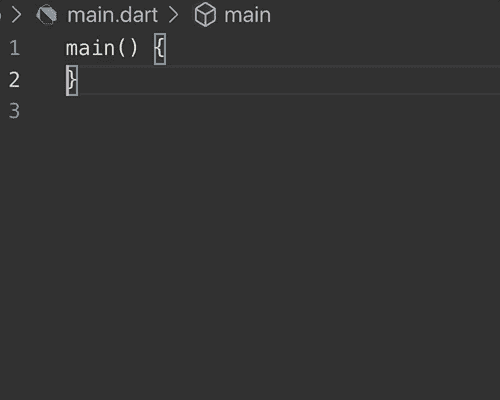
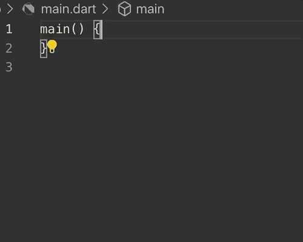

# Flutter 1.9 集成了 web repo，带来了 iOS 13 和 MacOS Catalina 支持，以及带有 Dart 2.5 的 ML 驱动的代码完成

> 原文：<https://www.xda-developers.com/flutter-19-web-repo-ios-13-macos-catalina-support-ml-code-completion-dart-25/>

# Flutter 1.9 集成了 web repo，带来了 iOS 13 和 MacOS Catalina 支持，以及带有 Dart 2.5 的 ML 驱动的代码完成

谷歌开源移动应用开发框架 Flutter 的最新版本集成了 web repo，带来了 iOS 13 支持和基于 ML 的代码完成。

开发跨平台应用程序可能是一堆非本地代码，所以谷歌开始尝试用一个统一的工具包来解决这个问题，这个工具包可以直接与你选择的编辑器集成。通过直接与 Android Studio 或您选择的其他开发环境集成， [Flutter](https://www.xda-developers.com/tag/flutter/) 创建了更快的开发体验，允许您跨平台统一您的 UI 设计。现在，谷歌宣布了一个新的稳定版本 Flutter v1.9 和 Dart 2.5。

这个 Flutter 版本的亮点是将 web 支持集成到主 Flutter 存储库中，这是一个重大的变化，因为它允许开发人员使用相同的代码库为移动、桌面和 web 编写代码。此外，Flutter 已经获得了对其端到端工具体验的更新，如支持新的 Xcode 构建系统，在整个工具链中实现 64 位支持，并简化平台依赖性，以确保它在 macOS Catalina 上工作良好。Flutter 1.9 还包括 iOS 13 可拖动工具栏的实现，支持长按和从右拖动动作以及振动反馈。支持 iOS 黑暗模式的工作也在进行中。在开发版本中也有对位代码的实验性支持。新的 Flutter 项目现在 iOS 默认为 Swift 而不是 Objective-C，Android 默认为 Kotlin 而不是 Java 但是如果你需要的话，你可以随时换回它们。Flutter 上的错误信息也得到更新，使它们更易读、更简洁、更具可操作性。

除了 Flutter 1.9，谷歌还发布了 Dart 2.5 SDK，其中包括两个主要的面向开发人员的新功能的技术预览:由机器学习(ML)支持的代码完成，以及用于直接从 Dart 调用 C 代码的`dart:ffi`外部函数接口。当 API 列表变得太大太长而无法按字母顺序浏览时，基于机器学习的代码补全就派上了用场。有了 *ML Complete* ，Dart 的 [TensorFlow Lite](https://www.xda-developers.com/tensorflow-lite-mobile-machine-learning/) 驱动的模型可以用来预测开发者正在编辑的下一个可能的符号。使用`dart:ffi`，开发人员不仅可以利用运行 Dart 代码的操作系统上现有的本地 API，还可以利用用 c 编写的跨平台本地库。

 <picture></picture> 

Without ML

 <picture></picture> 

With ML

你可以在 [Flutter 1.9](https://developers.googleblog.com/2019/09/flutter-news-from-gdd-china-flutter1.9.html?m=1) 和 [Dart 2.5](https://medium.com/dartlang/announcing-dart-2-5-super-charged-development-328822024970) 的公告帖子中详细了解这些和其他变化。