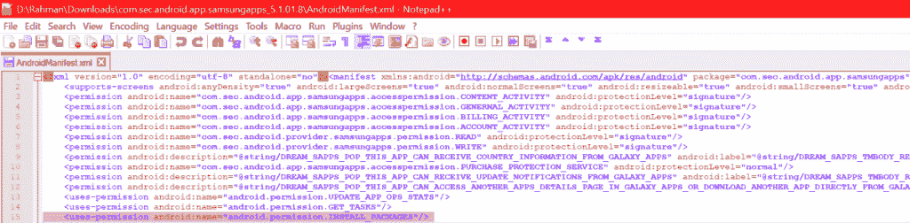

# 堡垒之夜安装程序可能会被滥用，在 Galaxy 手机上悄悄安装应用程序

> 原文：<https://www.xda-developers.com/fortnite-installer-abuse-silently-install-galaxy/>

堡垒之夜移动在 Android 上的推出并不太好，特别是因为许多受支持的设备真的很难以可接受的帧速率玩游戏。这款游戏作为[三星 Galaxy 独占推出仅 3 天](https://www.xda-developers.com/fortnite-mobile-android/)。在 Epic Games 允许非三星玩家从 Epic 网站上的堡垒之夜安装程序下载并安装完整游戏之前，堡垒之夜安装程序首先在[三星 Galaxy Apps](https://www.xda-developers.com/fortnite-mobile-on-android-samsung-galaxy-apps/) 上提供。在堡垒之夜安装程序发布后不久，Epic Games 悄悄地向安装程序推送了一个更新。现在我们知道原因了:他们修补了一个[磁盘人](https://blog.checkpoint.com/2018/08/12/man-in-the-disk-a-new-attack-surface-for-android-apps/)漏洞，使得恶意应用程序能够**在三星 Galaxy 智能手机**上静默安装他们想要的任何应用程序**。因为关于这个缺陷是如何工作的还存在一些困惑，我们将努力澄清一些事情。首先，我们需要解释一下 Android 上 app 安装的基础知识。**

* * *

## android 智能手机上的应用安装流程

### 来自第三方来源的静默安装

要在 Android 上静默安装一个 APK 而不提示用户许可，你需要一个系统级的应用程序并授予 [INSTALL_PACKAGES](https://android.googlesource.com/platform/frameworks/base/+/master/core/res/AndroidManifest.xml#3007) 权限。具有此权限的应用程序示例包括大多数 Android 设备上的谷歌 Play 商店。三星、华为和其他设备制造商的设备上的第一方应用程序商店也可能被授予 INSTALL_PACKAGES 权限。如果你想从谷歌 Play 商店安装任何应用程序，它会处理下载，并在你按下“安装”后自动为你安装应用程序，无需进一步干预(谷歌 Play 商店甚至自动[授予某些运行时权限](https://android.googlesource.com/platform/frameworks/base/+/master/core/res/AndroidManifest.xml#3100)，例如[覆盖的权限](https://android.googlesource.com/platform/frameworks/base/+/master/core/res/AndroidManifest.xml#2103)，而从 Play Store 外部安装的应用程序需要请求用户授予这些权限。)

如果你想知道你的设备上的应用程序是否有 INSTALL_PACKAGES 权限，你可以通过 ADB 命令找到答案。

```
 adb shell
dumpsys package package.name.here | grep "INSTALL_PACKAGES" 
```

例如，谷歌 Play 商店的包名是“`com.android.vending`”。另一个有这个权限的 app 是 Shell，包名`com.android.shell`。对于那些通过 Android Oreo 上的 Andromeda 插件使用[无根底层的人来说，从你的 PC 上运行的 Andromeda 脚本保持 shell 进程运行，因此底层可以使用它来安装包(主题覆盖)，然后使用](https://www.xda-developers.com/custom-themes-android-oreo-substratum/)[覆盖管理器命令](https://android.googlesource.com/platform/frameworks/base/+/master/services/core/java/com/android/server/om/OverlayManagerShellCommand.java)来启用覆盖。

### 从第三方来源下载应用程序

如果您试图从第三方应用商店之外下载并安装应用程序，您首先需要启用未知安装源。这让 Android 框架中的[包管理器服务](https://android.googlesource.com/platform/frameworks/base/+/master/services/core/java/com/android/server/pm/PackageManagerService.java#14795)(它拥有 INSTALL_PACKAGES 权限)知道你承认从第三方来源下载应用程序的风险。在 Android 之前的 Oreo 设备上，安全设置中有一个单一的开关，允许从未知来源安装。[在 Android Oreo 和更高版本](https://android.googlesource.com/platform/frameworks/base/+/master/core/java/android/content/pm/PackageManager.java#6023)上，要求安装 APK 的应用程序必须声明 [REQUEST_INSTALL_PACKAGES](https://android.googlesource.com/platform/frameworks/base/+/master/core/res/AndroidManifest.xml#2986) 权限，用户必须将该应用程序列入白名单，以便它可以通过软件包管理器服务请求安装应用程序。由于 REQUEST_INSTALL_PACKAGES 是一个“appop”权限，这使得它成为可以从设置的权限管理器或通过`cmd appops` shell 命令控制的权限之一。

一旦从未知来源安装被全局或专门为请求应用程序启用，则用户可以侧加载应用程序。然而，软件包管理器不允许应用程序静默安装。相反，它会提示用户是否要安装应用程序，并列出安装时请求授予的任何敏感权限。如果用户接受，则应用程序将使用所请求的非运行时权限进行安装。原始设备制造商也可以定制软件包管理器:例如，华为 EMUI 5 中国版的软件包管理器有一个功能，可以扫描 APK 来决定它是否安全，并控制在安装之前授予*什么权限。我在运行从中国进口的 EMUI 5 的 Honor Note 8 上观察到了这一点，尽管我确信其他中国华为和 Honor 设备的包管理器中也有这一功能。*

无论如何，这大概总结了从一个经过批准的第一方来源和第三方来源安装应用程序之间的区别。如果您尝试使用 INSTALL_PACKAGES 权限从 Play Store 或等效的 app store 安装应用程序，它会在您开始下载后自动处理安装，无需用户进一步干预。但是，如果您从 XDA 实验室、APKMirror 或其他第三方来源下载 APK，标准的软件包安装程序将处理安装并提示用户安装该软件包。那么堡垒之夜安装程序是从哪里来的呢？为什么这些都是相关的呢？

## 堡垒之夜安装过程中的一个缺陷

今天早些时候，谷歌[披露了他们在第一版堡垒之夜安装程序中发现的一个漏洞](https://issuetracker.google.com/issues/112630336)。该漏洞在 Exynos 三星 Galaxy S8+ (dream2lte)上进行了演示，但也影响了所有其他三星体验设备，包括三星 Galaxy Note 9 和三星 Galaxy Tab S4。该漏洞允许一个已经安装了**的恶意应用程序**利用堡垒之夜安装程序试图在三星 Galaxy 设备上首次安装堡垒之夜**的方式**。通过使用三星 Galaxy Apps 中的私有 API，堡垒之夜安装程序绕过了通过标准软件包安装程序提示用户安装堡垒之夜的需要。这是因为 Galaxy Apps 拥有静默安装所需的权限。如果静默安装的应用程序是真正的堡垒之夜，这种静默安装过程不会有任何问题。但是由于堡垒之夜安装程序存储了下载的堡垒之夜游戏的 APK 文件，它很容易被利用。

 <picture></picture> 

The AndroidManifest from Samsung Galaxy Apps shows that Galaxy Apps has the permission to install other apps on its own, bypassing the standard package installer.

根据问题跟踪器的报告，堡垒之夜的安装人员会将堡垒之夜移动 APK 下载到`/sdcard/Android/data/com.epicgames.portal/files/downloads/`。这在 Android 上被认为是“外部存储”,因为/sdcard 是指向/data/media/CURRENT_USER 的符号链接，而/sdcard 是 Android 早期应用程序数据存储在物理 SD 卡上时使用的名称。现在的 app 数据通常存储在/data/data/中的 app 专用目录下，每个 app 只能访问自己的/data/data 目录下的文件。因此，如果堡垒之夜安装程序将下载的堡垒之夜 APK 存储到自己的/data/data/目录中，任何没有读取权限的应用程序(即没有 root 访问权限)来了解这个目录中发生了什么。

然而，由于堡垒之夜安装程序**将下载的 APK 保存在外部存储器**中，它可以被**任何具有外部存储器读取权限**的应用程序监控和覆盖。通常，当应用程序存储用户需要通过 MTP 或其他应用程序访问的文件时，它们会写入/data/media，即“虚拟 SD 卡”。对于要读取或写入/data/media 的应用程序，他们需要分别拥有 READ_EXTERNAL_STORAGE 和 WRITE_EXTERNAL_STORAGE 权限(两者在同一个权限组下，因此被一起授予)。在 Android 4.4 KitKat 之前，大多数应用程序在安装时都会请求这些权限，因为否则，它们将无法读取或写入/data/media/中其包的指定外部存储目录中的文件.../Android/。随着在 Android 4.4 KitKat 中引入 [FUSE 来模拟 FAT-on-sdcard 风格的目录权限](https://www.xda-developers.com/diving-into-sdcardfs-how-googles-fuse-replacement-will-reduce-io-overhead/)，应用程序不再需要任何权限来访问外部存储中指定目录下的文件。访问任何其他目录中的文件仍然需要外部存储权限，这就是恶意应用程序可以劫持堡垒之夜安装过程的原因。

如下面的视频所示，一个具有 READ_EXTERNAL_STORAGE 权限的恶意应用程序会监控外部存储中堡垒之夜安装程序的下载目录。当它检测到下载完成并且指纹被验证时，由于 WRITE_EXTERNAL_STORAGE 许可，它用自己的恶意包替换下载的堡垒之夜包。但是，由于三星 Galaxy Apps 在安装前验证堡垒之夜 APK 的方式(...它只是检查软件包名称是否为“com.epicgames.fortnite”)，有可能让 Galaxy Apps **在没有用户干预或通知的情况下在后台静默安装恶意软件包**—只要恶意软件包的名称为“com.epicgames.fortnite”。更糟糕的是，如果该恶意软件包的目标是 SDK 级别 22 或更低(Android 5.1 Lollipop 和更低版本)，它将自动被授予其清单中定义的所有权限，因为运行时权限仅对目标为 SDK 级别 23 及以上(Android 6.0 Marshmallow 和更高版本)的应用是强制性的。

但是在非三星设备上会发生什么呢？嗯，因为三星 Galaxy Apps 没有安装在非三星设备上，所以恶意 APK **不会被悄悄地安装在后台**。堡垒之夜安装程序是一个第三方应用程序，因此需要首先提示用户启用未知来源的安装，然后向软件包安装程序发送请求，以安装假冒的堡垒之夜 app。当被问及是否要安装应用程序时，这将取决于用户点击“安装”。这是有问题的，尽管事实上非三星手机并不存在恶意应用程序在后台悄悄安装的危险。如果一个恶意 APK 的名字中带有“堡垒之夜”和堡垒之夜应用程序图标，普通用户也不会知道这一点。

尽管如此，在三星 Galaxy 智能手机和非三星智能手机上利用这一缺陷还是有明显区别的。前者是一种中间人攻击，它还利用隐藏的系统 API 在后台静默安装任何应用程序，具有任何权限，无需欺骗用户认为他们正在安装一个假冒的堡垒之夜 APK。后者是一种**标准的中间人攻击，也可能发生在其他将 apk 或其他重要数据保存在外部存储目录**中的应用程序上，正如最近的 [*检查点*](https://blog.checkpoint.com/2018/08/12/man-in-the-disk-a-new-attack-surface-for-android-apps/) 帖子所示。碰巧的是，由于隐藏的 Galaxy Apps API，这种磁盘人攻击在三星 Galaxy 设备上更加危险。

## 修复缺陷

值得称赞的是，Epic Games 对谷歌问题跟踪器的报告做出了非常迅速的反应，并尽快推出了 2.1.0 版本的更新。修复很简单——只需将下载的堡垒之夜·APK 保存到堡垒之夜安装程序的内部存储目录/data/data 中，而不是外部存储目录/data/media 中。Epic Games 的工程师要求在 90 天后披露该缺陷，但谷歌拒绝了，并在修复程序推出 7 天后公布了该问题。Epic Games 的首席执行官蒂姆·斯维尼对从最初的安全报告到披露的快速周转时间并不满意。他向 *[安卓中央](https://www.androidcentral.com/epic-games-first-fortnite-installer-allowed-hackers-download-install-silently)提供了以下声明。*

> #### Epic 真诚地感谢谷歌在我们在 Android 上发布后立即对堡垒之夜进行了深入的安全审计，并与 Epic 分享了结果，以便我们可以迅速发布更新来修复他们发现的漏洞。
> 
> #### 然而，谷歌如此迅速地公开披露漏洞的技术细节是不负责任的，因为许多安装尚未更新，仍然容易受到攻击。
> 
> #### 在我的敦促下，一名 Epic 安全工程师要求谷歌推迟 90 天的公开披露，以便有时间让更新得到更广泛的安装。谷歌拒绝了。你可以在 https://issuetracker.google.com/issues/112630336 读到这一切
> 
> #### 谷歌的安全分析工作受到赞赏，并有利于 Android 平台，然而，像谷歌这样强大的公司应该采取更负责任的披露时间，而不是在反对 Epic 在 Google Play 之外发行堡垒之夜的过程中危及用户。

我不敢说现有的三星 Galaxy 设备中有多少还在使用旧的堡垒之夜安装程序。也许 Epic Games 应该通过在堡垒之夜手机上发送消息来告诉这些用户更新他们的安装。Firebase 漂亮的新应用内消息功能可以做到这一点。虽然，这可能不是一个大问题，因为，如果一个用户用旧的安装程序已经下载了合法的堡垒之夜，那么任何 MITD 攻击将不会工作，因为恶意的 APK 不能安装在现有的堡垒之夜安装之上。无论如何，在堡垒之夜发布 Android 之后这么早就发现这个缺陷——当关于 Epic Games 的[决定放弃 Google Play](https://www.xda-developers.com/download-fortnite-mobile-on-android-epic-games-website/) 仍有很多争议的时候——肯定有助于证明 Epic Games 的决定是粗心的。这是否是谷歌这么快公布这个问题背后的意图，我们永远不会知道。