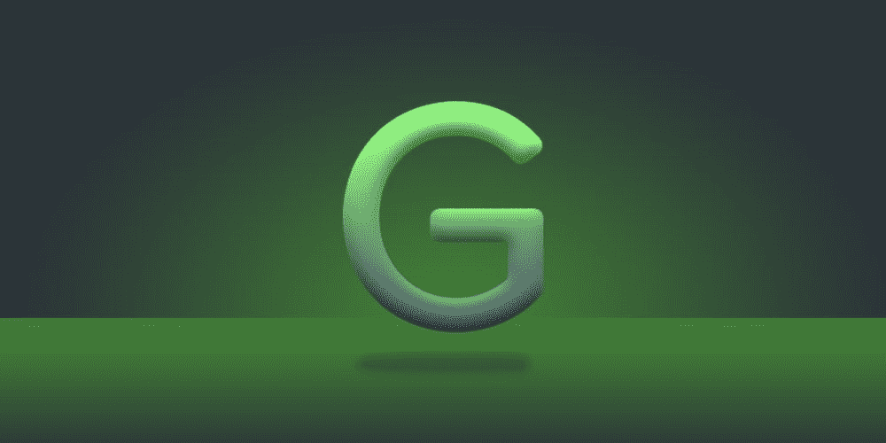
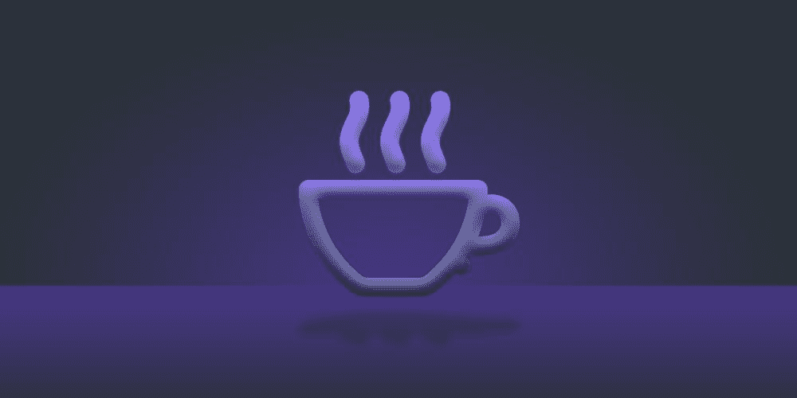

# 这个终极编码包是免费的

> 原文：<https://www.xda-developers.com/free-coding-bundle/>

# 这个终极编码包是免费的

这个来自 XDA 仓库的终极编码包目前是免费的。可以，27 小时全面编码指导绝对免费。

如果你刚刚开始学习 Ruby、Java、Javascript 或 Google Go Lang，这是一个很好的起点。在从 XDA 仓库购买更深入的捆绑包之前，[请免费查看这个](https://depot.xda-developers.com/sales/ultimate-freebie-coding-bundle)。这套初学者编码课程价值 737 美元。如果你通过 XDA 站买到它，你不用付钱。这是您将在这一包中找到的内容。

*   **Ruby 编程基础知识**
*   **学习 Google Go Lang**
*   **面向初学者的 Javascript 和 jQuery 基础知识**
*   **面向移动开发者的 Java 编程**
*   **在 14 天内成为一名全面的 Web 开发人员**

这里有超过 27 小时的内容可以探索。Ruby 是目前最流行的 web 编程语言之一。Java 将帮助你开始创建移动应用程序。全栈课程将教你如何创建一堆不同种类的 web 应用程序。

 <picture></picture> 

Diversify Your Coding Skill Set with This Open Source Language Developed (And Used) by Google

 <picture></picture> 

Dive into The Powerful jQuery Library to Quickly & Easily Write JavaScript Code

[**获取本课程！**](https://depot.xda-developers.com/sales/ultimate-freebie-coding-bundle)

*通过 [XDA 仓库](https://depot.xda-developers.com/)进行的采购有利于 XDA。我们的赞助商帮助我们支付与运行 XDA 相关的许多费用，包括服务器成本、全职开发人员、新闻撰稿人等等。虽然您可能会在门户内容旁边看到赞助内容(这些内容将始终被标记为赞助内容),但门户团队对这些帖子不承担任何责任。赞助内容、广告和 XDA 仓库完全由一个独立的团队管理。XDA 绝不会通过接受金钱来赞扬一家公司，或以任何方式改变我们的观点或看法，从而损害其新闻诚信。我们的意见不能被收买。*