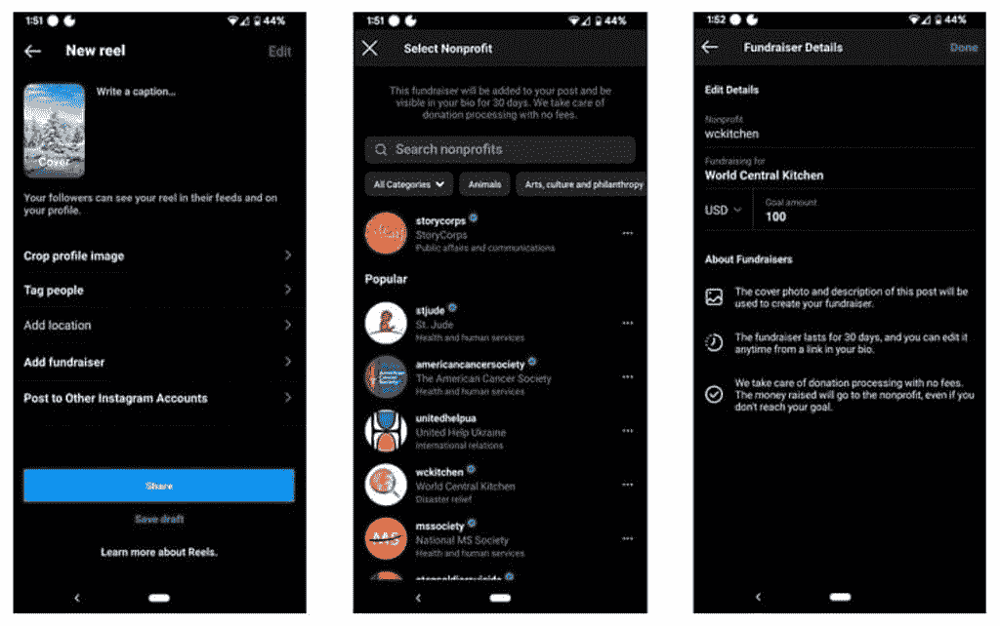

# 你现在可以通过 Instagram 卷轴为超过一百万的非政府组织筹集资金

> 原文：<https://www.xda-developers.com/fundraise-through-instagram-reels/>

# 你现在可以通过 Instagram 卷轴为超过一百万的非政府组织筹集资金

Instagram 现在通过其卷轴功能支持 30 多个国家超过 150 万个非营利组织的筹款。

在一个不平衡的世界里，有些人注定会遭遇不幸，每一个小小的帮助都很重要。尽管个人主义占据了越来越多的社会，但是我们不能忘记我们每个人身上的人性。筹款工具已经存在很多年了。他们有不同的方法、政策和目标。然而，相对而言，它们并不是最方便使用的。为了让捐款变得更简单、更容易，Meta 正在将其筹款功能引入其最受欢迎的平台之一。超过 30 个国家的用户现在可以通过 Instagram Reels 为超过 150 万个非政府组织筹集资金。所有筹集到的资金将直接捐给非营利组织——因为 Meta 负责处理和支付处理费用。

 <picture></picture> 

Credit: *Digital Trends*

在新闻编辑室的一篇帖子中，Instagram 的母公司 Meta 昨天宣布，作为其气候变化倡议的一部分，它将为 Instagram Reels 筹集资金。整合过程是无缝的——允许受支持国家的任何普通用户筹集资金或捐赠以支持某项事业。该公司仍然不允许用户为个人事务筹集资金，目前还不清楚这是否会在未来的不同条件下启用。要在 Instagram 卷轴上使用新的筹款工具:

*   启动 Instagram 应用程序。
*   像平常一样录制一卷。
*   点击*预览*按钮。
*   点击*下一个*。
*   点击*添加筹款人*。
*   选择或搜索你想为之筹款的非营利组织。
*   编辑募捐者的详细信息，并设定你的目标。
*   当你准备好了，点击*完成*，然后点击*分享*。

通过 Instagram Reels 筹集资金应该会鼓励更多人为人道主义事业捐款。考虑到该平台的受欢迎程度，许多用户将无需注册额外服务或下载其他应用程序即可使用该工具。

你打算用 Instagram 卷轴筹款吗？为什么或为什么不？请在下面的评论区告诉我们。

* * *

**来源:** [*元编辑部*](https://about.fb.com/news/2022/04/make-an-impact-for-earth-day/)

**Via:** [*数字趋势*](https://www.digitaltrends.com/social-media/instagram-reels-now-offer-fundraising-capabilities/)