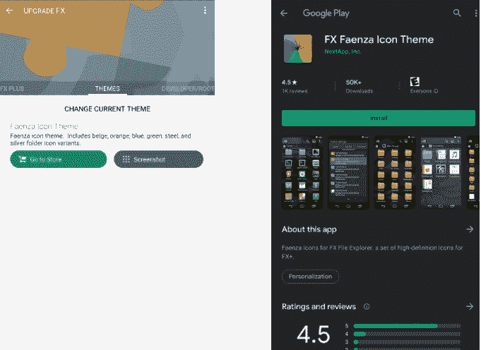

# 免费主题的“欺骗性”广告从 Play Store 中删除了 FX 文件浏览器

> 原文：<https://www.xda-developers.com/fx-file-explorer-removed-from-play-store-deceptive-advertising/>

# [更新:回到游戏商店] FX 文件浏览器因“欺骗性”广告而从游戏商店中移除...免费主题

FX 文件浏览器因违反欺骗性广告政策而从 Play Store 中删除，但它只是一个免费主题的按钮。

**美国东部时间 2019 年 12 月 10 日上午 8:08 更新:** FX 文件浏览器重返谷歌 Play 商店。滚动到底部了解更多信息。这篇发表于 2019 年 12 月 5 日的文章被保存如下。

FX 文件浏览器是 Android 爱好者比较喜欢的文件浏览器之一。我们已经[写了无数次关于](https://www.xda-developers.com/tag/fx-file-explorer/)这个应用的文章，开发者 T2 在我们的论坛上非常活跃。当开发者伸手告诉我们谷歌已经从 Play Store 中删除了他的应用程序时，我们感到很惊讶，当我们听到原因时，我们更加惊讶。

该应用因涉嫌违反欺骗性广告政策而被 Play Store 下架([你可以在这里阅读](https://play.google.com/about/privacy-security-deception/deceptive-behavior/))。简单来说，这是一项确保应用程序中的广告被明确标记的政策，以免欺骗用户与其互动。谷歌提供了一个有问题的“欺骗性广告”的截图，事实证明它只是主题设置中的一个按钮，将用户带到免费的 FX Faenza 图标主题。

 <picture></picture> 

The "deceptive" ad in question

开发者立即对移除提出上诉，但截至本文撰写之时，FX 文件浏览器仍未在 Play Store 中出现。主题部分的一个按钮可以让你看到来自同一开发者的免费主题，这显然不是欺骗性广告政策的内容。说谷歌在移除一个应用程序之前应该更加理解和伸出援手很容易，但有数百万个应用程序要审查，这些事情肯定会发生。我们只能希望这种情况很快得到解决。

**来源: [XDA 论坛](https://forum.xda-developers.com/showpost.php?p=81104665&postcount=4527)**

* * *

## 更新:FX 文件浏览器回到了谷歌 Play 商店

FX 文件浏览器已恢复回谷歌 Play 商店。奇怪的是，[开发者提到](https://forum.xda-developers.com/showpost.php?p=81156545&postcount=4557)APK 和几个月前上传的一样，所以没有做任何修改。开发人员所要做的就是在谷歌的相关部门找到一个真正的人，这种情况立即得到了纠正。

**[从谷歌 Play 商店](https://play.google.com/store/apps/details?id=nextapp.fx)下载 FX 文件资源管理器**

**[FX 文件浏览器- XDA 讨论线程](https://forum.xda-developers.com/showthread.php?t=1253399)**