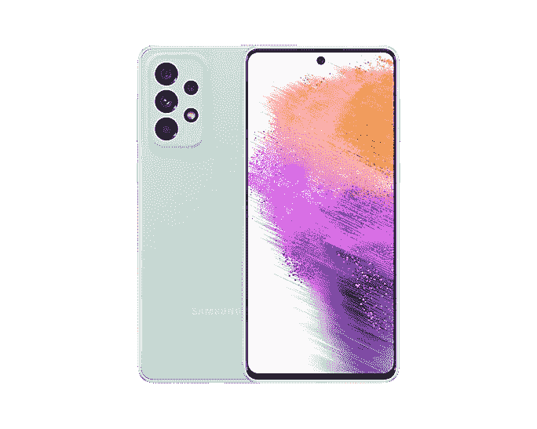

# 三星 Galaxy A73 印度定价揭晓，预购今天开始

> 原文：<https://www.xda-developers.com/galaxy-a73-indian-pricing-specifications/>

三星 Galaxy A73 现已在印度接受预购。上个月，Galaxy A73 与 Galaxy A53 一起推出，是 Galaxy A 系列中最强大的智能手机。最新型号加入了上个月底在印度推出的 Galaxy A33、Galaxy A23 和 Galaxy A13。

## Galaxy A73 印度定价和供货情况

Galaxy A73 绝不是一款平价智能手机。配备 8GB 内存和 128GB 存储空间的基本款从₹41,999 起价(～553 美元)，到 8GB/256GB 型号的₹44,999 起价(～593 美元)。用户可以从今天开始在 Samsung.com 预订这款手机，正式销售从 4 月 8 日开始。三星表示，那些预购该设备的人可以只花₹499.钱就能买到 Galaxy Buds Live worth ₹6,990 该公司还为三星金融+、ICICI 和 SBI 信用卡交易提供高达₹3000 的即时返现。这款手机有三种颜色:酷炫的薄荷色、酷炫的黑色和酷炫的白色。

 <picture></picture> 

Samsung Galaxy A73 5G

##### 三星 Galaxy A73

Galaxy A73 配备了 6.67 英寸 120Hz AMOLED 显示屏，骁龙 778G 芯片组和 108MP 主摄像头。

## 功能和规格

Galaxy A73 是 Galaxy A72 的直接继任者，并对其前身进行了几项关键升级，包括更好的显示屏、更快的芯片组和改进的主摄像头。它标榜 6.7 英寸 AMOLED 显示屏，正面具有 120Hz 的刷新率。在引擎盖下，它由高通的骁龙 778G 芯片组驱动，比 Galaxy A72 5G 的骁龙 750G SoC 更上一层楼。

Galaxy A73 最大的升级是 108MP 主摄像头，比 Galaxy A72 的 64MP 传感器有了很大的进步。虽然 12MP 超宽相机和 5MP 相机与上一款没有变化，但长焦镜头不见了，取而代之的是 5MP 深度镜头。

最后，Galaxy A73 配备了 5,000mAh 电池，支持 25W 快速充电，内置指纹扫描仪，IP67 防水防尘保护，5G 支持和蓝牙 5.0。这款手机运行的是开箱即用的 Android 12，上面有一个 UI 4.1，三星承诺提供长达四年的操作系统更新和五年的安全更新。