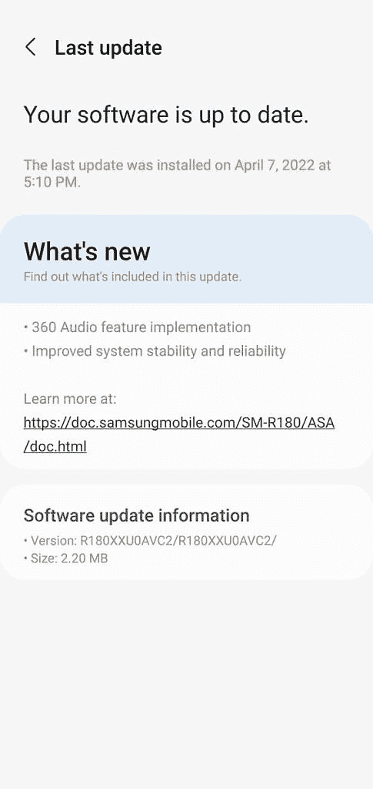

# Galaxy Buds Live 接收最新更新的 360°音频功能

> 原文：<https://www.xda-developers.com/galaxy-buds-live-360-audio/>

# 三星在 Galaxy Buds Live 上推出 Galaxy Buds Pro 的 360°音频功能

三星已经开始在 Galaxy Buds Live 上推出 Galaxy Buds Pro 的 360°音频功能。请继续阅读，了解更多信息。

三星推出了一项名为 360°音频的新功能，其旗舰产品 TWS 耳塞是 Galaxy Buds Pro T1。本月早些时候，[公司通过软件更新将它推广到 Galaxy Buds 2](https://www.xda-developers.com/galaxy-buds-2-360-audio/) ，让用户有机会在负担得起的耳塞上体验 360 度音频。现在，三星正在为 Galaxy Buds Live 推出类似的更新，带来了 360 音频功能和一些稳定性改进。

根据最近在 Reddit 上的一篇帖子，Galaxy Buds Live 用户正在接收一个新的软件更新，固件版本为 r 180 Xu 0 AVC 2。该更新只有 2.20MB，它有以下变更日志:

*   360°音频功能实施
*   提高系统稳定性和可靠性

如果你的耳塞还没有收到更新，你可以通过进入 Galaxy Wearables 应用程序中的耳塞设置选项来手动检查。点击设置页面上的*耳塞软件更新*选项来检查更新。在安装更新之前，请确保您的耳塞至少有 50%的电池电量。

 <picture></picture> 

Credit: u/msbeyoncecarter

如果你不熟悉 360 音频功能，这里有一个快速解释，当你第一次尝试它时，你可以期待什么。三星的 360°音频功能试图模仿环绕声体验，就像苹果耳塞和耳机上的空间音频功能一样。然而，与空间音频不同，三星 360 音频不依赖于为 360 度环绕声构建的音频内容。它只是根据你的头部运动来改变立体声通道的位置，从而模仿这种体验。

对该功能进行了广泛测试的用户表示，这只是一个噱头，并不能提供与苹果产品上的空间音频相同的体验。但那些没有在苹果产品上尝试过空间音频的人可能仍然会喜欢这个功能。

您收到 Galaxy Buds Live 上的 360 音频更新了吗？你觉得这个功能怎么样？请在下面的评论区告诉我们。