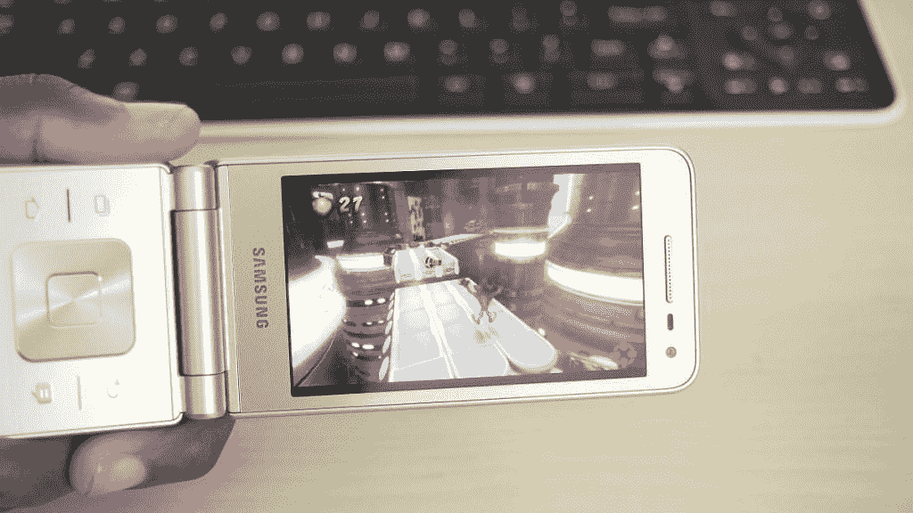
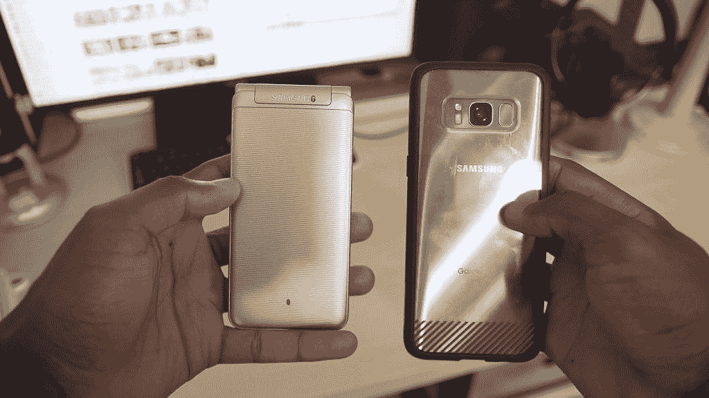

# 银河文件夹 2 拆箱和第一印象

> 原文：<https://www.xda-developers.com/galaxy-folder-2-unboxing-and-first-impressions/>

# 银河文件夹 2 拆箱和第一印象

迈尔斯在 XDA 电视台有一个新的视频，给了我们他对三星 Galaxy Folder 2 及其翻盖设计的第一印象。

迈尔斯在 XDA 电视台有一个新的视频，给了我们他对三星 Galaxy Folder 2 的第一印象。你会马上注意到的第一个特征是它的翻盖设计，让人想起摩托罗拉 RAZR V3 或三星 W2016 等手机。

 <picture></picture> 

The Folder 2 might not be the best for gaming.

 <picture></picture> 

Size comparison of the Folder 2 vs the Galaxy S8.

早在 2016 年 7 月首次宣布，它是否会在中国以外的地方上映仍未公布。虽然它的规格不是为了与今天的旗舰竞争，但它的外形可能会吸引一些人。观看视频，了解这款采用怀旧设计的现代手机的更多信息。

你对这个有点复古的设备有什么想法？