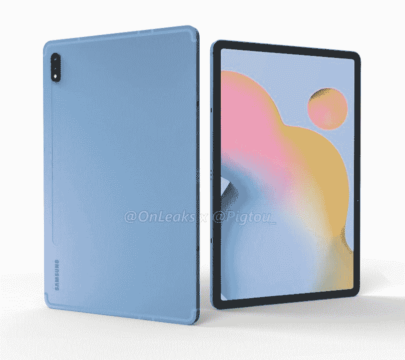

# [更新:Plus 渲染，120Hz] Galaxy Tab S7 泄露的渲染图显示了三星对苹果 iPad Pro 的回答

> 原文：<https://www.xda-developers.com/galaxy-tab-s7-leaked-renders-show-samsungs-answer-apple-ipad-pro/>

**更新(美国东部时间 6/15/20 @下午 4:20):**新泄露的消息展示了三星 Galaxy Tab S7+并暗示了 120Hz 的刷新率显示屏。

我们已经知道，三星正在准备推出去年旗舰产品 [Galaxy Tab S6](https://www.xda-developers.com/samsung-galaxy-tab-s6-review/) 的继任者。之前关于即将到来的平板电脑的泄露显示，三星[今年可能会提供两种尺寸的变体](https://www.xda-developers.com/samsung-galaxy-tab-s7-s20-12-4-inch-size/)——11 英寸显示屏的 Galaxy Tab S7 和 12.4 英寸显示屏的 Galaxy Tab S7+。更大的 Galaxy Tab S7+也在蓝牙 SIG 上被[发现，我们有理由相信该 Tab 将支持 5G。现在，知名泄密者 *@OnLeaks* 分享了三星 Galaxy Tab S7 的渲染图，让我们首次看到了苹果 iPad Pro 的竞争对手。](https://www.xda-developers.com/samsung-galaxy-tab-s7-spotted-bluetooth-sig/)

泄露的渲染图显示，Galaxy Tab S7 看起来几乎与去年的 Galaxy Tab S6 相同。它的特点是显示屏周围有细长的边框，背面有 LED 闪光灯的双摄像头设置，有一个容纳 S-Pen 的轻微凹痕，顶部和底部有天线。

来自 *Pigtou* 的一份关于此事的报告还披露了 Galaxy Tab S7 的准确尺寸——253.7 毫米 x 165.3 毫米 x 6.3 毫米——这意味着它将比其前身和 11 英寸 iPad Pro (2020 年)略大、略厚。虽然设计基本保持不变，但三星改变了自拍相机的位置，当平板电脑处于横向时，它现在位于顶部边框。

 <picture></picture> 

Samsung Galaxy Tab S7 5G

截至目前，三星尚未发布任何关于 Galaxy Tab S7 和 Tab S7+的官方信息。然而，我们认为这些平板电脑将采用高通的旗舰产品骁龙 865 SoC，并可能包括相机部门的改进。此外，一份泄露的 Galaxy Tab S7 3C 清单显示，该平板电脑[将配备 7760 毫安时电池](https://www.mysmartprice.com/gear/samsung-galaxy-tab-s7-specifications-3c-certification/)，略大于 Galaxy Tab S6 的 7040 毫安时电池。

**来源:[猪头](https://pigtoucoques.fr/blogs/tech/samsung-galaxy-tab-s7)**

* * *

## 更新:加渲染，120 赫兹

上周，我们首次看到了即将发布的三星 Galaxy Tab S7，看起来它有可能与苹果 iPad Pro 相抗衡。不过，关于这款设备，我们还有很多不了解的地方，包括“Plus”型号。今天，我们来看看这两款更大的平板电脑。据称它的长度和宽度为 285 毫米 x 185mm 毫米，厚度为 5.7 毫米。设计与较小的型号相同，但它有一个更大的 12.4 英寸显示屏。说到显示屏，根据 Twitter 泄密者 [*Ice Universe*](https://twitter.com/UniverseIce/status/1271435777616998402) 的说法，Galaxy Tab S7 和 Tab S7+将拥有 120Hz 刷新率显示屏。

**来源:[猪头](https://pigtou.com/blogs/android/samsung-galaxy-tab-s7-plus)**