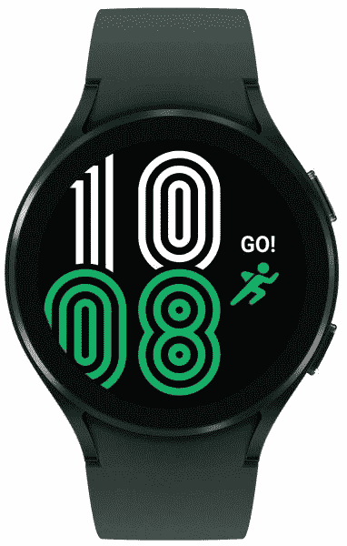

# Galaxy Watch 4 获得了三星健康改善的新更新

> 原文：<https://www.xda-developers.com/galaxy-watch-4-update-samsung-health-improvements-march-patch/>

Galaxy Watch 4 是目前市场上最好的佩戴操作系统的智能手表之一。它也是唯一一款开箱即可运行 [Wear OS 3](https://www.xda-developers.com/samsung-galaxy-watch-4/) 的智能手表。Galaxy Watch 4 配备了一流的硬件，随着时间的推移，软件更新也越来越及时。这款手表现在有了新的更新，带来了一些新的改进。

三星已经开始为 Galaxy Watch 4 推出新的软件更新。此次更新的内部版本号为 r 870 Xu 1 FVC 8，重量为 356.99MB。到目前为止，该产品已在美国推出，未来几天将有更多地区效仿。

截图鸣谢:Reddit 用户*u/goodhomesforent*

就新的变化而言，更新为三星健康功能带来了一些增强。然而，三星的官方变更日志并没有详细说明具体会有什么样的改进。此次更新还将安全补丁级别提升至 2022 年 3 月。这似乎是一个小的更新，因为除了这些变化，变更日志没有提到任何新的东西。

更新变更日志:

*   增强的三星健康功能
*   提高系统稳定性和可靠性

如果你有 Galaxy Watch 4，请留意新的软件更新。要检查更新，请打开手机头上的 Galaxy Wearable 应用程序，进入*手表设置>手表软件*更新。或者，在你的 Galaxy Watch 4 上导航到*设置>软件*更新。

 <picture></picture> 

Samsung Galaxy Watch 4

##### 三星 Galaxy 手表 4

三星 Galaxy Watch 4 包 Exynos W920 芯片组、高级健康跟踪功能和 Wear OS 3。

Galaxy Watch 4 在 2 月份获得了一次重大更新，为骑自行车者和跑步者带来了一个高级间隔目标功能，一个睡眠教练计划，新的手表外观和定制选项，新的身体成分见解等。在未来的更新中，Galaxy Watch 4 还将获得 YouTube 音乐应用程序和谷歌助手支持中的流媒体音乐功能。

你的 Galaxy Watch 4 收到新的软件更新了吗？请在下面的评论中告诉我们。

* * *

**来源** : [三星](https://doc.samsungmobile.com/SM-R870/019788210824/eng.html)

**Via** : [Reddit](https://www.reddit.com/r/GalaxyWatch/comments/twudbp/watch_4_update_lets_hope_it_brings_something_good/)