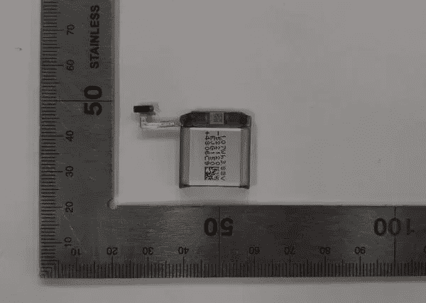

# [更新:两种尺寸]据报道，三星 Galaxy Watch 5 将拥有更大的电池

> 原文：<https://www.xda-developers.com/galaxy-watch-5-battery-report/>

**更新 1(****04/01/2022****@****02:52****ET):**根据 [SamMobile](https://www.sammobile.com/news/galaxy-watch-5-battery-bigger-capacity/) 指出的[监管清单](https://www.safetykorea.kr/release/certDetail?certNum=YU10211-22006&certUid=5337258)的一个[对](https://www.safetykorea.kr/release/certDetail?certNum=YU10211-22003&certUid=5328590)，看起来更大的 Galaxy Watch 5 也会有更高容量的电池。型号为 EB-BR910ABY 的更大的 Galaxy Watch 5 预计将使用 398 毫安时电池，比当前 44 毫米 Galaxy Watch 4 中的 361 毫安时电池有所增加。

文章发表于 2022 年 3 月 15 日，现保存如下。

三星在 8 月份发布了 Galaxy Watch 4 系列，这标志着三星在使用自己的 Tizen 软件几年后，重返谷歌的 Wear OS 平台。假设该公司坚持每年发布一次，Galaxy Watch 5 系列可能会在今年下半年发布，现在我们可能会有关于这些手表的第一个细节。

SamMobile 声称，较小的 Galaxy Watch 5(型号 SM-R900)将配备 276mAh 的额定电池容量，理由是一份未指明的“监管文件”如果属实，这将使电池略大于 40 毫米 Galaxy Watch 4 的电池，后者的容量为 247 毫安时。对较小的 Galaxy Watch 4 的评论经常提到电池续航能力差的问题——当[我尝试较小的 Galaxy Watch 4 Classic](https://www.xda-developers.com/samsung-galaxy-watch-4-classic-review/) (它有相同的电池)时，我对电池续航能力没有太大问题，但一次充电持续两天肯定很难。

 <picture></picture> 

Supposed photo of the battery (Source: SamMobile)

目前还没有关于三星将为较大的 Galaxy Watch 5 使用什么电池的信息，也没有关于较小手表电池的任何其他信息。同样不清楚的是，更大的电池是否需要更大的手表框架，这可能会让手腕较小的人感到烦恼，因为紧凑型智能手表没有太多选择。

42 毫米 Galaxy Watch 4 和 46 毫米 Galaxy Watch 4 采用 5 纳米 Exynos W920 芯片组，1.5GB RAM，16GB 内部存储，以及一系列传感器来监控健康信息。较大的型号配备了 1.36 英寸的圆形显示屏和 361 毫安时的电池，而较小的手表则配备了 1.19 英寸的显示屏和 247 毫安时的电池。这些手表主要使用 Wi-Fi 和蓝牙 5.0 进行连接，但三星也销售能够连接到蜂窝网络的 LTE 型号。

**来源:** [SamMobile](https://www.sammobile.com/news/galaxy-watch-5-battery-bigger-capacity/)